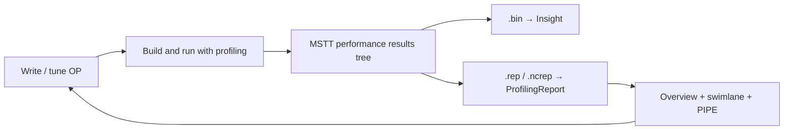

# Domain Context — Users, Pain Points, and Glossary

How Ascend / CANN **operator (OP) development** relates to this library’s design, UX scenarios, and vocabulary. Read after [PROJECT_GOALS.md](PROJECT_GOALS.md); pair with [UX_SPEC.md](../specs/ui/UX_SPEC.md) for interaction detail and [FORMATS_COMPARISON.md](../specs/formats/FORMATS_COMPARISON.md) for data semantics.

---

## 1. Who the user is

| Role | Description |
|------|-------------|
| **Primary** | OP developer using **MSTT** (Huawei OP DevTools in VS Code) to author, build, run, and profile Ascend kernels |
| **Secondary (later)** | Hosts such as **pypto-tools** that may reuse the same swimlane/report UI via an adapter |
| **Not this product’s focus** | Cluster / training / serving Insight users, or pure framework schedule authors who never open an OP report |

The user’s day job is **making one operator (or a small fused set) correct and fast on NPU AI Cores**, not operating a full training cluster.

---

## 2. What they develop

Developers write **Ascend / CANN operators** — device kernels that implement math or data-movement primitives for models (e.g. custom `add`, matmul variants, fused attention tiles). In practice they care about:

| Concern | What it means |
|---------|----------------|
| **Op type** | `vector`, `cube`, or **mix** (both sides active) — drives which pipes and counters are meaningful |
| **Correctness first** | Functional tests on host/device before deep perf work |
| **Perf second** | Shorten **task duration**, raise useful **pipe occupancy**, avoid memory-path bottlenecks and stalls |
| **Multi-core launch** | **Block Dim** / `block_id` — work split across AI Cores; imbalance wastes device time |
| **Iteration** | Change kernel or tiling → rebuild → re-profile → compare reports |

Profiling artifacts they open today:

- **`.bin`** — rich Insight operator dump (instruction / Source / Cache depth) — stays in **MindStudio Insight**
- **`.rep` / `.ncrep`** — portable **report pack** (metric CSVs + Chrome Trace) — target of **profiling-report**

---

## 3. Workflow (before and through the UI)



1. Author or edit the OP (C++ / Ascend C / tiling, etc.).
2. Run a profiled case; MSTT shows results under the performance tree.
3. Open **`.rep` / `.ncrep`** → host mounts `<ProfilingReport />` ([MSTT_INTEGRATION](../specs/architecture/MSTT_INTEGRATION.md)).
4. Answer “how long?”, “which pipes?”, “what’s busy when?” → change code → repeat.
5. For instruction-level Source / Cache / flag sync, open **`.bin`** in Insight (sibling path, not this library).

---

## 4. Performance problems (pain points)

| Pain point | Developer question | Product response | UX / phase |
|------------|--------------------|------------------|------------|
| Opaque total cost | How long did the op take? What’s compute vs I/O BW? | Report summary tiles from OpBasicInfo + aggregates | **S1** · M |
| Boundedness unclear | Am I compute-bound or memory-bound? | Summary + later **roofline** | **S1**, **S6** · roofline P2 ([Q11](OPEN_QUESTIONS.md)) |
| Pipe imbalance | Which pipes dominate or sit idle? | PIPE occupancy bars; gutter util % | **S4**, **S5** · M (field list P2) |
| Timeline blindness | Where is wall time spent across lanes? | Swimlane zoom / pan / hover / select | **S2**, **S3** · M |
| Core imbalance | Do some `block_id`s lag? | Gutter hierarchy + per-lane util; CSV keyed by block | **S4** · M |
| Memory path pressure | Is L1 / UB / GM / HBM the limiter? | Memory topology + field lists | **S6** · P2 |
| Sync / deps | Why is this interval waiting? | Dependency links + detail graph | **S8** · P2 ([Q9](OPEN_QUESTIONS.md)) |
| Source ↔ insn | Which line caused this stall? | Insight Source/Cache on `.bin`; optional later tabs | **S9** · P2 / Insight |
| Wrong hardware context | Which chip / HBM / core count was this run? | Hardware aside | **S7** · P2 ([Q7](OPEN_QUESTIONS.md)) |
| Fixture thinner than sketches | Why don’t I see multi-core instruction Gantt? | Render available lanes; hide empty charts | Honesty: [Q4](OPEN_QUESTIONS.md)/[Q5](OPEN_QUESTIONS.md)/[Q8](OPEN_QUESTIONS.md) |

MVP is deliberately scoped to the **highest-frequency questions** after opening a report: duration, pipe ranking, and timeline navigation. Deeper microarchitecture and schedule-orchestration features stay Phase 2 or in Insight / PyPTO.

---

## 5. Design direction (why the UI looks like this)

```text
Pain: need Insight-like OP metrics + PyPTO-like timeline
         without Insight stack for .rep
                    ↓
     Swimlane-first main pane  +  report analytics aside
                    ↓
     Shared Vue UI + .rep adapter  (not an uber-viewer)
```

| Design choice | Domain rationale |
|---------------|------------------|
| **Swimlane as primary** | Perf intuition is temporal — busy vs idle pipes over time (PyPTO-like) |
| **Summary + PIPE aside** | First answers after open (“how long / which pipes”) without clicking every bar |
| **Overview Cube/Vector charts** | Time-aligned compute mix when series exist; hide when not ([Q5](OPEN_QUESTIONS.md)) |
| **Hierarchical gutter** | Cores → pipes mirrors how developers reason about Block Dim and pipe children |
| **Color consistency** | Same Cube / Vector / MTE language across bars, lanes, and charts |
| **Keep Insight for `.bin`** | Instruction / Source / Cache depth is a different product question |
| **MVP before Source tabs** | Portable `.rep` may not carry Insight-grade source mapping yet |
| **Vue library, not sealed HTML** | MSTT already owns webview panels; library must compose ([ARCHITECTURE](../specs/architecture/ARCHITECTURE.md)) |

Sketches under [`docs/specs/ui/`](../specs/ui/) encode this composition: dense dark timeline + right-rail analytics.

---

## 6. User stories → UX scenarios

| User story | Scenario | Phase | Specs |
|------------|----------|------:|-------|
| As an OP dev, I open a report and immediately see total time and which pipes are hot | **S1** Open report and get overview | M | [UX_SPEC](../specs/ui/UX_SPEC.md), [FEATURE_MATRIX](../specs/ui/FEATURE_MATRIX.md) |
| As an OP dev, I zoom into a busy region and spot idle gaps | **S2** Find busy / idle regions | M | UX_SPEC, [INTERACTIONS](../specs/ui/INTERACTIONS.md) |
| As an OP dev, I inspect one interval’s name and timing | **S3** Inspect one event | M | UX_SPEC, INTERACTIONS |
| As an OP dev, I compare util across cores / pipes | **S4** Compare utilization | M | UX_SPEC, gutter + PIPE |
| As an OP dev, I rank pipes (and later search raw counters) | **S5** Drill into PIPE metrics | M / P2 | UX_SPEC, [METRICS_AND_TRACE](../specs/formats/METRICS_AND_TRACE.md) |
| As an OP dev, I check whether memory paths limit the op | **S6** Analyze memory paths | P2 | UX_SPEC, FEATURE_MATRIX |
| As an OP dev, I confirm NPU / HBM context for the run | **S7** Review hardware context | P2 | UX_SPEC, [Q7](OPEN_QUESTIONS.md) |
| As an OP dev, I follow deps or aggregate a time slice | **S8** Dependencies / multi-select | P2 | UX_SPEC, [Q9](OPEN_QUESTIONS.md) |
| As an OP dev, I switch to OP / Source / Details / Cache modes | **S9** Secondary tabs | P2 | UX_SPEC; Insight remains for `.bin` depth |

---

## 7. Glossary

Definitions for newcomers. CSV field mapping: [METRICS_AND_TRACE](../specs/formats/METRICS_AND_TRACE.md). Format roles: [FORMATS_COMPARISON](../specs/formats/FORMATS_COMPARISON.md).

### Products and hosts

| Term | Meaning |
|------|---------|
| **MSTT** | OP DevTools (VS Code): primary host for this library |
| **MindStudio Insight (msinsight)** | External viewer for rich operator **`.bin`** (and system modes out of scope here) |
| **PyPTO / pypto-tools** | Schedule-centric toolkit with swimlane UX; reference for interactions and optional later consumer |
| **profiling-report** | This Vue 3 library: swimlane + report panels for **`.rep` / `.ncrep`** |

### Platform

| Term | Meaning |
|------|---------|
| **Ascend** | Huawei NPU product line |
| **CANN** | Compute architecture / software stack for Ascend |
| **NPU** | Neural Processing Unit (device) |
| **AI Core** | Compute core on the NPU that executes Cube / Vector / MTE work |
| **AIC** | AI Cube side / counters (`aic_*` columns); often `NA` on vector-only ops |
| **AIV** | AI Vector side / counters (`aiv_*`) |
| **Block Dim** | Launch parallelism — how many AI Core blocks run the op |
| **`block_id`** | Per-block row key in metric CSVs (0…N−1) |

### Pipes and compute

| Term | Meaning |
|------|---------|
| **PIPE** | Hardware execution pipe (Cube, Vector, MTE, Scalar, FixP, …). **PIPE occupancy** ≈ fraction of time the pipe was busy |
| **Cube** | Matrix / cube arithmetic pipe (high FLOPS path) |
| **Vector** | Vector arithmetic pipe |
| **Scalar** | Scalar / control-oriented work; stalls often show here |
| **FixP / FixPipe** | Fix-point / related pipe family in reports |
| **MTE1 / MTE2 / MTE3** | Memory Transfer Engines — move data between on-chip buffers and memory hierarchy |
| **FLOWCTRL** | Flow-control related lane label in some instruction Gantts |
| **Utilization** | 0…1 (or %) busy ratio for a pipe, lane, or core aggregate |
| **`NA`** | Missing counter in CSVs — ignore in averages; do not treat as zero |

### Memory hierarchy (report diagrams)

| Term | Meaning |
|------|---------|
| **HBM** | High Bandwidth Memory (device DRAM-class) |
| **GM** | Global memory path in report language |
| **L1 / L0** | On-chip cache / buffer levels in Ascend memory diagrams |
| **L2** | Larger on-chip cache; **L2Cache.csv** / Cache tab (P2) |
| **UB** | Unified Buffer — on-chip scratch frequently involved in MTE traffic |
| **Roofline** | Chart of arithmetic intensity vs achievable performance vs bandwidth ceilings — bounds diagnosis (P2) |

### Timeline / formats

| Term | Meaning |
|------|---------|
| **Swimlane** | Multi-lane Gantt of timed intervals (processes → threads → events) |
| **Chrome Trace** | `trace.json` event format (`ph`, `ts`, `dur`, …) embedded in `.rep` |
| **`.rep` / `.ncrep`** | CANN report container: CSVs + trace ([REP_FORMAT](../specs/formats/REP_FORMAT.md)); product alias for OP reports |
| **`.bin`** | Insight operator profiling dump — not parsed by this library |
| **OverviewSeries** | Time-series points for Cube/Vector overview charts (not the same as PIPE bar ratios) |
| **Capability** | Feature flag (`roofline`, `dependencies`, …) so UI hides surfaces the format/host cannot fill |

### Related Chinese UI labels (sketches)

| Sketch label | English intent |
|--------------|----------------|
| PIPE 占用率 | PIPE occupancy |
| 统计分析 | Overview / statistical charts |
| OP算子 / 源码 / 详情 / 缓存 | Op / Source / Details / Cache secondary tabs (P2) |
| 显示控制 | Display / units / layer controls (P2) |

---

## Related docs

- [PROJECT_GOALS.md](PROJECT_GOALS.md) — product goals and non-goals
- [OPEN_QUESTIONS.md](OPEN_QUESTIONS.md) — unresolved producer / fixture / formula questions
- [UX_SPEC.md](../specs/ui/UX_SPEC.md) — scenarios S1–S9 and sync model
- [FEATURE_MATRIX.md](../specs/ui/FEATURE_MATRIX.md) — MVP vs Phase 2+ checklist
- [FORMATS_COMPARISON.md](../specs/formats/FORMATS_COMPARISON.md) — Insight vs `.rep` vs PyPTO semantics
- [ARCHITECTURE.md](../specs/architecture/ARCHITECTURE.md) — shared UI + adapters
