# Open Questions

Single source of truth for unanswered product / engineering questions. **Status is a field** on each record; which store it lives in is derived from that field.

**Statuses (single enum):** `open` | `partial` | `interim` | `deferred` | `resolved`

- `open` / `partial` — live here (this file).
- `interim` — engineering default only; the rule lives in [INTERIM_DECISIONS.md](INTERIM_DECISIONS.md) under a sub-letter id (e.g. `DATA-33b`). The question row stays here.
- `deferred` — Product-confirmed out of this iteration, marked `DEFERRED` in place (never renumbered).
- `resolved` — Product-final; the entry lives in [DECISIONS.md](DECISIONS.md), keeping the **same bare id**.

**When resolved:** write the decision into the owning specs **and** file a [DECISIONS.md](DECISIONS.md) entry in the **same change**; remove the row here. Process: [DEVELOPMENT.md § Resolving open questions](../process/DEVELOPMENT.md#resolving-open-questions).

## ID prefix taxonomy (closed set)

- `DATA-*` — file/field/formula data mapping (report data → visualized number/series/edge).
- `UI-*` — presentation / UX (layout, units, gestures, missing-input, labels).
- `PROC-*` — process / tooling / acceptance (producer, container format, MSTT policy, agent rules, acceptance owner).
- `PKG-*` — packaging / distribution (package identity, design system/i18n, licensing).

IDs are **permanent** — retire with a `WITHDRAWN` / `DEFERRED` marker in place, never delete or renumber (they are referenced by `@covers` test comments, specs, code comments, and design crops).

## Migration map (one-time, from the pre-merge spaces)

| Old id | New id |
|--------|--------|
| `HQ 1–29` | `DATA-1 … DATA-29` |
| `HQ 30–36` | `UI-30 … UI-36` |
| `Q3/Q4/Q5/Q6/Q7/Q8/Q9/Q11` | `DATA-30 … DATA-37` |
| `Q10/Q12/Q13/Q14/Q19/Q22` | `UI-37 … UI-42` |
| `Q1/Q2/Q15/Q20/Q21` | `PROC-1 … PROC-5` |
| `Q16/Q17/Q18` | `PKG-1 … PKG-3` |
| `I-Q2` | `PROC-2a` |
| `I-Q4` | `DATA-31a` |
| `I-Q5+` | `DATA-32a` |
| `I-Q6a–g` | `DATA-33a…DATA-33g` |
| `I-Q7a` | `DATA-34a` |
| `I-Q9` | `DATA-36a` |
| `I-Q11a–f` | `DATA-37a…DATA-37f` |
| `I-Q14` | `UI-40a` |
| `I-Q16–19` | `PKG-1a…PKG-3a`, `UI-41a` |

---

## DATA questions

### DATA-2 — 172 measured TFLOPS

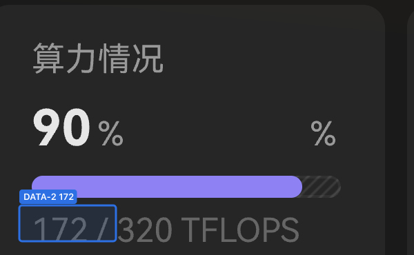

**Status:** `partial`

**Question:** **172** (measured TFLOPS) — which file, which field(s), and the formula?

**Answer so far:** Compute **cube** and **vector** separately (two columns per UI-33). Product formulas (MFU / measured TFLOPS — accuracy TBD):

- **Cube measured:** `MFU = (M×K×N) × 2 / aic_time(us)` (may run high; needs confirmation). Ops basis: `Cycle × 16 × sizeof(dataType) × 16 × 2`.
- **Cube peak (theoretical):** `16 × sizeof(dataType) × 16 × core_count × frequency × 2 / 1000` TFLOPS.
- **Vector measured:** `MFU = M×N / aiv_time(us)` (may run high). Ops basis: `Cycle × 16 × sizeof(dataType) × 16 × 2` (fp32/f16 separately).
- **Vector peak (theoretical):** `128 × core_count × frequency × 2 / 1000` TFLOPS.
- Inputs: `PipeUtilization.csv` `aic_time(us)` / `aiv_time(us)`; `HardwareInfo.jsonl` core counts + frequency; dtype from op context.

### DATA-3 — 320 peak TFLOPS

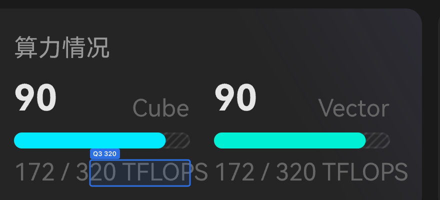

**Status:** `partial`

**Question:** **320** (peak TFLOPS) — which file and field? Or a fixed number per chip?

**Answer so far:** Product will supply **fixed theoretical peak** values per chip (not in report CSV). Interim formula until constants arrive: cube and vector peaks per DATA-2 (`HardwareInfo.jsonl` core counts + frequency + dtype).

### DATA-5 — 1.6 TB/s peak bandwidth

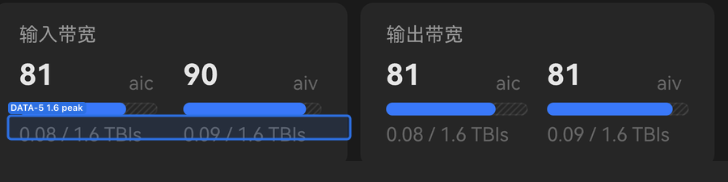

**Status:** `open`

**Question:** **1.6 TB/s** (peak) — which file and field?

### DATA-6 — peak same for aic / aiv / input / output?

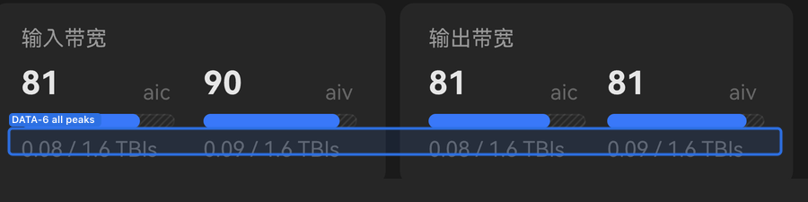

**Status:** `open`

**Question:** Is the peak the same for aic, aiv, input, and output? If no, give each peak. (Depends on DATA-5.)

### DATA-7 — 81 score

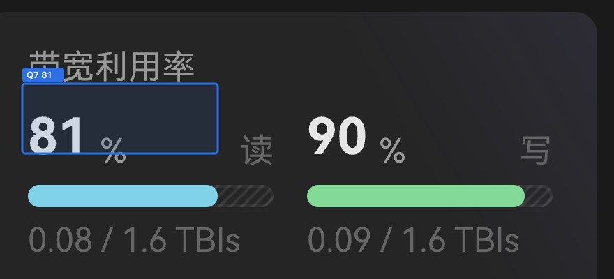

**Status:** `open`

**Question:** **81** (score) — what is the formula? It is not `0.08 / 1.6`.

### DATA-8 — I/O bandwidth cards from `Report.csv`?

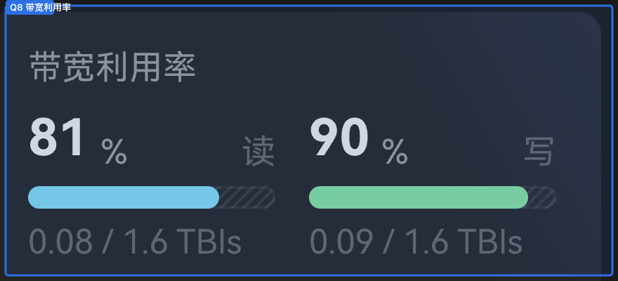

**Status:** `open`

**Question:** Do these cards come from `Report.csv` instead? If yes, list the column names. (Interim `DATA-33g` uses `Memory.csv`, not `Report.csv`.)

### DATA-9 — 82% average core utilization

**Status:** `open`

**Question:** **82%** — which file, which field, and the formula?

### DATA-10 — 24/24 enabled cores

**Status:** `open`

**Question:** **24/24** in **启用 n/m 核** — which field is *n*? Which field is *m*?

### DATA-11 — Roofline axes vs pipe busy rates

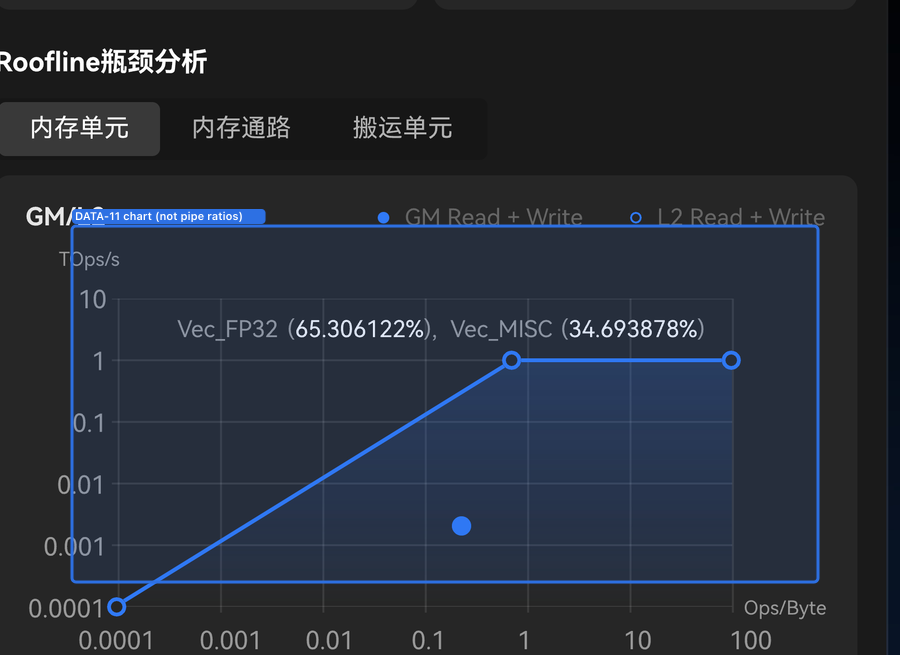

**Status:** `open`

**Question:** The old mapping uses `aic_cube_ratio`, `aic_mte2_ratio`, `aic_mte1_ratio` (pipe busy rates). What should we use instead? Real Roofline axes are undocumented.

### DATA-12 — X axis Ops/Byte

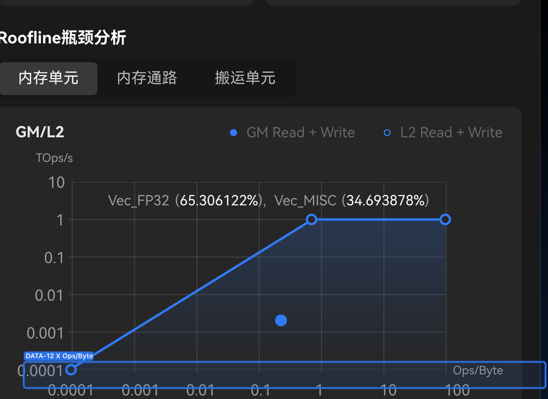

**Status:** `open`

**Question:** **X axis** (Ops/Byte) — file, fields, formula? Is GM and L2 the same formula?

### DATA-13 — Y axis TOps/s

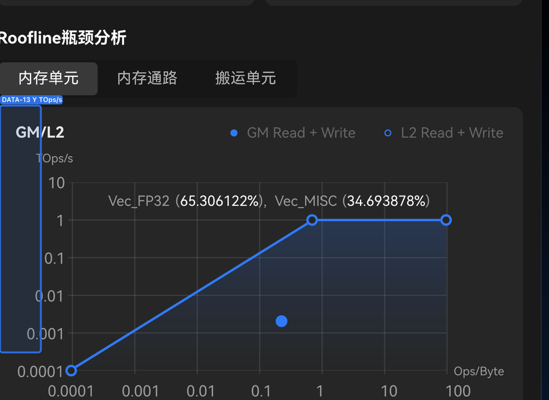

**Status:** `open`

**Question:** **Y axis** (TOps/s) — file, fields, formula? (Raw `aic_cube_fops` / `aiv_vec_fops` exist but are not a TOps/s formula.)

### DATA-14 — roof lines

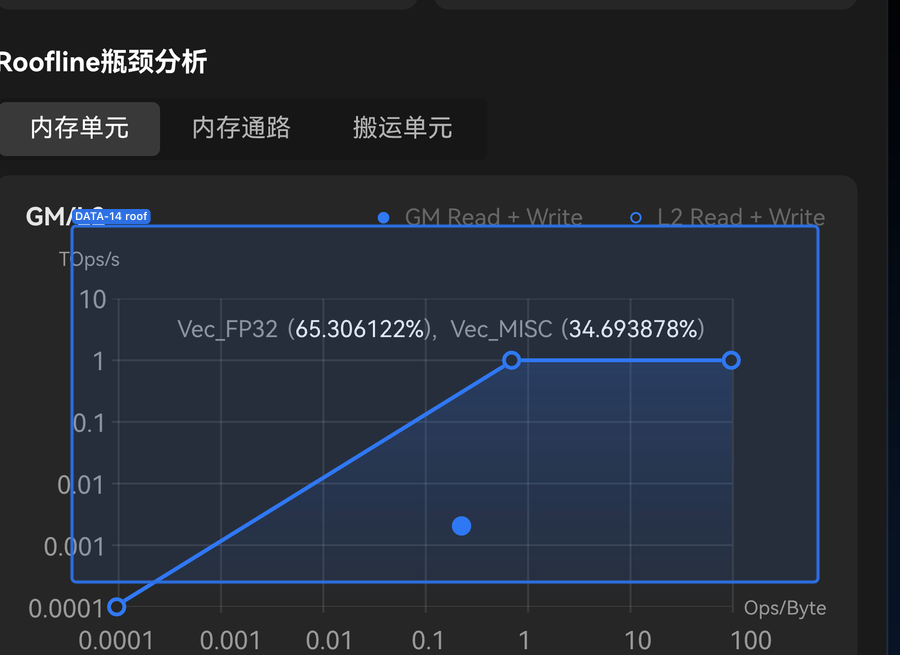

**Status:** `open`

**Question:** The **roof** lines (peak bandwidth and peak compute) — which file and fields?

### DATA-15 — L2 bytes

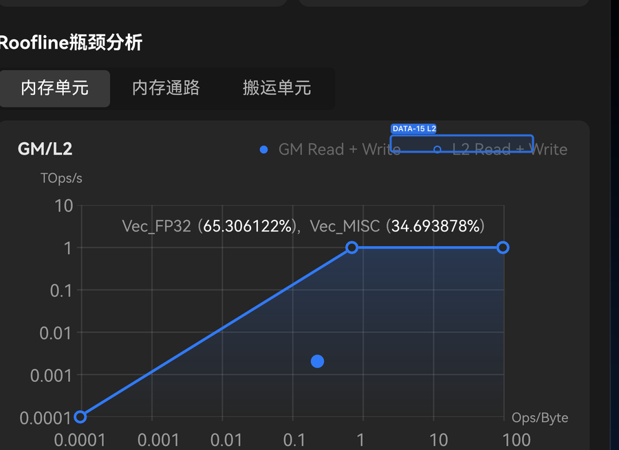

**Status:** `open`

**Question:** The **L2** point needs bytes moved. Which field has L2 bytes? (`L2Cache.csv` has hit counts and hit *rates*, no byte traffic.)

### DATA-16 — Vec_FP32 / Vec_MISC mix labels

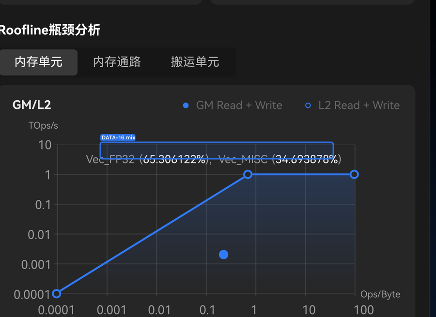

**Status:** `partial`

**Question:** Labels like `Vec_FP32` / `Vec_MISC` — which file and fields? Which labels when many are non-zero?

**Answer so far:** Fields exist in `ArithmeticUtilization.csv`: `aiv_vec_fp32_ratio`, `aiv_vec_fp16_ratio`, `aiv_vec_int32_ratio`, `aiv_vec_int16_ratio`, `aiv_vec_misc_ratio`. The docx dictionary uses *different* names (`aiv_vec_vf_ratio`, `aiv_vec_sfu_ratio`, `aiv_vec_simt_vf_ratio`). The "which to show when many are non-zero" rule is undocumented.

### DATA-17 — Roofline tabs

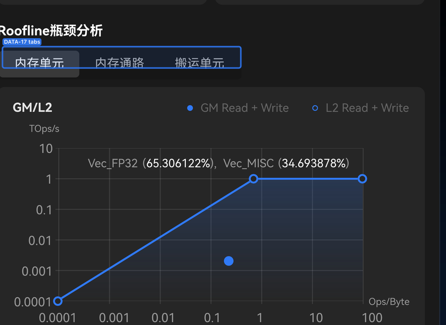

**Status:** `partial`

**Question:** Tabs **内存单元** / **内存通路** / **搬运单元** — what should each tab show?

**Answer so far:** The docx Roofline table maps 内存单元→`aic_cube_ratio`, 内存通路→`aic_mte2_ratio`, 搬运单元→`aic_mte1_ratio` (all `PipeUtilization.csv`) — the pipe-busy-rate mapping DATA-11 flags as wrong.

### DATA-19 — summary vs 详情 block scope

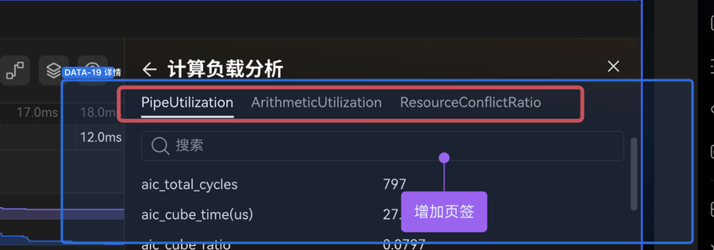

**Status:** `interim`

**Question:** On the summary bars, do we average all blocks? On **详情**, do we show only the selected block?

**Interim:** summary PIPE bars = mean of non-`NA` ratios across `block_id` ([`DATA-33b`](INTERIM_DECISIONS.md)); **详情** / memory / metrics = selected block ([`DATA-33c`](INTERIM_DECISIONS.md)). Product note: summary view is missing a **block selector** label.

### DATA-20 — Peak(%) box colors

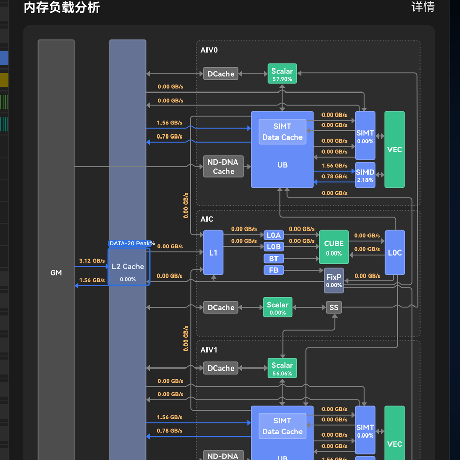

**Status:** `partial`

**Question:** **Peak (%)** color on each memory-diagram box — which file and field for each box?

**Answer so far:** **L2 box only:** Peak(%) = **hit rate** (命中率) from `L2Cache.csv` (read/write/total × AIC/AIV still per DATA-21). Other boxes (GM, L1, L0*, Cube, FixP, UB, Vec, Scalar) — still no Product mapping.

### DATA-21 — L2Cache Hit Rate on GM↔L2 arrow

**Status:** `interim`

**Question:** **L2Cache Hit Rate** on the GM↔L2 arrow — read, write, or total? AIC, AIV, or both?

**Interim:** adapter uses the first non-`NA` of `aic_total_hit_rate(%)`, `aiv_total_hit_rate(%)`, `aic_read_hit_rate(%)`, `aiv_read_hit_rate(%)`. Product has not picked read/write/total × AIC/AIV.

### DATA-22 — UB → L2/GM arrow

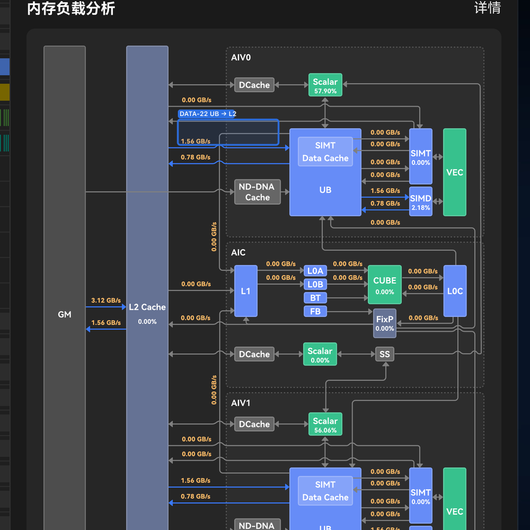

**Status:** `interim`

**Question:** **UB → L2/GM** — which file and field? Two names exist: `MemoryUB.csv` `aiv_ub_read_bw_gm` vs `Memory.csv` `aiv_ub_to_gm_bw`.

**Interim:** adapter tries `MemoryUB.csv` → `aiv_ub_read_bw_gm(GB/s)` first, then `Memory.csv` → `aiv_ub_to_gm_bw(GB/s)`. Sample MemoryUB has **no `*_gm` fields**.

### DATA-23 — L2/GM → UB arrow

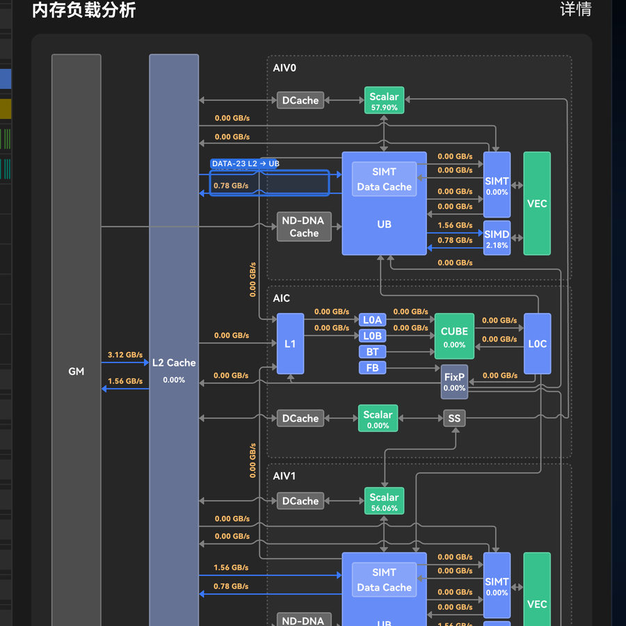

**Status:** `interim`

**Question:** **L2/GM → UB** — which file and field? (`MemoryUB.csv` `aiv_ub_write_bw_gm` vs `Memory.csv` `aiv_gm_to_ub_bw`.)

**Interim:** adapter tries `MemoryUB.csv` → `aiv_ub_write_bw_gm(GB/s)` first, then `Memory.csv` → `aiv_gm_to_ub_bw(GB/s)`. Same sample gap: no gm fields on MemoryUB.

### DATA-24 — L0C → L1

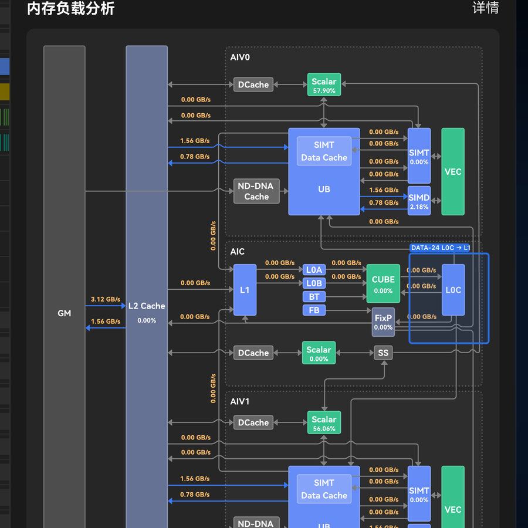

**Status:** `interim`

**Question:** **L0C → L1** — show it? Which field? (`L0C_to_L1_datas(KB)`?)

**Interim:** show `Memory.csv` → `L0C_to_L1_datas(KB)` when present. Product 理论值 is still 待确定. Sketch node is **LOC**.

### DATA-25 — L0C → L2/GM

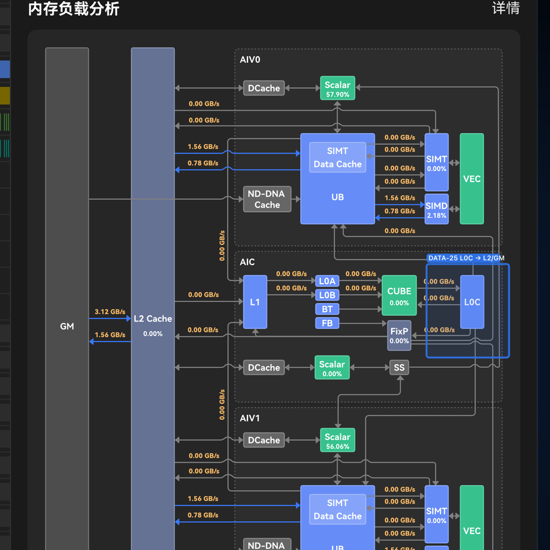

**Status:** `interim`

**Question:** **L0C → L2/GM** — show it? Which field? (`L0C_to_GM_datas(KB)`?)

**Interim:** show `Memory.csv` → `L0C_to_GM_datas(KB)` when present. Same **LOC** node as DATA-24.

### DATA-26 — L0C → UB

**Status:** `open`

**Question:** **L0C → UB** — show it? Which field? (None in the sample.)

### DATA-27 — Dual-Die / Remote memory

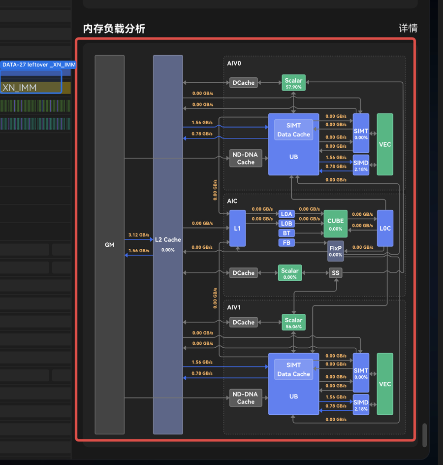

**Status:** `open`

**Question:** Dual-Die / Remote memory — show those arrows? Which fields? (Docx mentions remote/close-far access, but sample `L2Cache.csv` uses `r0`/`r1`.)

### DATA-28 — summary aggregation (mean / max / first / selected)

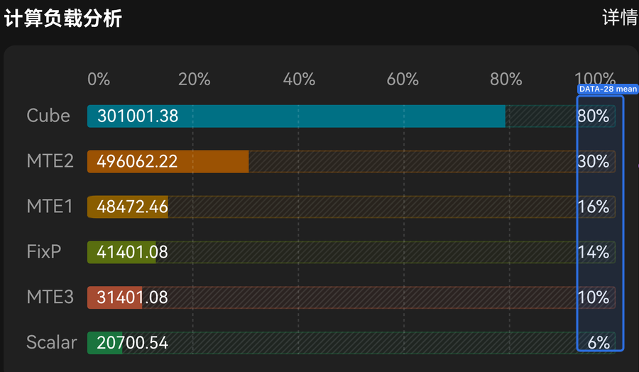

**Status:** `interim`

**Question:** A CSV often has many `block_id` rows. For summary numbers, **mean**, **max**, **first block**, or **selected block**?

**Interim:** [`DATA-33b`](INTERIM_DECISIONS.md): mean of non-`NA` values across `block_id` for summary PIPE / I/O measured BW. Product note: request a **general aggregation description document**.

### DATA-29 — same rule for every widget?

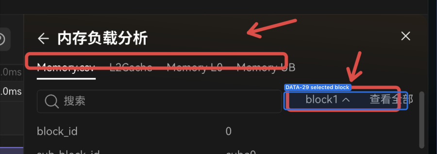

**Status:** `interim`

**Question:** Same aggregation rule for every widget (cards, PIPE, Roofline, memory diagram)?

**Interim:** [`DATA-33c`](INTERIM_DECISIONS.md): summary PIPE (and measured BW) stay mean-across-blocks; **详情** / memory diagram / metrics lists are the selected block. Roofline aggregates like [`DATA-33b`](INTERIM_DECISIONS.md).

### DATA-31 — authoritative MVP fixture shape (was: Q4)

**Status:** `partial`

**Question:** Authoritative MVP fixture shape?

**Answer so far:** Product target = sketch-like Gantt (A). **CI fixture** = `out.rep` until golden — [`DATA-31a`](INTERIM_DECISIONS.md).

### DATA-33 — report summary formulas (was: Q6)

**Status:** `interim`

**Question:** Report summary formulas?

**Answer so far (interim):** duration = `OpBasicInfo.csv` `Task Duration(us)`; I/O **measured** = `Memory.csv` `ai*_main_mem_{read|write}_bw`; I/O display **GB/s**. Compute TFLOPS and avg core util stay in the sketch grid as **title + `N/A`** until formulas exist. PIPE = mean non-`NA`. MIX Cube\|Vector + ICache Miss rows confirmed. **Open:** bandwidth **peak / score**, `block_id` mean vs max vs selected block. Interims: [`DATA-33a…DATA-33g`](INTERIM_DECISIONS.md).

### DATA-36 — dependencies encoding (was: Q9)

**Status:** `open` + `interim`

**Question:** Dependencies encoding?

**Interim:** [`DATA-36a`](INTERIM_DECISIONS.md) successor-list encoding via Chrome Trace `args`.

### DATA-37 — roofline formulas (was: Q11)

**Status:** `open`

**Question:** Roofline formulas?

**Interim:** [`DATA-37a…DATA-37f`](INTERIM_DECISIONS.md).

---

## UI questions

### UI-36 — KB vs GB/s units on the memory diagram

**Status:** `open`

**Question:** Some labels are **KB**, some **GB/s**. Keep both, or convert to one unit? (KB would be L0C datas.)

### UI-37 — Source / Details / Cache tabs (was: Q10)

**Status:** `open`

**Question:** Source / Details / Cache tabs?

**Specs:** [FEATURE_MATRIX](../ui/FEATURE_MATRIX.md), [UX_SPEC](../ui/UX_SPEC.md), [MSTT_INTEGRATION](../architecture/MSTT_INTEGRATION.md), [FORMATS_COMPARISON](../formats/FORMATS_COMPARISON.md)

### UI-40 — time units UX (was: Q14)

**Status:** `partial` + `interim`

**Question:** Time units UX?

**Answer so far:** Two-tier auto — [`UI-40a`](INTERIM_DECISIONS.md). Cycles deferred.

### UI-41 — gesture parity (was: Q19)

**Status:** `interim`

**Question:** Gesture parity?

**Interim:** Wheel/slider/drag MVP; W/S/A/D P2 — [`UI-41a`](INTERIM_DECISIONS.md).

---

## PROC questions

### PROC-2 — `.ncrep` vs `.rep` (was: Q2)

**Status:** `interim`

**Question:** `.ncrep` vs `.rep`?

**Interim:** Same layout/alias — [`PROC-2a`](INTERIM_DECISIONS.md).

### PROC-5 — acceptance owner (was: Q21)

**Status:** `open`

**Question:** Acceptance owner?

**Specs:** [PROJECT_GOALS](PROJECT_GOALS.md)

---

## PKG questions

### PKG-1 — package identity (was: Q16)

**Status:** `interim`

**Question:** Package identity?

**Interim:** [PACKAGING_SUGGESTIONS](PACKAGING_SUGGESTIONS.md) / [`PKG-1a`](INTERIM_DECISIONS.md).

### PKG-2 — design system / i18n (was: Q17)

**Status:** `interim`

**Question:** Design system / i18n?

**Interim:** [PACKAGING_SUGGESTIONS](PACKAGING_SUGGESTIONS.md) / [`PKG-2a`](INTERIM_DECISIONS.md).

### PKG-3 — PyPTO copy-paste license (was: Q18)

**Status:** `interim`

**Question:** PyPTO copy-paste license?

**Interim:** [PACKAGING_SUGGESTIONS](PACKAGING_SUGGESTIONS.md) / [`PKG-3a`](INTERIM_DECISIONS.md) — Legal before verbatim paste.
