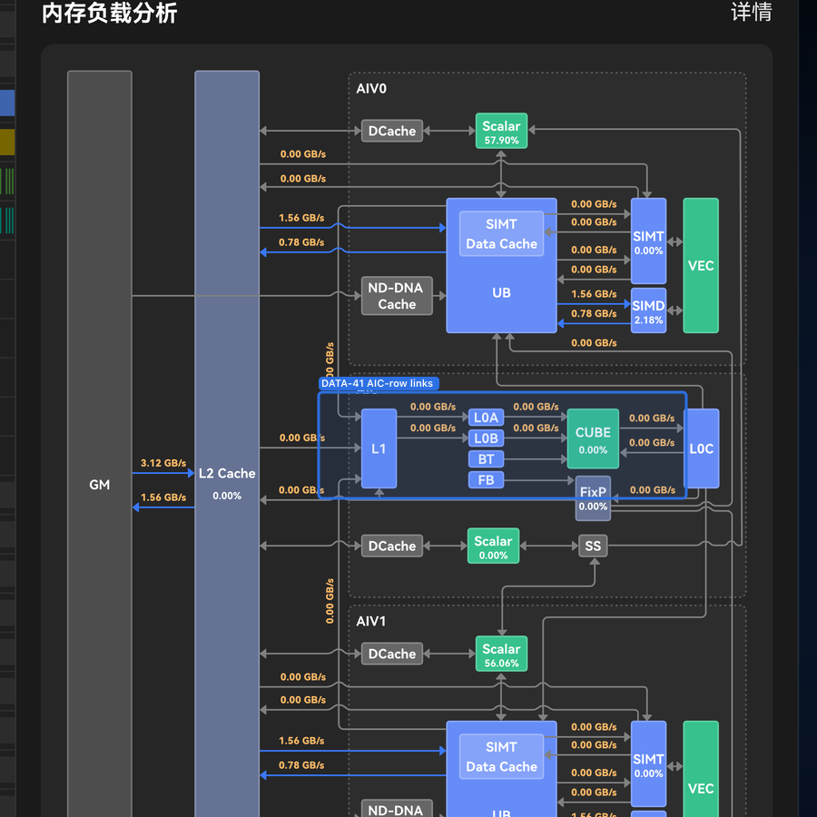

# DATA questions

Open **DATA** questions (file/field/formula data mapping). Status enum, prefix taxonomy, and migration map: [README.md](README.md).

## Roofline sub-questions — aliases of DATA-37

The seven **DATA-11…DATA-17** rows below are the granular roofline questions from the HQ/`Q11` batch. They keep permanent ids of their own, but carry the **same status as the [DATA-37](#data-37--roofline-formulas-was-q11) umbrella** and share its findings — ask Product for them together.

### DATA-11 — Roofline axes vs pipe busy rates

**Status:** `open` + `interim` — alias of [DATA-37](#data-37--roofline-formulas-was-q11).

**Question:** The Roofline chart plots **X = Ops/Byte** (arithmetic intensity) and **Y = TOps/s** (achieved performance). The producer doc's Roofline table instead points its three tab labels at **pipe busy rates** — `aic_cube_ratio`, `aic_mte2_ratio`, `aic_mte1_ratio` (`PipeUtilization.csv`). Busy-rate ratios cannot produce either axis, so: what are the real axis quantities, and are the tabs meant to be axes at all, or three separate bottleneck panels?

### DATA-12 — X axis Ops/Byte

**Status:** `open` + `interim` — alias of [DATA-37](#data-37--roofline-formulas-was-q11).

**Question:** **X axis = Ops/Byte** — which file, field(s), and formula? Does the **GM** point use the same formula and byte source as the **L2** point, or different ones? (Interim [DATA-37b](../decisions/interim/DATA.md): `fops ÷ ((read_main_memory_datas(KB) + write_main_memory_datas(KB)) × 1024)`.)

### DATA-13 — Y axis TOps/s

**Status:** `open` + `interim` — alias of [DATA-37](#data-37--roofline-formulas-was-q11).

**Question:** **Y axis = TOps/s** — which file, field(s), and formula? Raw FLOPS *counts* exist (`aiv_vec_fops`, `aic_cube_fops` on `ArithmeticUtilization.csv`) but there is no documented TOps/s conversion. Is it a per-side (Cube \| Vector) value or one combined number? (Interim [DATA-37a](../decisions/interim/DATA.md): `fops ÷ mean(*_time(us)) ÷ 1e6`.)

### DATA-14 — roof lines

**Status:** `open` + `interim` — alias of [DATA-37](#data-37--roofline-formulas-was-q11).

**Question:** The two **roof lines** — the bandwidth slope and the compute plateau — which file and fields? Peak compute ([DATA-3](../decisions/DATA.md): `aic/aiv_flops_theoretical`) and peak BW ([DATA-5](../decisions/DATA.md): `aicore_gm_bw_theoretical(GB/s)` = SOL **1600 GB/s**) are documented for the summary cards; nothing states whether the roofline roof reuses those values, or which one applies to which side.

### DATA-15 — L2 bytes

**Status:** `open` + `interim` — alias of [DATA-37](#data-37--roofline-formulas-was-q11).

**Question:** The chart legend has an **L2** series alongside GM, and the L2 point needs **bytes moved through L2**. Which field? `L2Cache.csv` carries hit/miss **counts** and hit **rates** only — no byte traffic. If no byte field exists, should the L2 series be dropped, or taken from another file? (Interim [DATA-37c](../decisions/interim/DATA.md): omit the L2 point.)

### DATA-16 — Vec_FP32 / Vec_MISC mix labels

**Status:** `open` + `interim` — alias of [DATA-37](#data-37--roofline-formulas-was-q11).

**Question:** The op-mix annotation above the plot prints labels such as `Vec_FP32` / `Vec_MISC`. Which file and fields feed them on **Cube vs Vector** ops, and when several mix ratios are non-zero at once, **which labels are shown, in what order, and with how much precision?**

**Answer so far:** Fields exist in `ArithmeticUtilization.csv` — `aiv_vec_{fp32,fp16,int32,int16,misc}_ratio`. The producer dictionary uses *different* names (`aiv_vec_{vf,sfu,simt_vf}_ratio`). The "which to show when many are non-zero" rule is undocumented.

### DATA-17 — Roofline tabs

**Status:** `open` + `interim` — alias of [DATA-37](#data-37--roofline-formulas-was-q11).

**Question:** Tabs **内存单元** / **内存通路** / **搬运单元** — what does each tab show, and is the tab set in scope at all this iteration (or should the panel stay single-chart)?

**Answer so far:** The producer doc maps 内存单元→`aic_cube_ratio`, 内存通路→`aic_mte2_ratio`, 搬运单元→`aic_mte1_ratio` (all `PipeUtilization.csv`) — the pipe-busy-rate mapping [DATA-11](#data-11--roofline-axes-vs-pipe-busy-rates) flags as wrong. No Product answer. (Interim [DATA-37f](../decisions/interim/DATA.md): hide the tabs.)

### DATA-31 — authoritative MVP fixture shape (was: Q4)

**Status:** `partial`

**Question:** Which fixture is authoritative for acceptance — the sketch-faithful Gantt (Card → Core → pipe hierarchy), or the flat AIV sample? Is there a golden report file Product will designate, and which properties must match (lane tree, values, chrome) versus which are pixel-cosmetic?

**Answer so far:** Product target = sketch-like Gantt (A). **CI fixture** = `out.rep` until golden — [`DATA-31a`](../decisions/interim/DATA.md).

### DATA-36 — dependencies encoding (was: Q9)

**Status:** `open` + `interim`

**Question:** How does the producer encode the dependency edges between timeline events — which Chrome Trace `args` keys, successor lists or predecessor lists, and how are ids made addressable? Are edges within one lane only, or also cross-lane?

**Interim:** [`DATA-36a`](../decisions/interim/DATA.md) successor-list encoding via Chrome Trace `args`.

### DATA-37 — roofline formulas (was: Q11)

**Status:** `open` + `interim`

**Release impact:** none this iteration — the Roofline card is **not in the current release**. It renders only for a host that opts in with the `roofline` capability ([FEATURE_MATRIX](../../ui/FEATURE_MATRIX.md)), so these questions block the Phase 2 card, not the current one. The same applies to the DATA-11…DATA-17 aliases below.

**Question:** Which file, field, and formula feeds **each element of the Roofline chart** — X axis (Ops/Byte), Y axis (TOps/s), the GM and L2 measured points, the two roof lines (peak bandwidth + peak compute), the op-mix labels, and the 内存单元 / 内存通路 / 搬运单元 tabs? The producer docs describe the chart's *purpose* but supply no formulas, so all seven sub-questions below are open and should be answered together.

Umbrella for the granular HQ twins retained as aliases: [DATA-11](#data-11--roofline-axes-vs-pipe-busy-rates) (axes vs pipe busy rates), [DATA-12](#data-12--x-axis-opsbyte) (X Ops/Byte), [DATA-13](#data-13--y-axis-topss) (Y TOps/s), [DATA-14](#data-14--roof-lines) (roof peaks), [DATA-15](#data-15--l2-bytes) (L2 bytes), [DATA-16](#data-16--vec_fp32--vec_misc-mix-labels) (mix labels), [DATA-17](#data-17--roofline-tabs) (tabs).

**Known so far (docs checked 2026-09-10):**

- **Axes (DATA-11–13):** not documented. NPU-Compute.md Q11–Q13 have no Product answer; the docx tab→field table (`aic_cube_ratio` / `aic_mte2_ratio` / `aic_mte1_ratio`, `PipeUtilization.csv`) is pipe busy rates, not axes.
- **Roof (DATA-14):** peak compute formulas *do* exist in NPU-Compute.md Q3 (`aic/aiv_flops_theoretical`) and peak BW = `aicore_gm_bw_theoretical` (SOL **1600 GB/s**, Q5), but the docs never wire them to the roofline roof.
- **L2 bytes (DATA-15):** absent — `L2Cache.csv` has hit/miss counts and hit *rates* only.
- **Mix (DATA-16):** fields exist in `ArithmeticUtilization.csv` (`aiv_vec_{fp32,fp16,int32,int16,misc}_ratio`); the docx dictionary uses `aiv_vec_{vf,sfu,simt_vf}_ratio`. The "which to show when many are non-zero" rule is undocumented.
- **Tabs (DATA-17):** docx maps 内存单元/内存通路/搬运单元 to the pipe ratios above — the mapping DATA-11 flags as wrong; no Product answer.

**Interim:** [`DATA-37a…DATA-37f`](../decisions/interim/DATA.md).

### DATA-40 — topology edge value aggregation vs the BW card

**Status:** `open` + `interim`

**Question:** A memory-diagram **edge** and the **带宽利用率 读/写 card** can describe the same GM↔L2 direction and then show different numbers, because the two surfaces use different aggregation rules. The edge takes the **first present non-`NA` candidate** (`aic_main_mem_read_bw` before `aiv_main_mem_read_bw`), while the card shows the **sum** of the aic + aiv sides ([DATA-8](../decisions/DATA.md)). Which one is the plate supposed to show — a single side, or the summed traffic? And more generally, for an edge fed by several candidate columns, is the rule **first non-`NA`**, the **sum**, or the **mean** of the candidates, and does it inherit the block selector ([DATA-19](../decisions/DATA.md) / [DATA-29](../decisions/DATA.md)) the same way the card does?

**Answer so far:** Nothing from Product — the producer's 理论值 column and the edge table say which file/field, not which aggregation. Both rules are currently documented and shipped:

- **Edge (interim, [DATA-40a](../decisions/interim/DATA.md)):** "prefer non-`NA` AIC then AIV" — `aic_main_mem_read_bw(GB/s)` then `aiv_main_mem_read_bw(GB/s)` for GM → L2, and the same shape for GM ← L2.
- **Card (resolved, [DATA-8](../decisions/DATA.md)):** `OpInfoSummary.aicore_gm_read_bw` / `aicore_gm_write_bw`, i.e. the aic + aiv sides summed.

**Why it reads as a contradiction:** on the product fixture [`sample.lite.rep`](../../../data/sample.lite.rep) op1 the GM → L2 arrow prints **560.00 GB/s** (AIC side only) while the 读 card one panel above prints **1092 GB/s** (560 + 532) — write is 480 vs 936. Neither number is wrong under its own rule; the two just never appear together in a mockup, so no sketch decides it.

**Roots / evidence:** `EDGE_MAP` in [memoryTopology.ts](../../../src/adapters/memoryTopology.ts) (`gm-l2-read` / `gm-l2-write` candidate order), the edge table in [VIEW_DATA_MAPPING §11.2.6](../../ui/VIEW_DATA_MAPPING.md), the DATA-8 I/O-bandwidth rule in [view-models.spec.md](../../../specs/core/view-models.spec.md), and the two mockups that show the surfaces apart — the card in [data-8.png](../visual/questions/data-8.png) and the plated diagram in [`v930/memory-load-detail.jpeg`](../../ui/source/v930/memory-load-detail.jpeg).

**Specs when answered:** [VIEW_DATA_MAPPING](../../ui/VIEW_DATA_MAPPING.md), [VIEW_DATA_REQUIREMENTS](../../formats/VIEW_DATA_REQUIREMENTS.md), [INPUT_FORMATS](../../formats/INPUT_FORMATS.md), [view-models.spec.md](../../../specs/core/view-models.spec.md), [MemoryTopologyPanel.spec.md](../../../src/ui/StatsAside/MemoryTopologyPanel/MemoryTopologyPanel.spec.md).

### DATA-41 — AIC-row link values and the L0C 理论值

**Status:** `open`

**Question:** The **AIC row** of the memory diagram (L1 ↔ L0A / L0B ↔ Cube ↔ L0C) carries values in the sketch, and the chrome has a plate for all seven of its plated links — `l2-l1-read`, `l1-l0a`, `l1-l0b`, `l0a-cube`, `l0b-cube`, `cube-l0c`, `l0c-cube` — but on the product fixture [`sample.lite.rep`](../../../data/sample.lite.rep) the whole row paints **blank**: `Memory.csv` `aic_l1_read_bw(GB/s)` / `aic_l1_write_bw(GB/s)` are `NA` in every block of both embedded ops, and "hide `NA`" then hides the labels. So: **(a)** which file and field is authoritative for each AIC-row plated link, and **(b)** is a fixture with non-`NA` AIC-row values available, so the row can be validated against the sketch? **Inherited from [DATA-20](../decisions/DATA.md):** for the slotless edges that carry a **理论值** — L0C → L1 and L0C → L2/GM ([DATA-24](../decisions/DATA.md) / [DATA-25](../decisions/DATA.md)) — which field holds the 理论值, and what is the edge's **100% reference**? The producer doc's 理论值 column is empty for every row.

**Answer so far:** None.

**Roots / evidence:** `EDGE_MAP` in [memoryTopology.ts](../../../src/adapters/memoryTopology.ts); the edge table in [VIEW_DATA_MAPPING §11.2.6](../../ui/VIEW_DATA_MAPPING.md); the AIC-row plates of the exported chrome ([memory-topology.svg](../../../src/ui/StatsAside/MemoryTopologyPanel/memory-topology.svg)); the sketch's AIC row in [`v930/report-stats-scrolled.jpeg`](../../ui/source/v930/report-stats-scrolled.jpeg).

**Specs when answered:** [MemoryTopologyPanel.spec.md](../../../src/ui/StatsAside/MemoryTopologyPanel/MemoryTopologyPanel.spec.md), [view-models.spec.md](../../../specs/core/view-models.spec.md), [VIEW_DATA_MAPPING](../../ui/VIEW_DATA_MAPPING.md), [INPUT_FORMATS](../../formats/INPUT_FORMATS.md).
