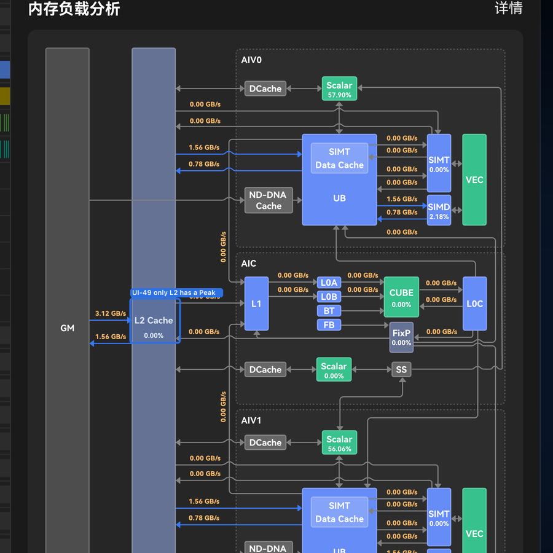

# UI questions

Open **UI** questions (presentation / UX). Status enum, prefix taxonomy, and migration map: [README.md](README.md).

### UI-48 — FixP corridor slot vs L1 write-back

**Status:** `open`

**Question:** The official chrome routes its lower L2↔AIC corridor link onto **FixP**. May the panel paint Memory.csv `aic_l1_write_bw` (`l2-l1-write`) on that slot, leave the slot blank, or should Product assign a different metric?

**Answer so far:** None. Until confirmed, the panel leaves that chrome slot blank (edge still exists in the model for 详情).

**Specs when answered:** [MemoryTopologyPanel](../../../src/ui/StatsAside/MemoryTopologyPanel/MemoryTopologyPanel.spec.md), [view-models](../../../specs/core/view-models.spec.md), [VIEW_DATA_REQUIREMENTS](../../formats/VIEW_DATA_REQUIREMENTS.md).

### UI-49 — Peak(%) badges beyond L2

**Status:** `open`

**Question:** [DATA-20](../decisions/DATA.md) resolved the **L2** plate: it shows **hit rate**, not a peak-relative percent. The exported chrome gives a Peak(%) plate to **no other unit** — GM, L1, L0A, L0B, L0C, Cube, FixP, UB, Vec and Scalar have no plate to print one in, and the adapter has no field for one. Should any other unit show a **Peak(%)** badge at all? If yes: does the **chrome** need a new (in-box) plate per unit, and what is each unit's **100% reference**?

**Answer so far:** None. The blocker is the **export**, not the sketch: the panel paints one in-box value (the L2 plate) and link magnitudes (GB/s, KB) everywhere else, so "L2 only" is a chrome limitation. The **sketch** carries **nine** further in-box `%` badges — AIV0/AIV1/AIC **Scalar `57.90% / 56.06% / 0.00%`**, AIV0/AIV1 **SIMT `0.00%`**, AIV0/AIV1 **SIMD `2.18%`**, **CUBE `0.00%`**, **FixP `0.00%`** (re-OCR of `visual/memory-topology.png`, 2026-09-14; an earlier reading of the same sketch mistook these for corridor link magnitudes — they are not, they sit **in-box** and read `%`, not `GB/s`). It is unresolved whether they are peak-relative or plain unit-utilisation percentages: the sketch states no 100% reference for any of them, and the producer docs give no per-unit peak for Cube/FixP/Scalar/SIMT/SIMD. The corridor values the same audit found are a separate gap: [DATA-42](DATA.md).

**Specs when answered:** [MemoryTopologyPanel](../../../src/ui/StatsAside/MemoryTopologyPanel/MemoryTopologyPanel.spec.md), [view-models](../../../specs/core/view-models.spec.md), [VIEW_DATA_MAPPING](../../ui/VIEW_DATA_MAPPING.md), [FEATURE_MATRIX](../../ui/FEATURE_MATRIX.md), [COLOR_TOKENS](../../ui/COLOR_TOKENS.md).

### UI-51 — Undo zoom scope

**Status:** `open`

**Question:** Does Undo zoom restore only the previous viewport window, or also vertical scroll, selection, and collapsed/pinned lane state?

**Answer so far:** Not implemented. Context-menu Undo zoom remains deferred until its history contract is defined.

**Specs when answered:** [ContextMenu.spec.md](../../../src/ui/ContextMenu/ContextMenu.spec.md), [INTERACTIONS.md](../../ui/INTERACTIONS.md).

### UI-52 — Offset action contract

**Status:** `open`

**Question:** Which event/lane data does Offset adjust, what value editor is used, and how is the change displayed or persisted?

**Answer so far:** Not implemented. Context-menu Offset remains deferred until its command contract is defined.

**Specs when answered:** [ContextMenu.spec.md](../../../src/ui/ContextMenu/ContextMenu.spec.md), [INTERACTIONS.md](../../ui/INTERACTIONS.md).

### UI-53 — Hide lane contract and restore path

**Status:** `open`

**Question:** Can a user hide an individual leaf lane, a folder, or both; where is the hidden state stored; and what UI restores hidden lanes?

**Answer so far:** Not implemented. Context-menu Hide lane remains deferred until its state and restore path are defined.

**Specs when answered:** [ContextMenu.spec.md](../../../src/ui/ContextMenu/ContextMenu.spec.md), [view-state.spec.md](../../../specs/core/view-state.spec.md), [INTERACTIONS.md](../../ui/INTERACTIONS.md).
