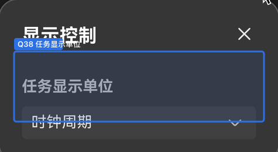

# UI questions

Open **UI** questions (presentation / UX). Status enum, prefix taxonomy, and migration map: [README.md](README.md).

### UI-36 — KB vs GB/s units on the memory diagram

**Status:** `open`

**Question:** Some labels are **KB**, some **GB/s**. Keep both, or convert to one unit? (KB would be L0C datas.)

### UI-37 — Source / Details / Cache tabs (was: Q10)

**Status:** `open`

**Question:** Source / Details / Cache tabs?

**Specs:** [FEATURE_MATRIX](../../ui/FEATURE_MATRIX.md), [UX_SPEC](../../ui/UX_SPEC.md), [MSTT_INTEGRATION](../../architecture/MSTT_INTEGRATION.md), [FORMATS_COMPARISON](../../formats/FORMATS_COMPARISON.md)

### UI-40 — time units UX (was: Q14)

**Status:** `partial` + `interim`

**Question:** Time units UX?

**Answer so far:** Two-tier auto **and** Time (auto) vs CPU clocks — [`UI-40a`](../decisions/interim/UI.md). Cycle *source* (true vs derived) → [UI-45](UI.md).

### UI-45 — Timeline CPU clocks — true vs derived (was: Q23 / HQ 38)

**Status:** `open` + `interim`

**Question:** Must timeline “CPU clocks” (event tooltip / detail strip) use **true** cycle-domain timestamps/counters from the producer, or is **derived** `ns × OpBasicInfo freq` acceptable? Should cycles also apply to the axis, cursor, or measure Δt?

- **A (interim / shipping):** derived via [`UI-40a`](../decisions/interim/UI.md) — `cycles = ns × freqMHz / 1000` (`currentFreq` when valid, else `ratedFreq`), integer, space-grouped, no suffix, no leading zeroes; scope = tooltip + detail only.
- **B:** drop the derived cycles mode; show real `*_total_cycles` only where present.
- **C:** producer adds per-event cycle timestamps (`start_cycles`/`end_cycles` or cycle-tick `ts`/`dur`).

**Interim:** time measurement / range Δt (and axis + cursor) always stay in wall time (`ms`/`µs`/`ns`), never cycles.

**Why open:** embeds have block `aic`/`aiv_total_cycles` only — no event cycle positions for axis/gaps/measure.

**Specs when answered:** METRICS_AND_TRACE, VIEW_DATA_REQUIREMENTS, FEATURE_MATRIX, format-time / INTERACTIONS.
