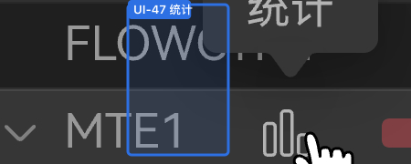

# Deferred questions (backlog)

Parked by Product — **out of this iteration**, not interim guesses and not resolved.

Each record keeps its domain id (`DATA-` / `UI-` / `PROC-` / `PKG-`) and is marked with the `deferred` status. A single flat file is the home for a one-item backlog; promote to `deferred/{PREFIX}.md` only if it grows.

Status enum, prefix taxonomy, and migration map: [README.md](README.md).

---

### UI-44 — pin grouping / folder nodes (was: D-PIN-FOLDER)

**Status:** `deferred`
**Question:** Pin grouping / folder nodes?
**Answer so far (deferred):** Do **not** ship folder/Card pin this iteration; leaf-only pin stays (`#51`).
**Parked work:** Branch `feat/pin-grouping-nodes` (PR [#69](https://github.com/IdeFrontend/profiling-report/pull/69) closed unmerged; branch kept).
**Revisit when:** Product schedules folder pin.

---

### UI-47 — Gutter mid-row 统计 control

**Status:** `deferred`
**Question:** What does the hover bar-chart control between the lane title and utilization bar do on click? Which rows show it (all leaves / pipes only / folders too)? What is the English (and confirmed Chinese) tooltip — bare **统计**, or something else?
**Answer so far (deferred):** Do **not** implement the mid-row 统计 control this iteration (no click behavior, no tooltip shipping).
**Sketch evidence:** [`v930/hardware-more-detail`](../../ui/source/v930/hardware-more-detail.jpeg) — MTE1 row; tooltip **统计**. Distinct from left-edge pin (**置顶**, [UI-44](deferred.md) / INTERACTIONS pin section).
**Not:** toolbar aside toggle (`t('stats')` → **报告**), StatsAside **报告统计**, or Card **时钟周期** ([UI-46](UI.md) / [DATA-38](DATA.md)).
**Revisit when:** Product schedules gutter mid-row 统计.
**Specs when answered:** [INTERACTIONS](../../ui/INTERACTIONS.md), [FEATURE_MATRIX](../../ui/FEATURE_MATRIX.md), [LaneGutter.spec.md](../../../src/ui/TimelineView/SwimlaneView/LaneGutter/LaneGutter.spec.md), [LOCALIZATION](../../ui/LOCALIZATION.md) / `src/i18n/index.ts`.
