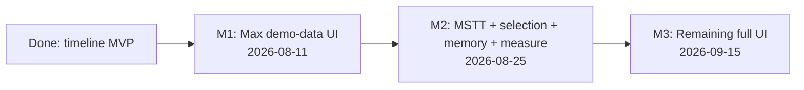

# Delivery roadmap

From the current **timeline MVP library** on `master` to **full UI** per [FEATURE_MATRIX.md](../../ui/FEATURE_MATRIX.md).

Per milestone, features are split into **Swimlane** vs **Other views**, plus **implementation tasks** and **potential blockers**. Details live in one file per milestone.

| Milestone | Target date | Focus | Doc |
|-----------|-------------|--------|-----|
| **M1** | **2026-08-11** | Max demo-data UI (mostly **Other views**; swimlane keep) | [milestone-1.md](milestone-1.md) · [M1_PROGRESS.md](M1_PROGRESS.md) |
| **M2** | **2026-08-25** | MSTT host + selection/deps + details + **memory graph** + **roofline** + **timeline time-range measure** | [milestone-2.md](milestone-2.md) · [M2_PROGRESS.md](M2_PROGRESS.md) |
| **M3** | **2026-09-15** | Remaining swimlane and other-views sketch UI | [milestone-3.md](milestone-3.md) |

## Current state (done)

**Swimlane:** parse → Canvas/WebGL hybrid lanes, gutter util, zoom/pan, overview brush, hover tooltip, single-select → detail dock with dependency mini-graph, dependency link curves, measure mode (度量模式), search, time units.

**Other views (M1–M2):** stacked 报告统计 aside — duration, interim roofline, PIPE bars (Cube|Vector toggle for MIX), memory topology graph with CSV edge labels, compute/memory CSV detail overlays (block switcher, 查看全部). Progress: [M1_PROGRESS.md](M1_PROGRESS.md), [M2_PROGRESS.md](M2_PROGRESS.md).

**MSTT host:** Ready on [`mstt` branch `feature/profiling-report`](https://github.com/IdeFrontend/mstt/tree/feature/profiling-report); library open PR [#29](https://github.com/IdeFrontend/profiling-report/pull/29) (layout).

**Still open (Product):** DATA-36 dep encoding in real `.rep`; DATA-37 roofline formulas (interim shipped); UI-42 measure → aside sync.

**Design frames:** M1 — Cube/Vector MIX toggle + compute/memory detail tabs (`v930/compute-load`, `v930/compute-load-detail`, `v930/memory-load-detail`); M2 — 度量模式 (`v930/task-measure-mode`; local overlay, aside unchanged) + topology edge values (`v930/memory-load-detail`). Index: [`DESIGN_INDEX.md`](../../ui/DESIGN_INDEX.md).

## Related

- [DEVELOPMENT.md](../DEVELOPMENT.md) — engineering process and completed library milestones 1–4
- [MSTT_INTEGRATION.md](../../architecture/MSTT_INTEGRATION.md) — host wiring (delivery M2)
- [FEATURE_MATRIX.md](../../ui/FEATURE_MATRIX.md) — MVP vs Phase 2+ checklist
