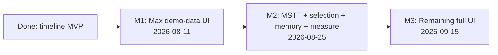

# Delivery roadmap

From the current **timeline MVP library** on `master` to **full UI** per [FEATURE_MATRIX.md](../../ui/FEATURE_MATRIX.md).

Per milestone, features are split into **Swimlane** vs **Other views**, plus **implementation tasks** and **potential blockers**. Details live in one file per milestone.

| Milestone | Target date | Focus | Doc |
|-----------|-------------|--------|-----|
| **M1** | **2026-08-11** | Max demo-data UI (mostly **Other views**; swimlane keep) | [milestone-1.md](milestone-1.md) |
| **M2** | **2026-08-25** | MSTT host + selection/deps + details + **memory graph** + **roofline** + **timeline time-range measure** | [milestone-2.md](milestone-2.md) |
| **M3** | **2026-09-15** | Remaining swimlane and other-views sketch UI | [milestone-3.md](milestone-3.md) |

## Current state (done)

**Swimlane:** parse → canvas lanes, gutter util, zoom/pan, overview brush, hover tooltip, single-select → compact `DetailStrip`, search, time units.

**Other views:** thin `OpBasicInfo` summary + PIPE bars only.

**Unused in [`data/out.rep`](../../../data/out.rep):** `ArithmeticUtilization`, `L2Cache`, `Memory*`, `ResourceConflictRatio` CSVs; richer OpBasicInfo columns. No dep encoding in fixture (Q9 open).

**Product changelog:** [`docs/source/changes/changes.png`](../../source/changes/changes.png) — M1 absorbs #2–#4 (Cube/Vector MIX toggle, compute/memory detail tabs + block + 查看全部); M2 absorbs #1 (度量模式 time-range measure) + #5 (topology edge values). Cross-view measure sync is [Q22](../../context/OPEN_QUESTIONS.md).

## Related

- [DEVELOPMENT.md](../DEVELOPMENT.md) — engineering process and completed library milestones 1–4
- [MSTT_INTEGRATION.md](../../architecture/MSTT_INTEGRATION.md) — host wiring (delivery M2)
- [FEATURE_MATRIX.md](../../ui/FEATURE_MATRIX.md) — MVP vs Phase 2+ checklist
