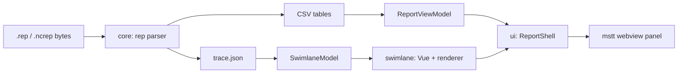

# Architecture

## Packaging decision

profiling-report ships as a **reusable Vue 3 library** consumed by host apps (MSTT first), **not** as a sealed HTML webview bundle.

This supersedes the webview-bundle recommendation in the archived [SWIMLANE_WEBVIEW_REUSE_REPORT.md](../../research/SWIMLANE_WEBVIEW_REUSE_REPORT.md) for this project. Reasons:

- MSTT already builds first-party panels with Vue 3 + Vite + Ant Design Vue.
- A library integrates via normal imports, shared theming, and typed props/emits.
- Hosts keep VS Code webview lifecycle; the library stays framework-UI only.

## Single package, internal modules

Prefer one publishable package with clear folders (can split later if needed):

```text
profiling-report/
  packages/profiling-report/          # or repo root src/ when implementation starts
    src/
      core/           # .rep parse, CSV parse, TraceModel / ReportViewModel
      swimlane/       # renderer (Canvas and/or WebGL) + swimlane Vue wrapper
      ui/             # ReportShell, StatsPanel, PipePanel, DetailStrip, …
      index.ts        # public exports
```

Logical names used in docs:

| Module | Responsibility |
|--------|-----------------|
| **core** | Binary `.rep` reader, CSV → metrics, Chrome Trace → swimlane model |
| **swimlane** | Timeline renderer + lane layout; no VS Code APIs |
| **ui** | Vue components composing the report shell |

## Data flow



### Host responsibilities

- Read file from disk / remote into `ArrayBuffer` or `Uint8Array`
- Create VS Code `WebviewPanel`, CSP, asset URIs
- Inject theme / locale
- Route open events for `.rep` / `.ncrep`
- Optional: persist UI state (zoom, selected event id)

### Library responsibilities

- Parse container and embeds
- Build view-models
- Render swimlane and panels
- Emit events: `ready`, `select`, `error`, `configChange`

### Suggested public API (illustrative)

```ts
// Props
interface ProfilingReportProps {
  source: ArrayBuffer | Uint8Array | ParsedReport;
  theme?: 'light' | 'dark';
  locale?: string;
  capabilities?: ReportCapability[]; // e.g. 'dependencies' | 'roofline'
}

// Emits
type ProfilingReportEmits = {
  ready: [];
  select: [event: SelectedEvent | null];
  error: [error: { message: string; cause?: unknown }];
};
```

Library must **not** depend on `useViewServer()`, `window.vscode`, or PyPTO DevUI.

## Canonical models (library-owned)

Align swimlane DTO with the reuse report’s TraceModel spirit:

```ts
interface SwimlaneModel {
  processes: SwimProcess[];
  minTime: number; // ns
  maxTime: number;
  metadata?: Record<string, unknown>;
}

interface SwimProcess {
  id: string;
  name: string;
  threads: SwimThread[];
}

interface SwimThread {
  id: string;
  name: string;
  utilization?: number; // 0..1 for gutter bar
  events: SwimEvent[];
}

interface SwimEvent {
  id: string;
  name: string;
  startTime: number;
  duration: number;
  args?: Record<string, unknown>;
  dependencies?: { predecessors: string[]; successors: string[] };
}
```

`ReportViewModel` aggregates OpBasicInfo + pipe/memory/arithmetic summaries for the right panel.

## Renderer strategy

See [SWIMLANE_IMPLEMENTATIONS.md](../../research/SWIMLANE_IMPLEMENTATIONS.md).

- **MVP:** Canvas 2D (or thin WebGL) sufficient for sample-scale traces; Vue chrome around it.
- **Target:** Hybrid — TypeScript WebGL interval layer (Sudu coverage-AA idea) + DOM/Canvas overlays for text and hit-testing.
- Copy-paste from PyPTO allowed for layout math, color tables, time formatting — strip host coupling.

## Theming

- Prefer CSS variables compatible with MSTT / VS Code theme injection.
- Dark default matching sketches; light mode supported via tokens.

## Testing fixtures

- Golden unpack of `data/out.rep`
- Unit tests for head/file-info parsing
- Component fixture: load sample bytes in Storybook or Vite demo app (implementation phase)

## Copy-paste policy

| Allowed | Not required |
|---------|----------------|
| PyPTO `eventRender` / mipmap / time utils ideas | Refactoring pypto_toolkit |
| Trace → process/thread mapping concepts | Shared monorepo with pypto |
| Sudu shader math (reimplement in TS) | Maven/TeaVM dependency on sudu-editor |
