# Visualization View ↔ Data Mapping

Clean specification of **UI sections**, **interactions**, and **display → field → source** mappings from product spec §11.2 可视化界面数据关联. Source mockups live under [`docs/specs/ui/source/`](../ui/source/).

Input schemas: [INPUT_FORMATS.md](../formats/INPUT_FORMATS.md).

Design reference (docx): [HDesign mock](https://octo-g.hdesign.huawei.com/developerPreview/developer/index.html#edit&uniqueId=Cbt3Yr1Wzd6zfmVfNkJOYQ-50712&pageId=1001695).

---

## Overview

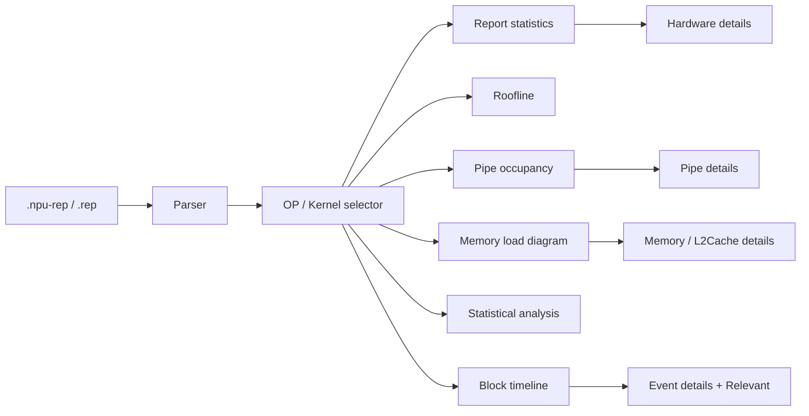

Mockups extracted from the source docx live under [`docs/specs/ui/source/`](../ui/source/).

---

## 11.2.2 Entry information

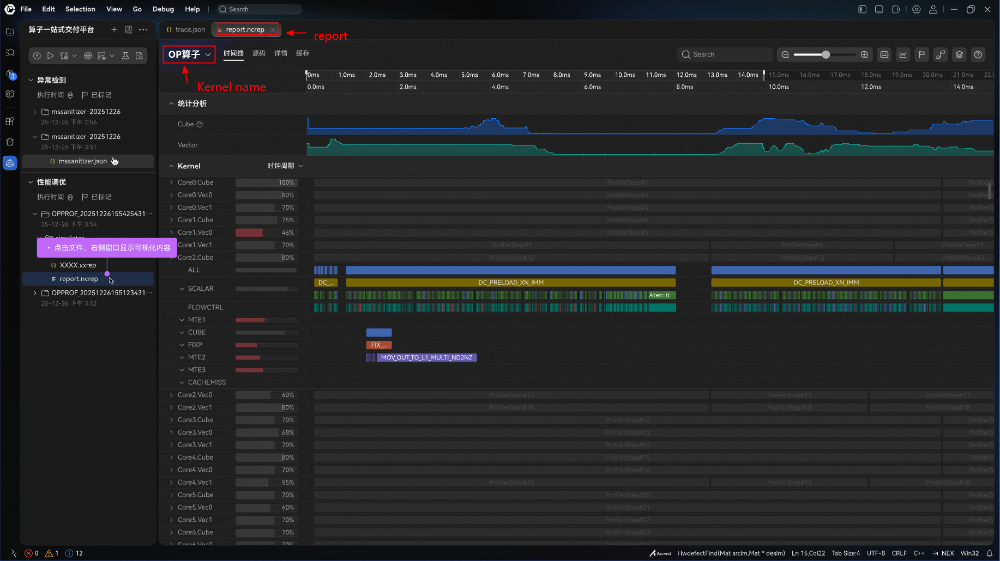

| # | UI | Behavior / data |
| --- | --- | --- |
| 1 | Report file | Open `report_<timestamp>_<rand id>.npu-rep` (product). Clicking the report opens the visualization pane. |
| 2 | OP 算子 selector | Choose among operators / kernels packaged in the report (docx: “npu-rep 中包含的 … 文件个数的选择”). Drives which metric rows / nested payloads feed all downstream views. |

**Rendering rules**

- Left explorer shows profiling run folders; selecting the report file loads the viewer.
- Top dropdown filters the active OP / kernel name.
- Main chrome includes tabs such as 时间线 / 源码 / 详情 / 缓存 (exact tab set follows product design; timeline is the primary swimlane surface).

---

## 11.2.3 Report statistics（报告统计）

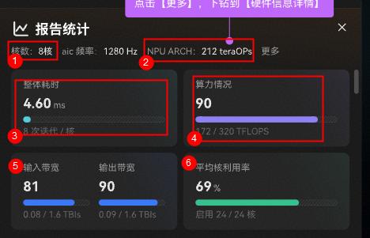

### Field mapping

| # | Display (CN) | Field | Source | Notes |
| --- | --- | --- | --- | --- |
| 1 | 进程ID | `PID` / `Pid` | `OpBasicInfo.csv` | |
| 2 | 算子类型 | `OpType` / `Op Type` | `OpBasicInfo.csv` | e.g. `vector`, `MIX` |
| 3 | Blocks | `Block Dim` | `OpBasicInfo.csv` | |
| 4 | 整体耗时 | `Task Duration（us）` / `Task Duration(us)` | `OpBasicInfo.csv` | Shown as ms in mockup (unit conversion in UI) |
| 5 | 算力情况 | — | — | **Unspecified in docx** |
| 6 | 输入带宽 | — | — | **Unspecified in docx** |
| 7 | 输出带宽 | — | — | **Unspecified in docx** |
| 8 | 平均核利用率 | — | — | **Unspecified in docx** |

### Visualization logic (from mockup)

| Element | Behavior |
| --- | --- |
| Header shell | Title **报告统计** + decorative chart icon + close (X). Close clears `asideVisible`. |
| Meta row | Segments **核数** / **aic频率** / **NPU ARCH** only when `SummaryMetrics.coreCount` / `currentFreq` / `npuArchLabel` are set. Hide entire meta row if all empty. Do **not** invent values. Adapter may leave cores/ARCH unset until `HardwareInfo` mapping exists; `Current Freq` from OpBasicInfo feeds aic频率. **`Rated Freq` / `ratedFreq` is intentionally not shown** on this shell (sketch aic频率 only). |
| 更多 | Visible when meta row is visible **or** capability `hardwareDetails`. Emit `open-hardware-details` only — full **硬件信息详情** panel (§11.2.3.1) remains **out of MVP (Q7)**. |
| 整体耗时 card | Large duration + progress bar; secondary text like iterations/core |
| 算力情况 card | Score / ratio bar + absolute TFLOPS vs peak |
| 输入/输出带宽 card | Dual bars with measured / peak TB/s |
| 平均核利用率 card | Percentage bar + enabled cores fraction |

Do **not** invent formulas for cards 5–8 until product defines fields; wire only once sources are known.

---

## 11.2.3.1 Hardware details（硬件信息详情）

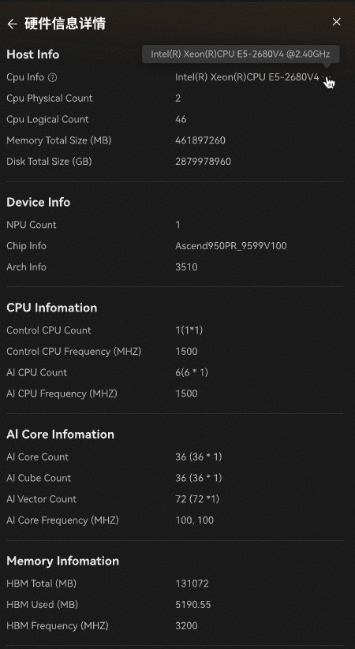

**Source:** `HardwareInfo.jsonl` (one object per line, `category` discriminator).

| Section (UI) | Typical fields |
| --- | --- |
| Host Info | Cpu Info (optional), Cpu Physical/Logical Count, Memory Total Size (MB), Disk Total Size (GB) |
| Device Info | NPU Count, Chip Info, Arch Info |
| CPU Information | Control / AI CPU count and frequency (MHZ) |
| AI Core Information | AI Core / Cube / Vector counts, AI Core Frequency (MHZ) list |
| Memory Information | HBM Total / Used (MB), HBM Frequency (MHZ) |

**Interaction:** opened from 报告统计 → 更多; dismiss with close control. Label left / value right layout.

**Gap:** file absent from local [`data/out.rep`](../../../data/out.rep); viewer should hide or empty-state this panel when missing.

---

## 11.2.4 Roofline bottleneck analysis（Roofline 瓶颈分析）

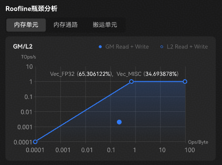

### Tabs → fields (as in docx)

| # | Display (CN) | Field | Source |
| --- | --- | --- | --- |
| 1 | 内存单元 | `aic_cube_ratio` | `PipeUtilization.csv` |
| 2 | 内存通路 | `aic_mte2_ratio` | `PipeUtilization.csv` |
| 3 | 搬运单元 | `aic_mte1_ratio` | `PipeUtilization.csv` |

### Visualization logic

- Log–log chart: Y = performance (TOps/s), X = arithmetic intensity (Ops/Byte).
- Theoretical roof: bandwidth slope + compute plateau; filled achievable region.
- Measured point(s) for GM vs L2 series (legend: GM Read+Write solid; L2 Read+Write hollow in mockup).
- Op-mix annotation (e.g. `Vec_FP32` / `Vec_MISC` %) — candidate source `ArithmeticUtilization.csv` (not listed in product field table).

**Contradictions / gaps (do not implement as-is):**

1. Tab labels are memory-oriented (内存单元 / 通路 / 搬运) while mapped fields are **pipe utilization ratios** (`aic_cube_ratio`, `aic_mte2_ratio`, `aic_mte1_ratio`). Possible mislabel or incomplete mapping.
2. Those ratios alone **cannot** supply Ops/Byte or TOps/s for the chart axes, nor peak bandwidth / peak compute for the roof. Product must define the real formulas and hardware-limit sources.

---

## 11.2.5 Pipe occupancy / compute load（PIPE 占用率）

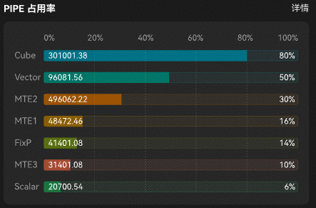

**Rule (product table + changelog):** for `OpType == MIX`, show **Cube \| Vector** segmented control and the active side’s bars (plus ICache rates when present). See [`docs/source/changes/changes.png`](../../source/changes/changes.png) #2.

**Layout (confirmed):** use the **Cube / Vector field tables** below with a MIX toggle — not a single combined bar list. `pipe-occupancy.png` remains a visual style reference for bar chrome. Non-MIX ops show only the relevant Cube or Vector set; omit or placeholder `NA` values.

### Cube occupancy

| # | Display | Field | Source |
| --- | --- | --- | --- |
| 1 | Cube | `aic_cube_ratio` | `PipeUtilization.csv` |
| 2 | MTE2 | `aic_mte2_ratio` | `PipeUtilization.csv` |
| 3 | MTE1 | `aic_mte1_ratio` | `PipeUtilization.csv` |
| 4 | FIXP | `aic_fixpipe_ratio` | `PipeUtilization.csv` |
| 5 | Scalar | `aic_scalar_ratio` | `PipeUtilization.csv` |
| 6 | ICache Miss | `aic_icache_miss_rate` | `PipeUtilization.csv` |

### Vector occupancy

| # | Display | Field | Source |
| --- | --- | --- | --- |
| 1 | Vector | `aiv_vec_ratio` | `PipeUtilization.csv` |
| 2 | MTE2 | `aiv_mte2_ratio` | `PipeUtilization.csv` |
| 3 | MTE3 | `aiv_mte3_ratio` | `PipeUtilization.csv` |
| 4 | Scalar | `aiv_scalar_ratio` | `PipeUtilization.csv` |
| 5 | ICache Miss | `aiv_icache_miss_rate` | `PipeUtilization.csv` |

### Visualization logic

- Horizontal 0–100% tracks; solid fill = ratio; hatched remainder.
- Optional absolute metric (time/cycles) drawn inside the filled segment (mockup).
- 详情 link opens §11.2.5.1.
- Summary PIPE bars for the aside default view may still use mean-across-blocks aggregation ([I-Q6b](../../context/INTERIM_DECISIONS.md)); detail tabs are block-scoped ([I-Q6c](../../context/INTERIM_DECISIONS.md)).

---

## 11.2.5.1 Compute-load details（计算负载分析详情）

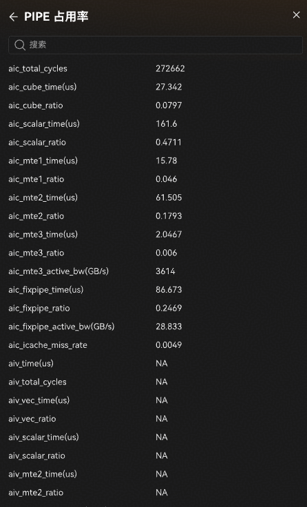

Changelog [#3](../../source/changes/changes.png): detail surface uses **tabs**:

| Tab | Source CSV |
| --- | --- |
| `PipeUtilization` | `PipeUtilization.csv` |
| `ArithmeticUtilization` | `ArithmeticUtilization.csv` |
| `ResourceConflictRatio` | `ResourceConflictRatio.csv` |

Render a searchable key–value (or table) list of all columns for the **selected block** ([I-Q6c](../../context/INTERIM_DECISIONS.md)):

- AIC group: cycles, `*_time(us)`, `*_ratio`, active BW, ICache miss, scalar stall/wait breakdowns.
- AIV group: same pattern; display `NA` when absent.
- Hide a tab when its CSV is missing from the report.

---

## 11.2.6 Memory load analysis（内存负载分析）

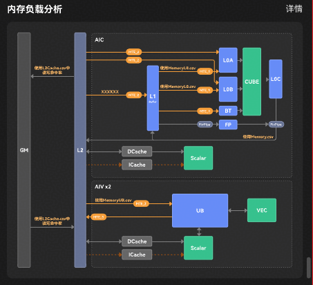

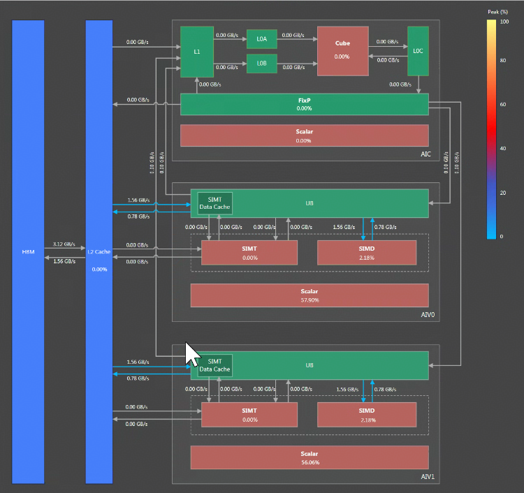

**Note (docx):** dual-Die / Remote memory — open whether right-click details exist.

**Changelog #5:** topology redraw must show **real CSV values** on buffer connection lines (not placeholders).

### Edge → field → source (engineering mapping for M2)

Use this table for `MemoryTopologyPanel` labels. Product may refine ([Q12](../../context/OPEN_QUESTIONS.md)); until then treat sample column names as canonical.

| Display edge | Field | Source | Notes |
| --- | --- | --- | --- |
| GM ← L2 | `aic_main_mem_read_bw(GB/s)` / `aiv_main_mem_read_bw(GB/s)` | `Memory.csv` | Prefer non-`NA` AIC then AIV |
| GM → L2 | `aic_main_mem_write_bw(GB/s)` / `aiv_main_mem_write_bw(GB/s)` | `Memory.csv` | |
| L2 → L1 | `aic_l1_read_bw(GB/s)` | `Memory.csv` | No `MemoryL1.csv` in sample |
| L2 ← L1 | `aic_l1_write_bw(GB/s)` | `Memory.csv` | |
| L1 → L0A | `aic_l0a_read_bw(GB/s)` | `MemoryL0.csv` | |
| L1 → L0B | `aic_l0b_read_bw(GB/s)` | `MemoryL0.csv` | |
| L0A → Cube | `aic_l0a_write_bw(GB/s)` | `MemoryL0.csv` | |
| L0B → Cube | `aic_l0b_write_bw(GB/s)` | `MemoryL0.csv` | |
| L0C → Cube | `aic_l0c_read_bw_cube(GB/s)` | `MemoryL0.csv` | |
| Cube → L0C | `aic_l0c_write_bw_cube(GB/s)` | `MemoryL0.csv` | |
| L0C → L1 | `L0C_to_L1_datas(KB)` | `Memory.csv` | |
| L0C → L2 | `L0C_to_GM_datas(KB)` | `Memory.csv` | |
| UB → L2 | `aiv_ub_to_gm_bw(GB/s)` or `aiv_ub_read_bw_gm(GB/s)` | `Memory.csv` / `MemoryUB.csv` | Prefer first present non-`NA` |
| L2 → UB | `aiv_gm_to_ub_bw(GB/s)` or `aiv_ub_write_bw_gm(GB/s)` | `Memory.csv` / `MemoryUB.csv` | |
| Vec → UB | `aiv_ub_read_bw_vector(GB/s)` | `MemoryUB.csv` | |
| UB → Vec | `aiv_ub_write_bw_vector(GB/s)` | `MemoryUB.csv` | |
| L2Cache Hit Rate | first `*_hit_rate(%)` | `L2Cache.csv` | AIC/AIV column choice TBD |

Omit edge label when value is missing/`NA`. Edge thickness stays static.

### Visualization logic

- Static architecture template: GM/HBM → L2 → AIC (L1, L0A/B/C, Cube, FixP, Scalar) and AIV×2 (UB, Vec/SIMT/SIMD, Scalar).
- Overlay **GB/s** (or KB) on edges from the mapping table; emphasize non-zero paths.
- Overlay **Peak (%)** utilization on units only when a field mapping exists (still open for many units).
- Labels are **block-scoped** via the same block switcher as memory details ([I-Q6c](../../context/INTERIM_DECISIONS.md)).

---

## 11.2.6.1 Memory load details

Changelog [#4](../../source/changes/changes.png):

| Control | Behavior |
| --- | --- |
| Tabs | `Memory L1` (`Memory.csv`), `L2Cache` (`L2Cache.csv`), `Memory L0` (`MemoryL0.csv`), `Memory UB` (`MemoryUB.csv`) — hide tab if CSV absent |
| Block switcher | Filter rows to selected `block_id` ([I-Q6c](../../context/INTERIM_DECISIONS.md)); default = first block |
| 查看全部 | Emit open-full-CSV intent; host/playground opens complete CSV in a new tab ([I-Q6d](../../context/INTERIM_DECISIONS.md)) |

Searchable key–value / table of columns for the active tab + block. Show `NA` when present.

---

## 11.2.7 Statistical analysis（统计分析）

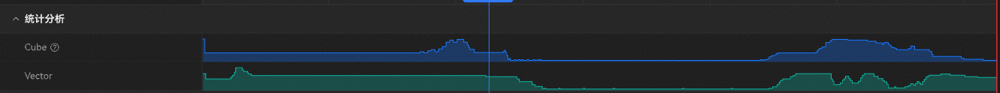

Docx placeholder samples:

```json
{"category":"Cube",1:1,2:2}
{"category":"Vector",1:1,2:2}
```

Treat as illustrative only (invalid JSON / stub series).

### Visualization logic

- Collapsible section with synchronized **Cube** and **Vector** area charts over time.
- Shared time axis with a vertical scrubber aligned to the Kernel timeline below.
- Series provenance not specified in docx; candidates: aggregated pipe busy from timeline events, or derived block time series. Mark as **TBD** until product defines the series file.

---

## 11.2.8 Kernel block-level timeline

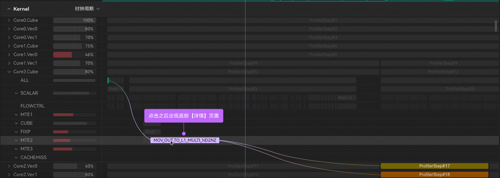

Docx field table is **empty**. Behavior from mockups + sample `trace.json`:

### Structure

| UI region | Content |
| --- | --- |
| Left tree | Hierarchical Kernel → `CoreN.Cube` / `CoreN.Vec*` → pipes (`SCALAR`, `MTE1/2/3`, `CUBE`, `FIXP`, `CACHEMISS`, …) with utilization % bars |
| Main pane | Gantt / swimlane blocks on a time or **时钟周期** axis |
| Selection | Click block → bottom **详情** (§11.2.8.1) |
| Dependencies | Curved connectors between related blocks |

### Sample data binding (local)

| Need | Sample source |
| --- | --- |
| Lane identity | `thread_name` metadata (`AIV0/PIPE_FIX/status`, …) |
| Intervals | `ph:"X"` events (`ts`, `dur`, `name`, `cat`, `args`) |
| Pipe busy states | `args.state_PIPE_*` on pipe-state records |

Utilization % per row and nested `ProfilerStep#*` / ISA-like labels in the mockup exceed the sample trace richness — full binding remains TBD.

---

## 11.2.8.1 Pipeline / event details（流水中详情 / 详情）

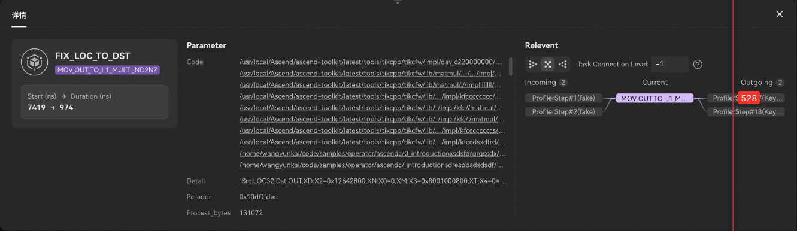

Docx table empty. Mockup layout:

| Region | Content |
| --- | --- |
| Summary | Task name, subtype/tag, Start (ns) → Duration (ns) |
| Parameters | `Code` (source paths), `Detail` (register/memory string), `Pc_addr`, `Process_bytes` |
| Relevant | Local dependency graph: Incoming → Current → Outgoing; connection level control; optional edge badge (counts/latency) |

**Interaction:** activated by clicking a timeline block (callout in mockup: 点击之后出现底部【详情】页面).

**Gap:** these detail fields are not in sample `trace.json`; require a richer event payload or side table not defined in the docx.

---

## Open questions / TBD (visualization)

Full prioritized list for the product owner: [OPEN_QUESTIONS.md](../OPEN_QUESTIONS.md).

| Topic | Source status |
| --- | --- |
| Report-stat cards 5–8 field derivation | Empty in product tables |
| Stats header 核数 / freq / NPU ARCH source | HardwareInfo vs OpBasicInfo unresolved |
| Roofline tab names vs pipe-ratio fields; missing axis formulas | Contradictory / incomplete |
| Pipe occupancy: combined mockup vs Cube/Vector tables | Layout conflict |
| Dual-Die remote memory right-click details | Explicit product question |
| Memory Peak (%) per unit | No field mapping |
| L2 hit-rate column choice; MemoryL1 vs Memory.csv | Incomplete |
| L0C → UB edge | 待确定 |
| UB↔GM column file + read/write direction | Name mismatch |
| Statistical analysis series schema | Placeholder only |
| Timeline + event-detail field tables | Empty; mockup-driven |
| HardwareInfo / MemoryL1 availability | Missing from sample archive |
| Container magic `npu-rep` vs local `cann-rep` | See [INPUT_FORMATS §1](../formats/INPUT_FORMATS.md#1-report-container) |
| `ResourceConflictRatio.csv` | In sample; no UI mapping |
| Block-level aggregation for OP summary cards | Unspecified (sample has 8 blocks) |

---

## Mockup index

| File | Section |
| --- | --- |
| [`entry-overview.png`](../ui/source/entry-overview.png) | Entry + overall timeline chrome |
| [`npu-rep-layout.png`](../ui/source/npu-rep-layout.png) | Container binary layout |
| [`report-stats.png`](../ui/source/report-stats.png) | Report statistics |
| [`hardware-details.png`](../ui/source/hardware-details.png) | Hardware details |
| [`roofline.png`](../ui/source/roofline.png) | Roofline |
| [`pipe-occupancy.png`](../ui/source/pipe-occupancy.png) | Pipe occupancy bars |
| [`pipe-details.png`](../ui/source/pipe-details.png) | Pipe details list |
| [`memory-topology-annotated.png`](../ui/source/memory-topology-annotated.png) | Memory topology + CSV annotations |
| [`memory-load-heatmap.png`](../ui/source/memory-load-heatmap.png) | Memory load with BW / peak % |
| [`statistical-analysis.png`](../ui/source/statistical-analysis.png) | Cube/Vector statistical tracks |
| [`kernel-block-timeline.png`](../ui/source/kernel-block-timeline.png) | Block timeline |
| [`event-details.png`](../ui/source/event-details.png) | Event / Relevant details |
