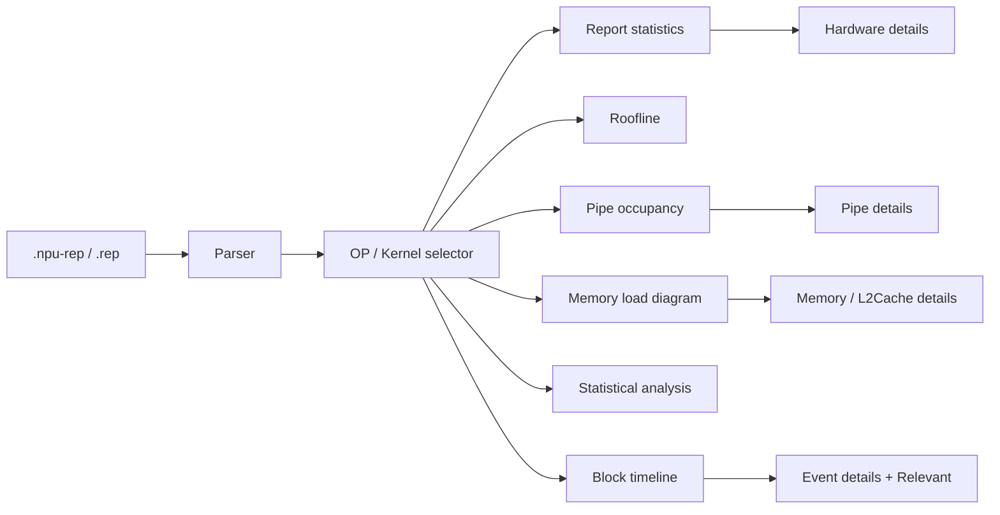
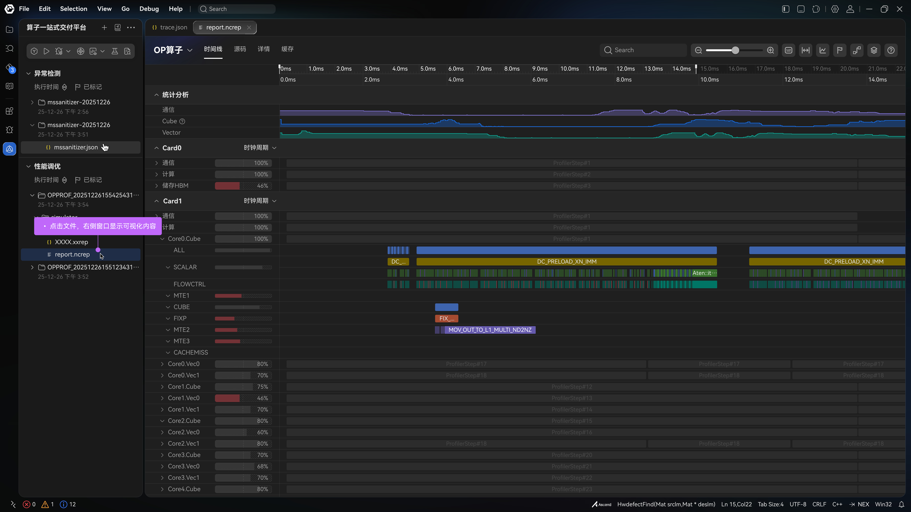
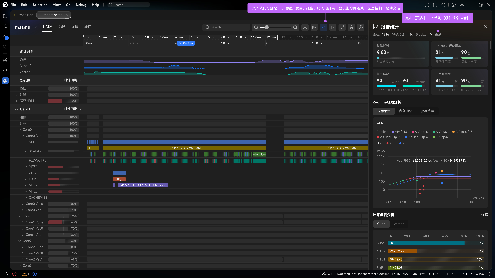
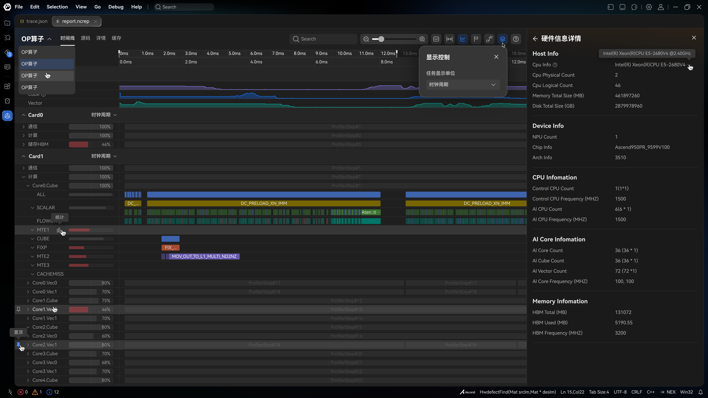
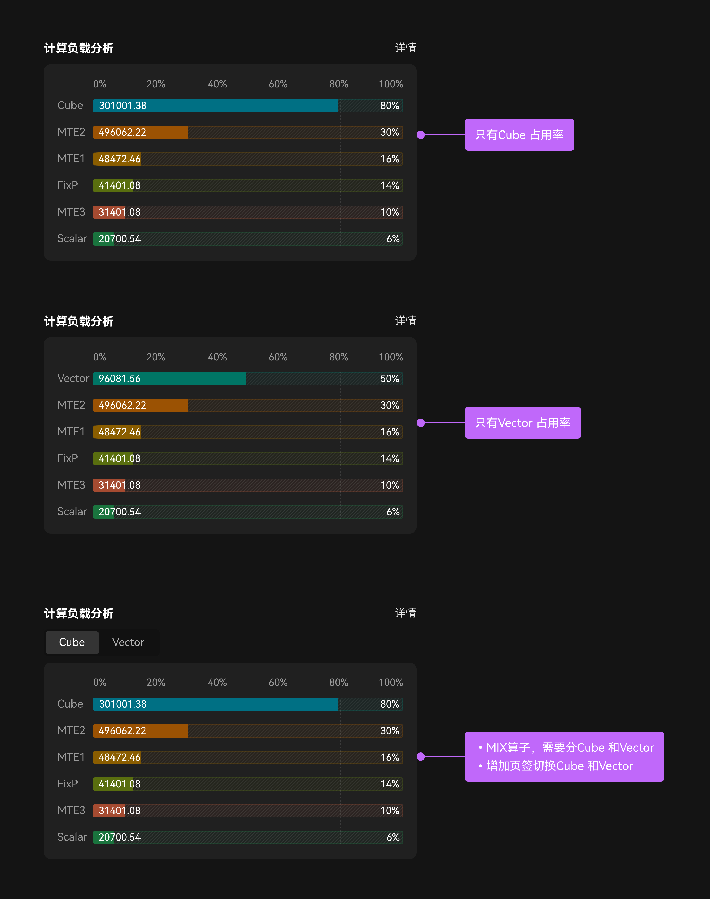
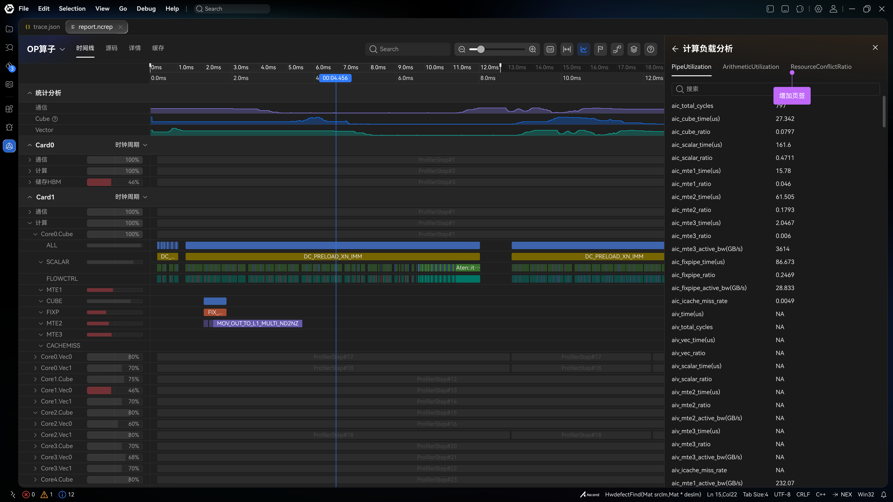
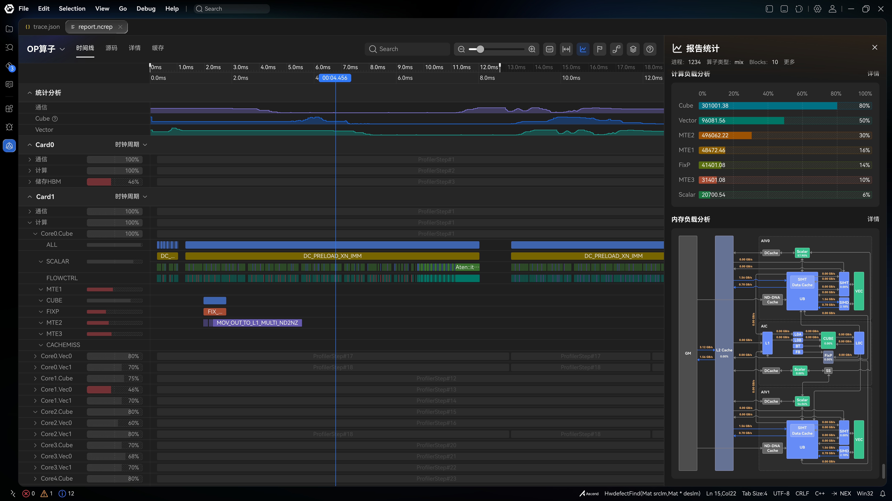
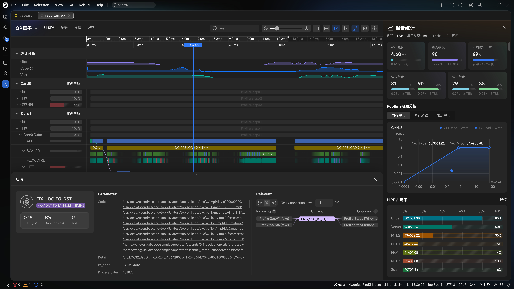

# Visualization View ↔ Data Mapping

Clean specification of **UI sections**, **interactions**, and **display → field → source** mappings from product spec §11.2 可视化界面数据关联. Source mockups live under [`docs/ui/source/`](./source/) (``v930/`). Hierarchy: [`DESIGN_INDEX.md`](./DESIGN_INDEX.md).

Input schemas: [INPUT_FORMATS.md](../formats/INPUT_FORMATS.md).

Design reference (docx): [HDesign mock](https://octo-g.hdesign.huawei.com/developerPreview/developer/index.html#edit&uniqueId=Cbt3Yr1Wzd6zfmVfNkJOYQ-50712&pageId=1001695).

---

## Overview



Mockups extracted from the source docx live under [`docs/ui/source/v930/`](./source/v930/).

---

## 11.2.2 Entry information



| # | UI | Behavior / data |
| --- | --- | --- |
| 1 | Report file | Open `report_<timestamp>_<rand id>.npu-rep` (product). Clicking the report opens the visualization pane. |
| 2 | OP 算子 selector | Choose among operators / kernels packaged in the report (docx: “npu-rep 中包含的 … 文件个数的选择”). Drives which metric rows / nested payloads feed all downstream views. |

**Rendering rules**

- Left explorer shows profiling run folders; selecting the report file loads the viewer.
- Top dropdown filters the active OP / kernel name.
- Main chrome includes tabs such as 时间线 / 源码 / 详情 / 缓存 (exact tab set follows product design; timeline is the primary swimlane surface).

---

## 11.2.3 Report statistics（报告统计）



### Field mapping

| # | Display (CN) | Field | Source | Notes |
| --- | --- | --- | --- | --- |
| 1 | 进程ID | `PID` / `Pid` | `OpBasicInfo.csv` | |
| 2 | 算子类型 | `OpType` / `Op Type` | `OpBasicInfo.csv` | e.g. `vector`, `MIX` |
| 3 | Blocks | `Block Dim` | `OpBasicInfo.csv` | |
| 4 | 整体耗时 | `Task Duration（us）` / `Task Duration(us)` | `OpBasicInfo.csv` | **Confirmed** (npu-compute 0818). Shown as ms in mockup (unit conversion in UI) |
| 5 | 算力情况 | — | — | **Unspecified in docx** |
| 6 | 输入带宽 | `aic_main_mem_read_bw(GB/s)` / `aiv_main_mem_read_bw(GB/s)` | `Memory.csv` | **Measured confirmed.** Peak / score still **I-Q6g** (1600 GB/s guess; sketch 81 ≠ ratio) |
| 7 | 输出带宽 | `aic_main_mem_write_bw(GB/s)` / `aiv_main_mem_write_bw(GB/s)` | `Memory.csv` | same as #6 |
| 8 | 平均核利用率 | — | — | **Unspecified in docx** |

### Visualization logic (from mockup)

| Element | Behavior |
| --- | --- |
| Header shell | Title **报告统计** + decorative chart icon + close (X). Close clears `asideVisible`. |
| Meta row | **进程** / **算子类型** / **Blocks** / **更多** / CANNBot. `OpBasicInfo.csv` → `Pid` (also `PID`) / `Op Type` / `Block Dim`. Hide a segment when unset. Meta row stays visible on the report shell so **更多** is always reachable (HQ 30–31). Not 核数, aic频率, or NPU ARCH. `Current Freq` / `Rated Freq` stay off this shell (hardware overlay / OpBasicInfo dump). Overlay `chip_info` / `arch_info` are Device Info names, not a header ARCH value. |
| 更多 | **Always** on the report shell (HQ 30–31). Opens hardware overlay and emits `open-hardware-details`. Render `HardwareDetailsPanel` when `hardwareDetails` is present (`HardwareInfo.jsonl` preferred; OpBasicInfo fallback per I-Q7a); else show **缺少 hardware info** / Missing hardware info. |
| 整体耗时 card | Large duration (always **2 decimal places**; full value in hover `title`) + progress bar = `min(100%, Block Dim / core_count × 100%)` when adapter sets `summary.coreCount` (HQ 32); else decorative ~15% fill (I-Q6e). Secondary: `{blockDim} / {coreCount}` iterations/core when both set (HQ 1); else `blockDim` only; else `opName`; else omit. No standalone op-type card. |
| 算力情况 card | Score / ratio bar + absolute TFLOPS vs peak — until Q6: **title + `N/A`** placeholder (no invented values) |
| 输入/输出带宽 card | Dual aic \| aiv columns: large score (no %), bar = score% of track, `measured / peak GB/s` — **I-Q6g** / HQ 34 (hide side/card when NA). Same card chrome as 整体耗时. |
| 平均核利用率 card | Percentage bar + enabled cores fraction — until Q6: **title + `N/A`** placeholder (no invented values) |

Do **not** invent formulas for cards 5 and 8 until product defines fields. Cards 6–7 **measured** columns are product-confirmed; peak and score stay [I-Q6g](../context/INTERIM_DECISIONS.md).

### Interim I-Q6g (input / output bandwidth)

| Slot | Interim |
| --- | --- |
| Measured | **Confirmed:** mean of non-`NA` matching Memory.csv column(s) across `block_id` (same as I-Q6b) |
| Peak | 1600 GB/s (1.6 TB/s) for every aic/aiv × in/out slot — sketch HW guess, **not** max of measured columns |
| Score | `round(measuredGBs / peakGBs × 100)` clamped 0–100. Sketch 81 vs `0.08/1.6` does **not** match; follow the ratio |
| Display | **GB/s** with magnitude rounding: ≥10 → 1 decimal; ≥0.01 → 2; ≥0.001 → 3; else 4 |
| Layout | Same raised card chrome as 整体耗时. Inner aic \| aiv columns; `aic`/`aiv` to the right of the score (no `%`). Outer sketch **3+2 grid** with duration (six columns: duration span 2, each BW span 3) |
| Bar | Fill width = score % of track (`--pr-color-bandwidth-bar`); same 8px pill hatched track as duration; 0% fill has no 2px sliver |
| NA | Omit that aic/aiv column; omit the card if both sides NA |
| `Report.csv` | Named SOL/平均带宽 in producer notes; **no schema** — unused |

---

## 11.2.3.1 Hardware details（硬件信息详情）



**Source (confirmed):** `HardwareInfo.jsonl` (one object per line, `category` discriminator). Not required to open Timeline. **更多** always opens the overlay (HQ 30–31): show sections when `hardwareDetails` is present; else **缺少 hardware info**. Adapter may still fall back to OpBasicInfo columns when jsonl is absent (I-Q7a). `data/out.rep` omits jsonl; the toolkit `example.rep` pack includes it (not in git).

| Section (UI) | Typical fields |
| --- | --- |
| Host Info | Cpu Info (optional), Cpu Physical/Logical Count, Memory Total Size (MB), Disk Total Size (GB) |
| Device Info | NPU Count, Chip Info, Arch Info |
| CPU Information | Control / AI CPU count and frequency (MHZ) |
| AI Core Information | AI Core / Cube / Vector counts, AI Core Frequency (MHZ) list |
| Memory Information | HBM Total / Used (MB), HBM Frequency (MHZ) |

**Interaction:** opened from 报告统计 → 更多; dismiss with close control. Label left / value right layout.

---

## 11.2.4 Roofline bottleneck analysis（Roofline 瓶颈分析）


### Tabs → fields (as in docx)

| # | Display (CN) | Field | Source |
| --- | --- | --- | --- |
| 1 | 内存单元 | `aic_cube_ratio` | `PipeUtilization.csv` |
| 2 | 内存通路 | `aic_mte2_ratio` | `PipeUtilization.csv` |
| 3 | 搬运单元 | `aic_mte1_ratio` | `PipeUtilization.csv` |

### Visualization logic

- Log–log chart: Y = performance (TOps/s), X = arithmetic intensity (Ops/Byte).
- Theoretical roof: bandwidth slope + compute plateau; filled achievable region.
- Measured point(s) for GM vs L2 series (legend: GM Read+Write solid; L2 Read+Write hollow in mockup).
- Op-mix annotation (e.g. `Vec_FP32` / `Vec_MISC` %) — candidate source `ArithmeticUtilization.csv` (not listed in product field table).

**Contradictions / gaps (do not implement as-is):**

1. Tab labels are memory-oriented (内存单元 / 通路 / 搬运) while mapped fields are **pipe utilization ratios** (`aic_cube_ratio`, `aic_mte2_ratio`, `aic_mte1_ratio`). Possible mislabel or incomplete mapping.
2. Those ratios alone **cannot** supply Ops/Byte or TOps/s for the chart axes, nor peak bandwidth / peak compute for the roof. Product must define the real formulas and hardware-limit sources.

### Interim M2 implementation (I-Q11a–f)

Do **not** use the docx tab→pipe-ratio table. While Q11 is open:

| Axis / element | Interim source |
| --- | --- |
| Y achieved | I-Q11a: `fops / timeUs / 1e6` from `ArithmeticUtilization.csv` |
| X GM | I-Q11b: fops / GM R+W bytes from `Memory.csv` |
| L2 point | I-Q11c: omit |
| Roof | I-Q11d: peakCompute=1 TOps/s; peakBW from main-mem BW columns |
| Op-mix labels | I-Q11e: normalize Vector/Cube mix ratios |
| Tabs | I-Q11f: hidden |

Hide `RooflinePanel` when no GM point can be derived.

---

## 11.2.5 Pipe occupancy / compute load（PIPE 占用率）



**Rule (product table):** for `OpType == MIX`, show **Cube \| Vector** segmented control and the active side’s bars (plus ICache rates when present). Sketch: [`v930/compute-load`](./source/v930/compute-load.jpeg).

**Layout (confirmed):** use the **Cube / Vector field tables** below with a MIX toggle — not a single combined bar list. `pipe-occupancy.png` remains a visual style reference for bar chrome. Non-MIX ops show only the relevant Cube or Vector set; omit or placeholder `NA` values.

### Cube occupancy

| # | Display | Field | Source |
| --- | --- | --- | --- |
| 1 | Cube | `aic_cube_ratio` | `PipeUtilization.csv` |
| 2 | MTE2 | `aic_mte2_ratio` | `PipeUtilization.csv` |
| 3 | MTE1 | `aic_mte1_ratio` | `PipeUtilization.csv` |
| 4 | FIXP | `aic_fixpipe_ratio` | `PipeUtilization.csv` |
| 5 | Scalar | `aic_scalar_ratio` | `PipeUtilization.csv` |
| 6 | ICache Miss | `aic_icache_miss_rate` | `PipeUtilization.csv` |

### Vector occupancy

| # | Display | Field | Source |
| --- | --- | --- | --- |
| 1 | Vector | `aiv_vec_ratio` | `PipeUtilization.csv` |
| 2 | MTE2 | `aiv_mte2_ratio` | `PipeUtilization.csv` |
| 3 | MTE3 | `aiv_mte3_ratio` | `PipeUtilization.csv` |
| 4 | Scalar | `aiv_scalar_ratio` | `PipeUtilization.csv` |
| 5 | ICache Miss | `aiv_icache_miss_rate` | `PipeUtilization.csv` |

### Visualization logic

- Horizontal 0–100% tracks with a percent scale above the rows; solid fill = ratio; hatched remainder to 100%.
- In-bar absolute (HQ 18, [I-Q6f](../context/INTERIM_DECISIONS.md)): mean non-`NA` matching `*_time(us)` for that family/side; omit when absent.
- **详情** opens the compute CSV overlay (`CsvFieldListPanel`) and emits `open-pipe-details`.
- Summary PIPE bars for the aside default view may still use mean-across-blocks aggregation ([I-Q6b](../context/INTERIM_DECISIONS.md)); detail tabs are block-scoped ([I-Q6c](../context/INTERIM_DECISIONS.md)).
- Include **ICache Miss** rows when the corresponding `*_icache_miss_rate` mean is present (no time column → no absolute).

---

## 11.2.5.1 Compute-load details（计算负载分析详情）



Detail surface uses **tabs** ([`v930/compute-load-detail`](./source/v930/compute-load-detail.jpeg)):

| Tab | Source CSV |
| --- | --- |
| `PipeUtilization` | `PipeUtilization.csv` |
| `ArithmeticUtilization` | `ArithmeticUtilization.csv` |
| `ResourceConflictRatio` | `ResourceConflictRatio.csv` |

Render a searchable key–value (or table) list of all columns for the **selected block** ([I-Q6c](../context/INTERIM_DECISIONS.md)):

- AIC group: cycles, `*_time(us)`, `*_ratio`, active BW, ICache miss, scalar stall/wait breakdowns.
- AIV group: same pattern; display `NA` when absent.
- Hide a tab when its CSV is missing from the report.

---

## 11.2.6 Memory load analysis（内存负载分析）




**Note (docx):** dual-Die / Remote memory — open whether right-click details exist.

**Topology edges:** redraw must show **real CSV values** on buffer connection lines (not placeholders). Sketch: [`v930/report-stats-scrolled`](./source/v930/report-stats-scrolled.jpeg) (topology SVG); CSV 详情 is [`v930/memory-load-detail`](./source/v930/memory-load-detail.jpeg).

### Edge → field → source (engineering mapping for M2)

Use this table for `MemoryTopologyPanel` labels. Bare `*_read_bw` = leaving the named resource; `*_write_bw` = arriving there.

| Display edge | Field | Source | Notes |
| --- | --- | --- | --- |
| GM → L2 | `aic_main_mem_read_bw(GB/s)` / `aiv_main_mem_read_bw(GB/s)` | `Memory.csv` | Prefer non-`NA` AIC then AIV. Read = leaving GM (`out.rep` 16.89) |
| GM ← L2 | `aic_main_mem_write_bw(GB/s)` / `aiv_main_mem_write_bw(GB/s)` | `Memory.csv` | Write = arriving at GM (≡ `aiv_ub_to_gm_bw`) |
| L2 → L1 | `aic_l1_read_bw(GB/s)` | `Memory.csv` | **Confirmed** file. Keep master L2→cluster; `out.rep` NA |
| L2 ← L1 | `aic_l1_write_bw(GB/s)` | `Memory.csv` | Same |
| L1 → L0A | `aic_l0a_read_bw(GB/s)` | `MemoryL0.csv` | Keep master L1→L0A (operand buffer); `out.rep` NA |
| L1 → L0B | `aic_l0b_read_bw(GB/s)` | `MemoryL0.csv` | Same |
| L0A → Cube | `aic_l0a_write_bw(GB/s)` | `MemoryL0.csv` | Same |
| L0B → Cube | `aic_l0b_write_bw(GB/s)` | `MemoryL0.csv` | Same |
| L0C → Cube | `aic_l0c_read_bw_cube(GB/s)` | `MemoryL0.csv` | |
| Cube → L0C | `aic_l0c_write_bw_cube(GB/s)` | `MemoryL0.csv` | |
| L0C → L1 | `L0C_to_L1_datas(KB)` | `Memory.csv` | Product still 待确定; sample has the column |
| L0C → L2 | `L0C_to_GM_datas(KB)` | `Memory.csv` | Product still 待确定; sample has the column |
| UB → L2 | `aiv_ub_read_bw_gm(GB/s)` then `aiv_ub_to_gm_bw(GB/s)` | `MemoryUB.csv` then `Memory.csv` | Product name first (unverified; absent from sample); sample fallback |
| L2 → UB | `aiv_ub_write_bw_gm(GB/s)` then `aiv_gm_to_ub_bw(GB/s)` | `MemoryUB.csv` then `Memory.csv` | Product name first (unverified; absent from sample); sample fallback |
| Vec → UB | `aiv_ub_write_bw_vector(GB/s)` | `MemoryUB.csv` | `ub_read_*` = leaving UB (`out.rep` add 2:1) |
| UB → Vec | `aiv_ub_read_bw_vector(GB/s)` | `MemoryUB.csv` | |
| L2Cache Hit Rate | first `*_hit_rate(%)` | `L2Cache.csv` | AIC/AIV column choice TBD |

**NA (confirmed):** do not show `NA` labels; **do show 0**. Edge thickness stays static.

### Visualization logic

- Static architecture template: GM/HBM → L2 → AIC (L1, L0A/B/C, Cube, FixP, Scalar) and AIV×2 (UB, Vec/SIMT/SIMD, Scalar).
- Overlay **GB/s** (or KB) on edges from the mapping table. Hide `NA`; show `0`.
- Overlay **Peak (%)** utilization on units only when a field mapping exists (still open for many units).
- Labels are **block-scoped** via the same block switcher as memory details ([I-Q6c](../context/INTERIM_DECISIONS.md)).

---

## 11.2.6.1 Memory load details

Memory detail controls ([`v930/memory-load-detail`](./source/v930/memory-load-detail.jpeg)):

| Control | Behavior |
| --- | --- |
| Tabs | `Memory L1` (`Memory.csv`), `L2Cache` (`L2Cache.csv`), `Memory L0` (`MemoryL0.csv`), `Memory UB` (`MemoryUB.csv`) — hide tab if CSV absent |
| Block switcher | Filter rows to selected `block_id` ([I-Q6c](../context/INTERIM_DECISIONS.md)); default = first block |
| 查看全部 | Emit open-full-CSV intent; host/playground opens complete CSV in a new tab ([I-Q6d](../context/INTERIM_DECISIONS.md)) |

Searchable key–value / table of columns for the active tab + block. Show `NA` when present.

---

## 11.2.7 Statistical analysis（统计分析）


Docx placeholder samples:

```json
{"category":"Cube",1:1,2:2}
{"category":"Vector",1:1,2:2}
```

Treat as illustrative only (invalid JSON / stub series).

### Visualization logic

- Collapsible section with synchronized **Cube** and **Vector** area charts over time.
- Shared time axis with a vertical scrubber aligned to the Kernel timeline below.
- Series provenance not specified in docx; candidates: aggregated pipe busy from timeline events, or derived block time series. Mark as **TBD** until product defines the series file.

---

## 11.2.8 Kernel block-level timeline


Docx field table is **empty**. Behavior from mockups + sample `trace.json`:

### Structure

| UI region | Content |
| --- | --- |
| Left tree | Hierarchical **Card** → 通信 / 计算 / 储存HBM → `CoreN.Cube` / `CoreN.Vec*` → pipes (`ALL`, `SCALAR`, `FLOWCTRL`, `MTE1/2/3`, `CUBE`, `FIXP`, `CACHEMISS`, …) with utilization % bars. Only Card is a group header; nested folders are lane-style expandable rows |
| Main pane | Gantt / swimlane blocks on a time or **时钟周期** axis |
| Selection | Click block → bottom **详情** (§11.2.8.1) |
| Dependencies | Curved connectors between related blocks |

### Sample data binding (local)

| Need | Sample source |
| --- | --- |
| Lane identity | `thread_name` metadata (`AIV0/PIPE_FIX/status`, …) |
| Intervals | `ph:"X"` events (`ts`, `dur`, `name`, `cat`, `args`) |
| Pipe busy states | `args.state_PIPE_*` on pipe-state records |

Utilization % per row and nested `ProfilerStep#*` / ISA-like labels in the mockup exceed the sample trace richness — full binding remains TBD.

---

## 11.2.8.1 Pipeline / event details（流水中详情 / 详情）



Docx table empty. Mockup layout:

| Region | Content |
| --- | --- |
| Summary | Task name, subtype/tag, Start (ns) → Duration (ns) |
| Parameters | `Code` (source paths), `Detail` (register/memory string), `Pc_addr`, `Process_bytes` |
| Relevant | Local dependency graph: Incoming → Current → Outgoing; connection level control; optional edge badge (counts/latency) |

**Interaction:** activated by clicking a timeline block (callout in mockup: 点击之后出现底部【详情】页面).

**Gap:** these detail fields are not in sample `trace.json`; require a richer event payload or side table not defined in the docx.

---

## Open questions / TBD (visualization)

Full prioritized list for the product owner: [OPEN_QUESTIONS.md](../context/OPEN_QUESTIONS.md).

| Topic | Source status |
| --- | --- |
| Report-stat cards 5, 8 field derivation | Empty in product tables |
| I/O bandwidth peak / score (cards 6–7) | **Measured confirmed.** Peak / score still **I-Q6g** |
| Stats header 进程 / 算子类型 / Blocks | **Closed.** `OpBasicInfo.csv` `Pid` / `Op Type` / `Block Dim`. 核数 / NPU ARCH / aic频率 are not on the v930 header. |
| Roofline tab names vs pipe-ratio fields; missing axis formulas | Contradictory / incomplete |
| Pipe occupancy: combined mockup vs Cube/Vector tables | Layout conflict |
| Dual-Die remote memory right-click details | Explicit product question |
| Memory Peak (%) per unit | No field mapping |
| L2 hit-rate column choice | Incomplete |
| L0C → UB edge | 待确定 |
| UB↔GM | Product `MemoryUB.csv` names first; sample `Memory.csv` fallback |
| Statistical analysis series schema | Placeholder only |
| Timeline + event-detail field tables | Empty; mockup-driven |
| HardwareInfo | Confirmed source; in toolkit `example.rep` (not in git), absent from `out.rep` |
| Container magic `npu-rep` vs local `cann-rep` | See [INPUT_FORMATS §1](../formats/INPUT_FORMATS.md#1-report-container) |
| `ResourceConflictRatio.csv` | In sample; no UI mapping |
| Block-level aggregation for OP summary cards | Unspecified (sample has 8 blocks) |

---

## Mockup index

| File | Section |
| --- | --- |
| [`entry-overview.png`](./source/v930/entry.jpeg) | Entry + overall timeline chrome |
| [`npu-rep-layout.png`](./source/v930/entry.jpeg) | Container binary layout |
| [`report-stats.png`](./source/v930/report-stats-open.jpeg) | Report statistics |
| [`hardware-details.png`](./source/v930/hardware-more-detail.jpeg) | Hardware details |
| [`roofline.png`](./source/v930/report-stats-open.jpeg) | Roofline |
| [`pipe-occupancy.png`](./source/v930/compute-load.jpeg) | Pipe occupancy bars |
| [`pipe-details.png`](./source/v930/compute-load-detail.jpeg) | Pipe details list |
| [`memory-topology-annotated.png`](./source/v930/report-stats-scrolled.jpeg) | Memory topology SVG (nodes/edges) |
| [`memory-load-heatmap.png`](./source/v930/report-stats-scrolled.jpeg) | Memory load with BW / peak % |
| [`statistical-analysis.png`](./source/v930/entry.jpeg) | Cube/Vector statistical tracks |
| [`kernel-block-timeline.png`](./source/v930/entry.jpeg) | Block timeline |
| [`event-details.png`](./source/v930/detail-strip-raised.jpeg) | Event / Relevant details |
