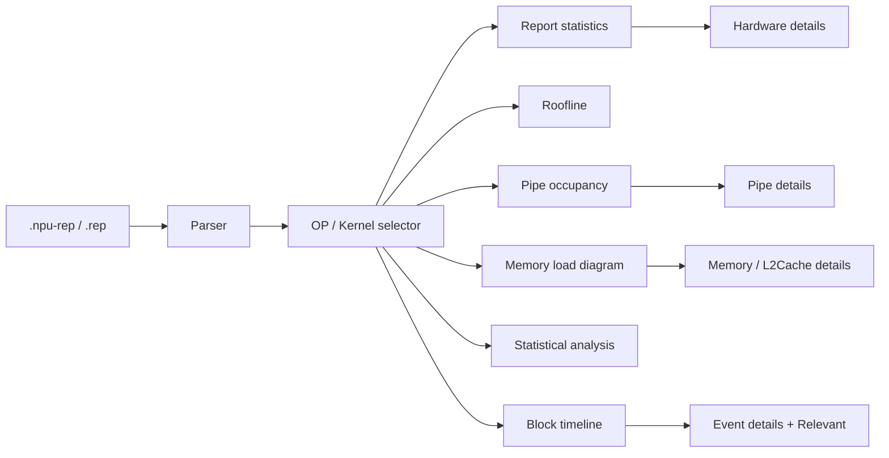

# Visualization View ↔ Data Mapping

**Role:** Product docx §11.2 可视化界面数据关联 → [view packets](../views/). **Column / field / edge / slot → view-model tables live in those packets**, not here. This file is the docx § index (backward links only).

Container hub: [formats/README.md](../formats/README.md). Compute: [compute/FORMAT.md](../formats/compute/FORMAT.md). Emulate: [emulate/FORMAT.md](../formats/emulate/FORMAT.md). Catalog: [views/README.md](../views/README.md).

Input schemas: [INPUT_FORMATS.md](../formats/INPUT_FORMATS.md). Design hierarchy: [`DESIGN_INDEX.md`](./DESIGN_INDEX.md). Source mockups: [`docs/ui/source/v930/`](./source/v930/).

Design reference (docx): [HDesign mock](https://octo-g.hdesign.huawei.com/developerPreview/developer/index.html#edit&uniqueId=Cbt3Yr1Wzd6zfmVfNkJOYQ-50712&pageId=1001695).

---

## Overview

---

## Docx § → view packet

| Docx § | Feature | View packet | Phase / notes |
| --- | --- | --- | --- |
| 11.2.2 | Entry / OP selector | _(shell — see [timeline](../views/timeline.md))_ | Report open + OP dropdown drives all aside views |
| 11.2.3 | Report statistics | [report-summary](../views/report-summary.md) | Field map + DATA-33h / DATA-8 slots in **Compute fill** |
| 11.2.3.1 | Hardware details | _(stub — no packet yet)_ | Overlay from 更多; see [VIEW_DATA_REQUIREMENTS](../formats/VIEW_DATA_REQUIREMENTS.md) |
| 11.2.4 | Roofline | [roofline](../views/roofline.md) | Tabs→fields + DATA-37 interim in **Compute fill** |
| 11.2.5 | PIPE occupancy | [pipe-occupancy](../views/pipe-occupancy.md) | Cube / Vector column tables in **Compute fill** |
| 11.2.5.1 | Compute-load CSV details | _(stub — no packet yet)_ | Tabs over PipeUtilization / Arithmetic / ResourceConflict |
| 11.2.6 | Memory load analysis | [memory-topology](../views/memory-topology.md) | Edge / plate map in **Compute fill** |
| 11.2.6.1 | Memory CSV details | _(stub — no packet yet)_ | Memory / L2Cache / L0 / UB (+ PipeUtilization when CSV-only) |
| 11.2.7 | Statistical analysis | [overview-charts](../views/overview-charts.md) | Sampling.json counters; no docx column table |
| 11.2.8 | Kernel block timeline | [timeline](../views/timeline.md) | Sample CTEF binding in **Compute fill** |
| 11.2.8.1 | Event / Relevant details | _(stub — no packet yet)_ | Bottom detail strip; richer payload TBD |

### Emulate profile (MHTML §11.2.3)

Same host file (`.npu-rep`); leaf via `manifest.json` ([PROC-8](../context/decisions/PROC.md)). Schemas: [emulate/FORMAT.md](../formats/emulate/FORMAT.md).

| § | Feature | View packet | Sept 30 |
| --- | --- | --- | --- |
| — | Timeline swimlane | [timeline](../views/timeline.md) | **in** |
| — | Thin report summary | [report-summary](../views/report-summary.md) | **out** ([DATA-47](../context/decisions/DATA.md)) |
| 11.2.3.4 / .6 | PIPE occupancy | [pipe-occupancy](../views/pipe-occupancy.md) | **in** |
| 11.2.3.1 | Architecture Diagram | [arch-diagram](../views/arch-diagram.md) | **in** (ArchDiagramMetrics→slot in **Emulate fill**; interim plated chrome) |
| — | Overview charts | [overview-charts](../views/overview-charts.md) | **hide** |
| 11.2.3.5 | Roofline | [roofline](../views/roofline.md) | **hide** |
| 11.2.3.2 | Memory Utilization Heatmap | _(reserved)_ | **out** ([DATA-49](../context/questions/DATA.md)) |
| 11.2.3.3,7–8 | AiCore / VF IPC / call stacks | _(reserved)_ | **out-of-scope** |

---

## Stub surfaces (no packet yet)

Do **not** invent packets in this index. Until extracted:

| Surface | Sketch / source | Interim home |
| --- | --- | --- |
| Hardware details | [`hardware-more-detail.jpeg`](./source/v930/hardware-more-detail.jpeg) | [VIEW_DATA_REQUIREMENTS](../formats/VIEW_DATA_REQUIREMENTS.md), StatsAside 更多 |
| Pipe / compute CSV detail tabs | [`compute-load-detail.jpeg`](./source/v930/compute-load-detail.jpeg) | Same + PipeOccupancy 详情 |
| Memory CSV detail tabs | [`memory-load-detail.jpeg`](./source/v930/memory-load-detail.jpeg) | Same + MemoryTopology 详情 |
| Event details + Relevant | [`detail-strip-raised.jpeg`](./source/v930/detail-strip-raised.jpeg) | Timeline selection / EventTooltip |

Open product questions: [context/questions/](../context/questions/).

---

## Mockup index

| File | Section |
| --- | --- |
| [`entry-overview.png`](./source/v930/entry.jpeg) | Entry + overall timeline chrome |
| [`npu-rep-layout.png`](./source/v930/entry.jpeg) | Container binary layout |
| [`report-stats.png`](./source/v930/report-stats-open.jpeg) | Report statistics |
| [`hardware-details.png`](./source/v930/hardware-more-detail.jpeg) | Hardware details |
| [`roofline.png`](./source/v930/report-stats-open.jpeg) | Roofline |
| [`pipe-occupancy.png`](./source/v930/compute-load.jpeg) | Pipe occupancy bars |
| [`pipe-details.png`](./source/v930/compute-load-detail.jpeg) | Pipe details list |
| [`memory-topology-annotated.png`](./source/v930/report-stats-scrolled.jpeg) | Memory topology SVG (nodes/edges) |
| [`memory-load-heatmap.png`](./source/v930/report-stats-scrolled.jpeg) | Memory load with BW / peak % |
| [`statistical-analysis.png`](./source/v930/entry.jpeg) | Cube/Vector statistical tracks |
| [`kernel-block-timeline.png`](./source/v930/entry.jpeg) | Block timeline |
| [`event-details.png`](./source/v930/detail-strip-raised.jpeg) | Event / Relevant details |
