# UI review findings (profiling-report)

UCD visual-review items that apply to **this** Vue library (Ascend / CANN `.rep` performance report).

| | |
|---|---|
| **Source sheet** | `0826(Ascend C)` / 性能调优 from the UCD workbook `开发检视.xlsx` |
| **Raised** | 2026-08-26 by Zhou Zezhen (周泽镇) |
| **Status** | **17** fixed · **2** partial · **2** open · **1** closed (see below) |
| **Screenshots** | [`screenshots/ascend-c/`](./screenshots/ascend-c/) — progressive JPEG q=82, original pixel dimensions |

Out of scope for this repo (omitted): PyPTO GM memory viz (`0731`), swimlane-PMU (`0708`), and the historical MSTT ledger (compute graph, workflow, quick start, …).

Design base: [HDesign uniqueId `Cbt3Yr1Wzd6zfmVfNkJOYQ-50712`](https://octo-g.hdesign.huawei.com/developerPreview/developer/index.html#edit&uniqueId=Cbt3Yr1Wzd6zfmVfNkJOYQ-50712&pageId=1001696).

---

## Status

Fixed on `spec/ui-review` unless noted. Sub-items are numbered as in each finding below.

| Item | Status | Notes |
|------|--------|-------|
| AC-01 | Fixed | White label-width underline, `#b3b3b3` inactive tabs, 18px/700 brand, corner wash now actually visible — see below |
| AC-02 | Fixed | `search` design icon |
| AC-03 | Fixed | `zoom-in` / `zoom-out` design icons |
| AC-04 | Fixed | `stats` design icon |
| AC-05 | Fixed | `:focus-visible` only, plus `color-scheme: dark` so the field stops rendering light-mode chrome |
| AC-06 | Open | In progress on another branch — deliberately untouched here |
| AC-07 | Fixed | Hovered leaf row fills `#363636` across gutter *and* track; the pin slice's `#252525` gutter-only highlight was both the wrong value and half the row. Track band is painted behind events by both renderers |
| AC-08 | Fixed | Every state is an OKLCH offset from the lane's base fill (`eventFill`); the white ring is now selection's alone |
| AC-09 | Fixed | `#363636`, 12px radius, hairline border, soft shadow |
| AC-10 | Fixed | 52px dock header, 16px top radii, min-content ID-card track, translucent card surfaces |
| AC-11 | Fixed | `rgba(231,67,74,0.4)` / `rgba(255,255,255,0.08)` util fills, 4px radius |
| AC-12 | Fixed | No change needed: sampling the design crop gives `#3b3b3b`, one level off the `#3a3a3a` we already ship in both DOM and canvas |
| AC-13 | Fixed | Cursor line raised above the Card strips that were punching gaps in it |
| AC-14 | Fixed | `#262626` band, `#313131` ticks, `#1b1b1b` muted band |
| AC-15 | Fixed | Covered by the shared `:focus-visible` rule |
| AC-16 | Fixed | Pointer on event blocks, overview track, time axis, and the CSV select; swimlane empty space uses default arrow |
| AC-17 | Partial | Card expander at 40px with 14px/700 label. Category-row typography and the chevron column are still open — see below |
| AC-18 | Open | New capability (per-card clock-cycle metric dropdown), not polish |
| AC-19 | Partial | .1 landed with the pin slice (#51); .2 label lift fixed. Folder/group pin **deferred** this iteration ([UI-44](../../context/questions/deferred.md)); leaf-only remains shipped — see below |
| AC-20 | Fixed | .1 .2 .3 .5 fixed; .6 fixed on the second pass — the native spinner takes no styling, so the field carries a custom stepper; .4 needed no change — the design panel samples `#363636` and its input `#404040`, both already shipped |
| AC-21 | Fixed | .1 and .2 were already satisfied (menu opens below the trigger; no checkbox); .3 retinted |
| AC-22 | Closed | Dev-harness only — the strip is the playground header and never ships |

## Summary themes

- **Toolbar / chrome:** tab underline & colors, search/zoom/stats icons, focused search ring, zoom slider borders, pointer cursor, remove extra top strip (AC-01–05, AC-15–16, AC-22).
- **Swimlane geometry:** gutter vs canvas radii, continuous cursor line, axis colors, hover (fill lift, not a white stroke), tooltip chrome (AC-06–09, AC-13–14).
- **Lane gutter / cards:** fixed widths, colors, dividers, expand icons, clock-cycle metric selector, pin-on-hover (AC-10–12, AC-17–19).
- **Dialogs / menus:** Chinese copy, help icon, spinner, dropdown styling (AC-20–21).

---

## Findings

### AC-01 — Tab strip / `out.rep` label

1. Tab underline: change blue to white; underline width must match label width.
2. Unselected tab label color → design token.
3. `out.rep` label: match design font size and weight.
4. Add background-gradient asset/slice.

| Dev | Design |
|-----|--------|
| 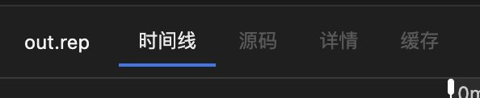 | 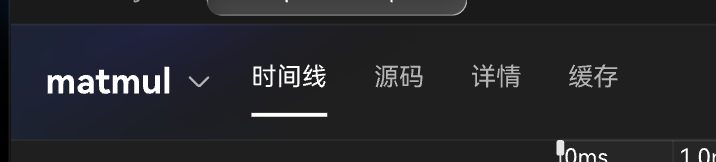 |

Design: [page 1001696](https://octo-g.hdesign.huawei.com/developerPreview/developer/index.html#edit&uniqueId=Cbt3Yr1Wzd6zfmVfNkJOYQ-50712&pageId=1001696)

**Sub-item 4 shipped twice.** The gradient was first added as a `.pr-root__corner-wash` child of `.pr-root` at `z-index: 0`, but the toolbar renders inside `.pr-main`, which is `position: relative; z-index: 1` with an opaque background — so the wash was painted over and the strip stayed flat `#1f1f1f`. It now lives on `.pr-chrome` itself (`PR-TOOLBAR-018`; `PR-ROOT-006` withdrawn). The original test only asserted the CSS text existed in the source, which an occluded layer passes just as happily; the replacement asserts ownership instead.

**Hard seam (2026-09-02).** Figma’s radial `150.89%` horizontal radius overruns the 208px wash box, so opacity was still ~0.12 at the right clip and read as a vertical cut into `#1f1f1f`. Radial radius is now `59%` so the transparent stop lands on the box edge.

### AC-02 — Search icon

1. Search box icon → design icon.

| Dev | Design |
|-----|--------|
| 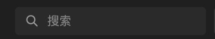 | 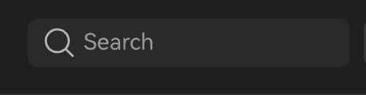 |

Design: [page 1001696](https://octo-g.hdesign.huawei.com/developerPreview/developer/index.html#edit&uniqueId=Cbt3Yr1Wzd6zfmVfNkJOYQ-50712&pageId=1001696)

### AC-03 — Zoom icons

1. Zoom in / zoom out icons → design icons.

| Dev | Design |
|-----|--------|
| 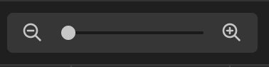 | 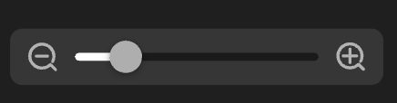 |

Design: [page 1001696](https://octo-g.hdesign.huawei.com/developerPreview/developer/index.html#edit&uniqueId=Cbt3Yr1Wzd6zfmVfNkJOYQ-50712&pageId=1001696)

### AC-04 — Stats icon

1. Stats / report icon → design icon.

| Dev | Design |
|-----|--------|
| 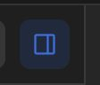 | 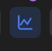 |

Design: [page 1001696](https://octo-g.hdesign.huawei.com/developerPreview/developer/index.html#edit&uniqueId=Cbt3Yr1Wzd6zfmVfNkJOYQ-50712&pageId=1001696)

### AC-05 — Search focus ring

1. Focused search field: remove surrounding white outline.

| Dev | Design |
|-----|--------|
| 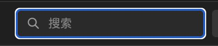 | *(no design crop)* |

### AC-06 — Corner radii

1. Outer corner radii → design.
2. Left clock-cycle (lane gutter) radius **4**; right swimlane radius **2**.

| Dev | Design |
|-----|--------|
| 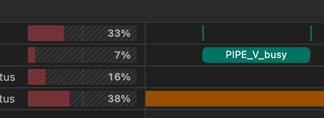 | 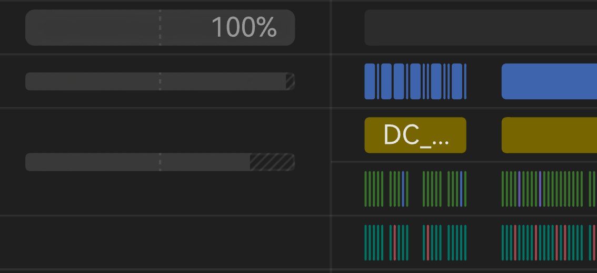 |

Design: [page 1001696](https://octo-g.hdesign.huawei.com/developerPreview/developer/index.html#edit&uniqueId=Cbt3Yr1Wzd6zfmVfNkJOYQ-50712&pageId=1001696)

### AC-07 — Lane hover

1. Each swimlane module: add hover effect.

| Dev | Design |
|-----|--------|
| 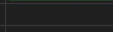 | 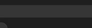 |

Design: [page 1001601](https://octo-g.hdesign.huawei.com/developerPreview/developer/index.html#edit&uniqueId=Cbt3Yr1Wzd6zfmVfNkJOYQ-50712&pageId=1001601)

**Resolution.** The lane pin slice (#51) already wired half of this: the pointer over a gutter row, *or* over that lane's band on the canvas (`hoveredLaneId`), highlights the gutter row. Two things were wrong with it. The value — it shipped `#252525`, while this crop and AC-19's both measure `#363636`, the raised-surface token. And the reach: this crop is a full-width empty row with no label or utilization bar, so it is the *track* side, which had no hover chrome at all.

Both are fixed. The hovered leaf row now fills `#363636` across gutter and track alike, so the two read as one continuous row.

The track band is painted by the renderers, in the background pass **behind events** — `setHoveredLane` on both the Canvas and WebGL backends. The first attempt laid a translucent DOM band over the canvas, which is cheaper and backend-agnostic but wrong: it tinted every event it crossed, and a lifted event fill already means hover on *that event* (AC-08). Only the row background may change.

### AC-08 — Hover treatment

1. Hover is **not** a white border — use the design hover treatment.

| Dev | Design |
|-----|--------|
| 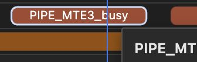 | 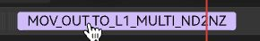 |

Design: [page 1001601](https://octo-g.hdesign.huawei.com/developerPreview/developer/index.html#edit&uniqueId=Cbt3Yr1Wzd6zfmVfNkJOYQ-50712&pageId=1001601)

**Fixed by separating the channels, not by recolouring the stroke.** Hover and selection both drew a ring (`#c8e0ff` at 1.5px vs `#ffffff` at 2px), which is why they read as the same state. Sampling the design crop shows the hovered block is a lighter fill, so hover lifts the block's own colour and the ring belongs to selection alone.

The lift is now an OKLCH offset rather than an sRGB blend toward white, and the same mechanism supplies both states from one base colour per lane: `hover` and `selected` both `L+0.33`, with `selected` also `C×1.05`. Perceptual lightness is the point — an sRGB blend of the same nominal size moves the dark greens much further than the oranges, so the states would not read alike across lanes. Out-of-gamut requests keep lightness and hue and give up chroma, which the light oranges need. Labels stopped being unconditionally white and now flip to dark above `L 0.6`, which both lifts cross, so a label inverts as the pointer crosses its block. Hover sizing took a few passes: clamping under the flip left it invisible; pushing to `+0.34` treated muddy dark labels as a fill problem when they were the selection dim washing a non-selected hover. Current trial: share selection's lightness (`+0.33`) and let the ring + chroma mark selection.

Under WebGL the resting fills are the GL pass's, so `SwimlaneOverlayPainter` repaints any non-resting block at the same dim. Both backends were verified against the computed palette pixel-for-pixel: `#1a743e` → hover `rgb(110,194,135)`, selected `rgb(148,237,173)`.

### AC-09 — Event tooltip chrome

1. Hover tooltip: remove border, add corner radius, background color per design.

| Dev | Design |
|-----|--------|
| 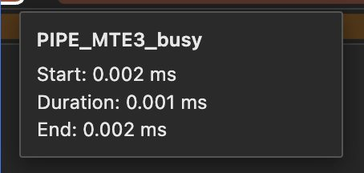 | 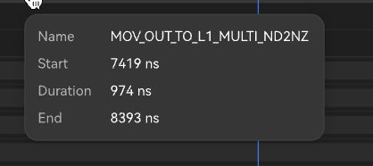 |

Design: [page 1001601](https://octo-g.hdesign.huawei.com/developerPreview/developer/index.html#edit&uniqueId=Cbt3Yr1Wzd6zfmVfNkJOYQ-50712&pageId=1001601)

### AC-10 — Left cards layout

1. Left cards: fixed width; match design hierarchy, corner radii, and border details.

| Dev | Design |
|-----|--------|
| 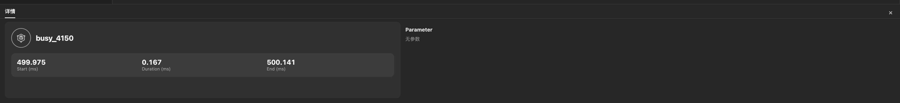 | 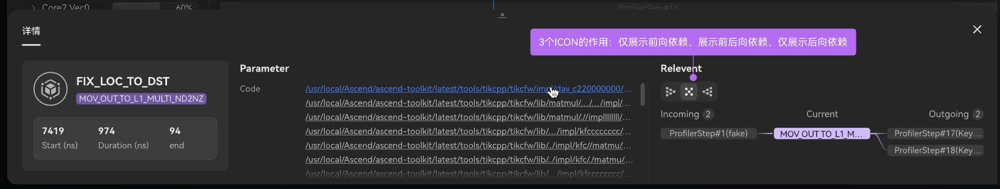 |

Design: [page 1001705](https://octo-g.hdesign.huawei.com/developerPreview/developer/index.html#edit&uniqueId=Cbt3Yr1Wzd6zfmVfNkJOYQ-50712&pageId=1001705)

### AC-11 — Card colors / radii

1. Colors → design.
2. Adjust corner radii.

| Dev | Design |
|-----|--------|
| 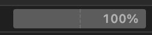 | 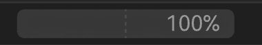 |

Design: [page 1001705](https://octo-g.hdesign.huawei.com/developerPreview/developer/index.html#edit&uniqueId=Cbt3Yr1Wzd6zfmVfNkJOYQ-50712&pageId=1001705)

### AC-12 — Dividers

1. Divider line colors → design dividers.

| Dev | Design |
|-----|--------|
| 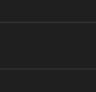 | 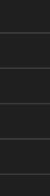 |

Design: [page 1001705](https://octo-g.hdesign.huawei.com/developerPreview/developer/index.html#edit&uniqueId=Cbt3Yr1Wzd6zfmVfNkJOYQ-50712&pageId=1001705)

**No change needed.** Row dividers in the design crop sample a flat `#3b3b3b`; we ship `#3a3a3a` in the gutter CSS and the same value in `CanvasSwimlaneRenderer`, so DOM and canvas already agree with each other and sit one level of 255 off the design. The dev crop reads dimmer (43–49) only because a 1px line loses contrast to JPEG. Retinting would be a no-op the eye cannot resolve. The unused `--pr-divider` token stays as a host override hook.

### AC-13 — Continuous time indicator

1. Time indicator / cursor line must be continuous — no gap in the middle.

| Dev | Design |
|-----|--------|
| 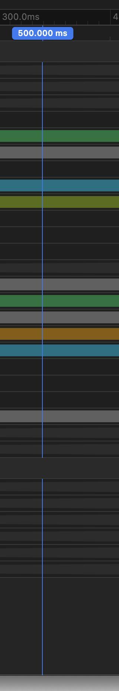 | 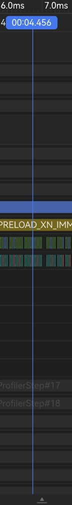 |

Design: [page 1001705](https://octo-g.hdesign.huawei.com/developerPreview/developer/index.html#edit&uniqueId=Cbt3Yr1Wzd6zfmVfNkJOYQ-50712&pageId=1001705)

### AC-14 — Time-axis colors

1. Time-axis tick colors (line + background) → design exactly.

| Dev | Design |
|-----|--------|
| 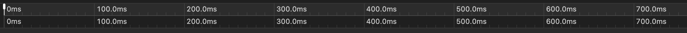 | 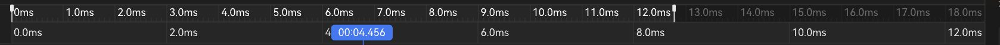 |

Design: [page 1001705](https://octo-g.hdesign.huawei.com/developerPreview/developer/index.html#edit&uniqueId=Cbt3Yr1Wzd6zfmVfNkJOYQ-50712&pageId=1001705)

### AC-15 — Zoom slider borders

1. Zoom slider bug: remove white and blue borders.

| Dev | Design |
|-----|--------|
| 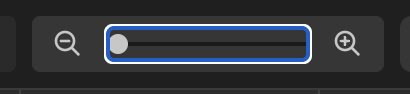 | 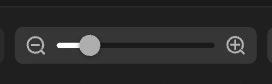 |

Design: [page 1001705](https://octo-g.hdesign.huawei.com/developerPreview/developer/index.html#edit&uniqueId=Cbt3Yr1Wzd6zfmVfNkJOYQ-50712&pageId=1001705)

### AC-16 — Pointer cursor

1. All hoverable / clickable targets use pointer (`cursor: pointer`). Swimlane empty space uses the standard arrow (`cursor: default`), not `crosshair` or hand. Measure mode / edge bars keep `col-resize`.

| Dev | Design |
|-----|--------|
| 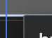 | 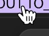 |

Design: [page 1001705](https://octo-g.hdesign.huawei.com/developerPreview/developer/index.html#edit&uniqueId=Cbt3Yr1Wzd6zfmVfNkJOYQ-50712&pageId=1001705)

### AC-17 — Lane gutter hierarchy

1. Lane gutter hierarchy / typography / alignment per design; add expand / collapse icons.

**Partial.** The Card expander is done: 40px row, label 14px / 700 / 22px / `#e6e6e6`. Still open:

- Category-row typography (still 11px / 400 / `#b0b0b0`), pending values from Product — the design crop is a 2x export, so its measurements cannot be read as CSS pixels.
- Chevrons on `通信` / `储存HBM`. They are synthetic leaves with no children, so a working chevron needs expandable content, which is domain work rather than CSS.
- Label alignment, which is downstream of the chevrons: rows without one let the label slide left into the chevron column, so siblings do not line up. Landing a reserved column before the chevrons exist would leave visible empty slots, so it travels with them.

| Dev | Design |
|-----|--------|
| 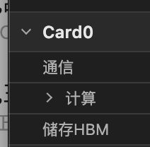 | 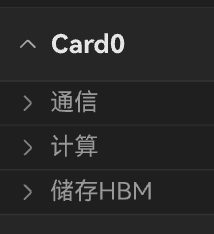 |

Design: [page 1001705](https://octo-g.hdesign.huawei.com/developerPreview/developer/index.html#edit&uniqueId=Cbt3Yr1Wzd6zfmVfNkJOYQ-50712&pageId=1001705)

### AC-18 — Clock-cycle metric selector

1. Each card header: add **clock cycle** metric dropdown on the right.

| Dev | Design |
|-----|--------|
| 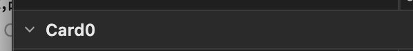 | 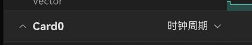 |

Design: [page 1001705](https://octo-g.hdesign.huawei.com/developerPreview/developer/index.html#edit&uniqueId=Cbt3Yr1Wzd6zfmVfNkJOYQ-50712&pageId=1001705)

### AC-19 — Pin on hover

1. Hover shows pin-to-top icon.
2. Label text color also changes on hover.

| Dev | Design |
|-----|--------|
| 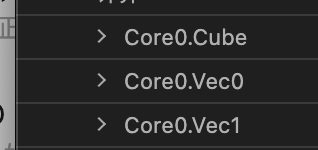 | 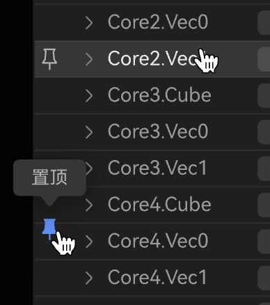 |

Design: [page 1001698](https://octo-g.hdesign.huawei.com/developerPreview/developer/index.html#edit&uniqueId=Cbt3Yr1Wzd6zfmVfNkJOYQ-50712&pageId=1001698)

**Resolution.** Bullet 1 landed with the pin slice (#51): hovering a lane row reveals an outline pushpin, flush-left, with a 置顶 tooltip, and clicking it pins the lane to a sticky strip.

Bullet 2 was never implemented — the row label stayed `#b0b0b0` through hover. Sampling this crop, a resting label peaks at ~`#b0b0b0` while the hovered row's peaks at pure white, so hover now lifts the label to `#fff`. The pin tooltip moved onto the raised-surface chrome at the same time: its spec says to follow EventTooltip, but named that chrome by value (`#2a2a2a` / `#555`), which went stale when AC-09 retinted the tooltip. This crop's bubble measures `#363636`, agreeing with the token.

**Product (2026-09-04) — [UI-44](../../context/questions/deferred.md):** do **not** ship folder/group pin in the current iteration. Shipped behavior remains **leaf lanes only** (`#51`). Folder + subtree strip is implemented on `feat/pin-grouping-nodes` (PR [#69](https://github.com/IdeFrontend/profiling-report/pull/69) closed unmerged; branch kept) for a later iteration.

### AC-20 — Dialog chrome / copy

1. Second-line English copy → Chinese.
2. `?` help icon → design icon; hover shows explanation.
3. Fix white border while typing.
4. Background color → design.
5. Close icon → design.
6. Number spinner up/down arrows: no white background — match icon color values.

**Fixed.** .1 (任务连接层级 in Chinese), .2 (`help` design icon with a CSS hover bubble — the native `title` waited ~1s and drew light-mode OS chrome), .3 (`:focus-visible` only), .5 (`close` design icon). .4 needed no change: sampling the design crop gives a `rgb(54,54,54)` panel on a `rgb(64,64,64)` input, which is the `#363636` / `#404040` already shipped, and the panel's own edge samples `rgb(89,89,89)` against our `#5e5e5e`.

**.6 took two passes.** It reads as "restyle these arrows", and the first pass deleted them instead — the native spinner cannot be restyled (`appearance: none` does not even remove it in Chrome, and nothing tints its light-mode block), and the design crop shows a bare field, so removal looked like agreement with both. It was not: the crop shows a field whose value happens to be typed, and dropping the arrows left no way to step at all. The field now carries its own pair — two half-height chevron buttons inset behind a hairline at its right edge, in the operator menu's hover and active tints, disabled at each clamp. See `PR-TOOLBAR-019`.

| Dev | Design |
|-----|--------|
| 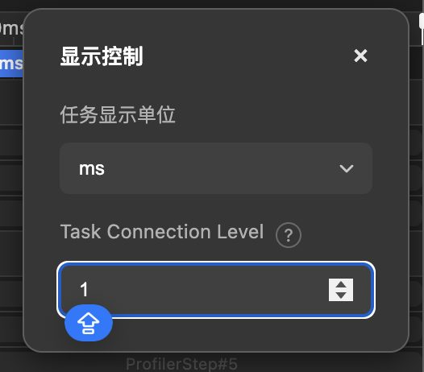 | 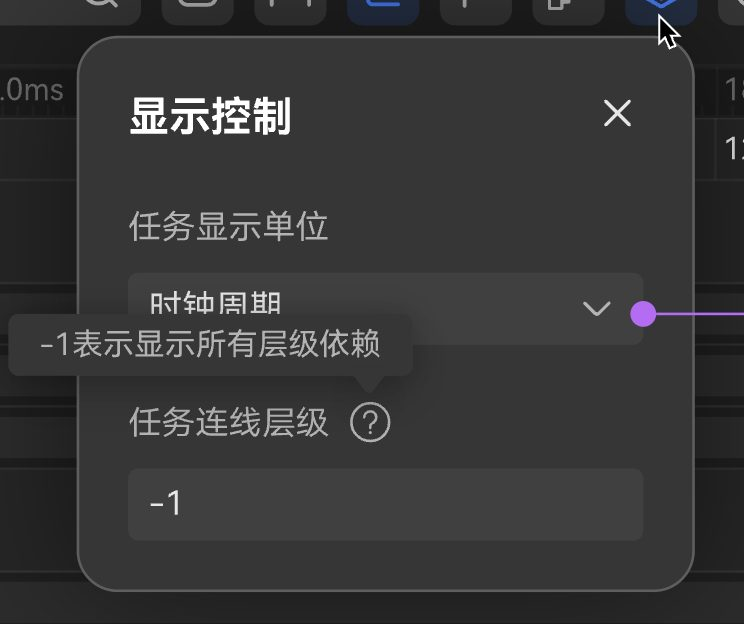 |

Design: [page 1001698](https://octo-g.hdesign.huawei.com/developerPreview/developer/index.html#edit&uniqueId=Cbt3Yr1Wzd6zfmVfNkJOYQ-50712&pageId=1001698)

### AC-21 — Dropdown menu

1. Dropdown must not cover the trigger incorrectly.
2. Remove leading checkbox.
3. Selected / hover / border / radius per design.

**Fixed.** .1 and .2 were already satisfied — the menu opens below the trigger and the items never had a checkbox. .3 retinted: hover `rgba(255,255,255,0.1)` (the old `#2a2a2a` was darker than the menu, so hovering made the row recede), active `rgba(49,122,247,0.2)`, menu border removed.

| Dev | Design |
|-----|--------|
| 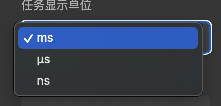 | 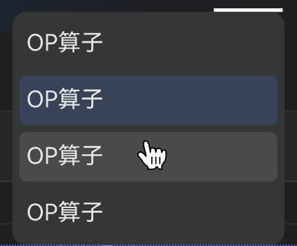 |

Design: [page 1001698](https://octo-g.hdesign.huawei.com/developerPreview/developer/index.html#edit&uniqueId=Cbt3Yr1Wzd6zfmVfNkJOYQ-50712&pageId=1001698)

### AC-22 — Top chrome strip

1. Remove the extra top chrome strip; design top is tabs only — match tab bar height.

**Closed, no change.** That strip is the playground dev harness header, not library chrome, so it never reaches a consumer either way. It carries fixture switching, stress presets, the WebGL/Canvas toggle, and open-file, so it stays for development.

| Dev | Design |
|-----|--------|
| 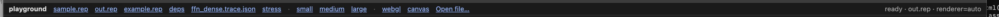 | 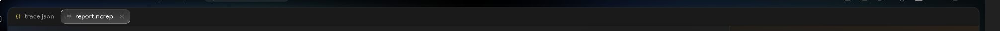 |

Design: [page 1001698](https://octo-g.hdesign.huawei.com/developerPreview/developer/index.html#edit&uniqueId=Cbt3Yr1Wzd6zfmVfNkJOYQ-50712&pageId=1001698)

---

## Related docs

- Design hierarchy: [`../DESIGN_INDEX.md`](../DESIGN_INDEX.md)
- Interactions: [`../INTERACTIONS.md`](../INTERACTIONS.md)
- Color tokens: [`../COLOR_TOKENS.md`](../COLOR_TOKENS.md)
- UX: [`../UX_SPEC.md`](../UX_SPEC.md)
