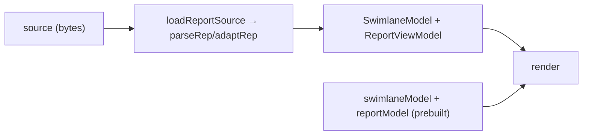

# Using the profiling-report library

Consumer-facing guide for embedding `@huawei/profiling-report` in a host application (MSTT first, later PyPTO). This documents the **current, implemented** contract — the props, emits, and loaders a host actually uses. Design rationale lives in [`docs/architecture/ARCHITECTURE.md`](../architecture/ARCHITECTURE.md); the formal acceptance contract is [`specs/architecture/public-api.spec.md`](../../specs/architecture/public-api.spec.md).

## What it is

A reusable **Vue 3** library that renders an Ascend/CANN operator profiling report as an interactive swimlane timeline plus analytics panels, from **`.rep` / `.ncrep`** containers or **Chrome Trace** (`trace.json`) JSON.

- Zero runtime dependencies — `vue` is the only peer dependency (`^3.5.0`).
- Canvas 2D renderer with an optional WebGL2 hybrid backend (`preferRenderer`).
- Dark theme by default, light theme via `theme` prop / `data-theme` attribute.
- Built-in `en` / `zh-CN` i18n.

Out of scope for this library (owned by hosts): MindStudio Insight `.bin` viewing, VS Code webview lifecycle, file I/O, theme injection.

## Consumption patterns

Two supported ways to consume the library:

1. **Published package** — import from `@huawei/profiling-report` after `npm install`; resolves to `dist/profiling-report.js` + `dist/index.d.ts`.
2. **Git submodule + Vite alias** (the MSTT pattern) — the host compiles the library's `src/` directly, avoiding a separate npm publish. See `mstt/docs/profiling-report-integration.md`.

The barrel entry is the only supported public import:

```ts
import { ProfilingReport, loadReportSource, parseRep, adaptRep } from '@huawei/profiling-report';
```

Deep imports (`@huawei/profiling-report/...`) are **not** part of the public surface — the package `exports` map restricts to the barrel. Domain helpers (time formatting, colors, view state) are available as deep imports for advanced hosts during local development only.

## Public API

Barrel exports ([`src/index.ts`](../../src/index.ts)):

| Export | Kind | Purpose |
|--------|------|---------|
| `ProfilingReport` | Vue component | Default host entry — renders the full report |
| `loadReportSource` | function | `(ArrayBuffer \| Uint8Array) → AdaptedReport` — auto-detects `.rep` vs Chrome Trace |
| `parseRep` | function | `(bytes) → ParsedRep` — parse the `.rep` container |
| `adaptRep` | function | `(ParsedRep) → AdaptedReport` — container → canonical models |
| `adaptChromeTrace` | function | `(unknown) → AdaptedReport` — Chrome Trace → models |
| `chromeTraceToSwimlane` | function | `(unknown) → SwimlaneModel` — Chrome Trace → timeline only |
| `LIBRARY_NAME` | const | `'profiling-report'` |
| domain types | `export type *` | `SwimlaneModel`, `ReportViewModel`, `SelectedEvent`, `ReportCapability`, … |

## `ProfilingReport` component

Source of truth: [`src/ui/ProfilingReport/ProfilingReport.vue`](../../src/ui/ProfilingReport/ProfilingReport.vue).

### Props

| Prop | Type | Default | Notes |
|------|------|---------|-------|
| `source` | `ArrayBuffer \| Uint8Array` | — | Raw report bytes; library auto-detects format, parses, adapts, renders |
| `swimlaneModel` | `SwimlaneModel` | — | Pre-built timeline model; bypasses parsing |
| `reportModel` | `ReportViewModel` | — | Pre-built analytics model; bypasses parsing |
| `title` | `string` | — | Toolbar title |
| `theme` | `'light' \| 'dark'` | `'dark'` | Drives `data-theme` on `.pr-root` |
| `locale` | `string` | `'zh-CN'` | `en` / `zh-CN` (any other → `zh-CN`) |
| `timeUnit` | `'ms' \| 'us' \| 'ns'` | `'ms'` | Initial axis display unit |
| `preferRenderer` | `'auto' \| 'webgl' \| 'canvas'` | `'auto'` | Force swimlane backend (perf A/B) |
| `capabilities` | `ReportCapability[]` | `[]` | Feature-gates sub-panels |

### Emits

| Emit | Payload | When |
|------|---------|------|
| `ready` | `[]` | After `source` parsed and models loaded |
| `select` | `SelectedEvent \| null` | User selects/deselects an event |
| `error` | `{ message: string; cause?: unknown }` | Load/parse failure |
| `view-full-csv` | `ViewFullCsvPayload` (`{ fileName, text }`) | 查看全部 / View full CSV |
| `open-hardware-details` | `[]` | Hardware info drill-down |
| `open-pipe-details` | `[]` | PIPE occupancy drill-down |

### Two loading paths



1. **`source`** — pass raw bytes; the library does everything. Use this for `.rep`/`.ncrep` and Chrome Trace.
2. **`swimlaneModel` + `reportModel`** — the host runs its own data pipeline and passes prebuilt canonical models; the library skips parsing. Prebuilt models take precedence when provided alongside `source`.

## Minimal example

```vue
<script setup lang="ts">
import { ref } from 'vue';
import { ProfilingReport } from '@huawei/profiling-report';

const bytes = ref<Uint8Array | null>(null);

// Host reads the file (its responsibility) and assigns bytes.
const onError = (err: { message: string }) => console.error(err.message);
</script>

<template>
  <div style="height: 100vh">
    <ProfilingReport
      v-if="bytes"
      :source="bytes"
      :theme="'dark'"
      :locale="'en'"
      @ready="() => {}"
      @error="onError"
    />
  </div>
</template>
```

The host wrapper must give the component a definite height — `ProfilingReport`'s root uses `height: 100%`.

## Theming

- `theme` prop (`'dark'` default) sets `data-theme` on the `.pr-root` element.
- Colors come from CSS custom properties in [`src/ui/tokens.css`](../../src/ui/tokens.css) — `--pr-bg-panel`, `--pr-bg-deep`, `--pr-playhead`, per-lane colors, etc. Dark is the `:root` default; light overrides via `.pr-root[data-theme='light']`.
- A VS Code host bridges its active color theme to the `theme` prop (or toggles `data-theme` directly); the library does not read `--vscode-*` variables itself.

## Internationalization

- `locale` prop selects the built-in catalog: `en` or `zh-CN` (default). Any unrecognized value falls back to `zh-CN`.
- `resolveLocale` / `t` ([`src/i18n/index.ts`](../../src/i18n/index.ts)) are the internal helpers; hosts only set `locale`.

## Capabilities

`ReportCapability` ([`src/domain/types.ts`](../../src/domain/types.ts)) gates sub-panels so a host only shows what its data supports:

```
'roofline' | 'dependencies' | 'memoryDiagram' | 'hardwareDetails' | 'sourceTab' | 'cacheTab' | 'aicpu'
```

`[]` (or omitted) shows only MVP features: summary, PIPE occupancy, M1 detail tabs, and the timeline. Pass flags to unlock the corresponding panel modes.

## Host vs library responsibilities

| Concern | Host owns | Library owns |
|---------|-----------|--------------|
| File read / remote fetch | yes | no |
| VS Code webview lifecycle / CSP / asset URIs | yes | no |
| Theme + locale injection | yes | no |
| Passing `capabilities` for the opened format | yes | no |
| Format parse → canonical models | no | yes |
| Swimlane + panel rendering | no | yes |
| `ready` / `select` / `error` events | consumes | emits |

The library must never call `useViewServer()`, `window.vscode`, or a host router.

## Related docs

- [`docs/architecture/ARCHITECTURE.md`](../architecture/ARCHITECTURE.md) — packaging + adapter strategy
- [`docs/architecture/COMPONENTS.md`](../architecture/COMPONENTS.md) — canonical models + component catalog
- [`specs/architecture/public-api.spec.md`](../../specs/architecture/public-api.spec.md) — formal public-API contract
- [`docs/architecture/MSTT_INTEGRATION.md`](../architecture/MSTT_INTEGRATION.md) — design-level MSTT integration
- [`docs/formats/REP_FORMAT.md`](../formats/REP_FORMAT.md) — `.rep` container layout
