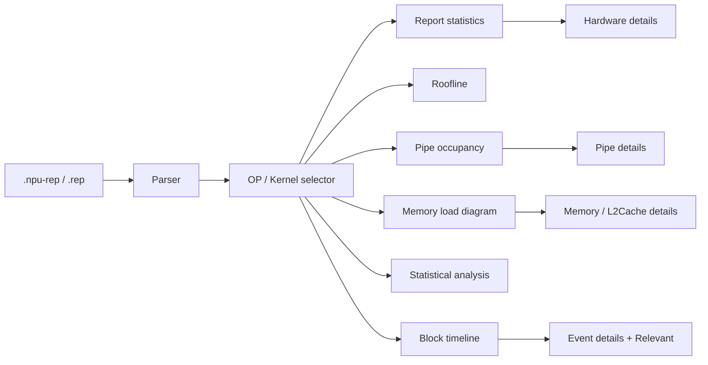

# Views — consumer surface catalog

Per-surface packets: **sketches + adapted view-model + compute/emulate fill** (including **column / slot / edge → view-model tables**). Profile **on-disk** schemas stay under [`../formats/`](../formats/) (`compute/`, `emulate/`). Adapter dispatch: [`../formats/ADAPTERS.md`](../formats/ADAPTERS.md). Product § → packet indexes: [`product-sections.md`](product-sections.md).

**New packet:** copy [`_template.md`](_template.md). Heading order is fixed (Sketches before View-model).

## Overview

## Catalog

| Id | File | Phase | Unification | Sept 30 | Sketch (primary) |
|----|------|-------|-------------|---------|------------------|
| `timeline` | [timeline.md](timeline.md) | M | `same-path` | **in** | `entry.jpeg` / task-* |
| `event-details` | [event-details.md](event-details.md) | M (+ Relevant P2) | `gap` | **thin** (CTEF strip) | `detail-strip-raised.jpeg` |
| `report-summary` | [report-summary.md](report-summary.md) | M | `adapt-mapper` | **out** ([DATA-47](../context/decisions/DATA.md)) | `report-stats-open.jpeg` |
| `hardware-details` | [hardware-details.md](hardware-details.md) | M1 | `adapt-mapper` | **out** with summary ([DATA-47](../context/decisions/DATA.md)) | `hardware-more-detail.jpeg` |
| `pipe-occupancy` | [pipe-occupancy.md](pipe-occupancy.md) | M | `adapt-mapper` | **in** | `compute-load.jpeg` |
| `overview-charts` | [overview-charts.md](overview-charts.md) | M | `gap` | **hide** | OverviewCharts visual |
| `roofline` | [roofline.md](roofline.md) | M2 | `gap` | **hide** | RooflinePanel visual |
| `memory-topology` | [memory-topology.md](memory-topology.md) | M2 / M4 | `adapt-mapper` | compute **in** (`memoryDiagram`); emulate Architecture Diagram **in** on same chrome (`archDiagram`) | `memory-topology.svg` (`v930-chrome`) |
| `performance-hints` | [performance-hints.md](performance-hints.md) | M4 | `adapt-mapper` | **planned** | `v930-sim` 性能提示 report panel |

### Stubs (second pass)

Surfaces still described in legacy [VIEW_DATA_REQUIREMENTS](../formats/VIEW_DATA_REQUIREMENTS.md) until extracted: time axis, lane gutter, swimlane canvas, measure mode, secondary tabs. Intended sketches when known: `task-hover.jpeg`, `task-measure-mode.jpeg`.

## Mockup index

Source files under [`../ui/source/v930/`](../ui/source/v930/). Full design hierarchy: [`DESIGN_INDEX.md`](../ui/DESIGN_INDEX.md).

| File | Section |
| --- | --- |
| [`entry-overview.png`](../ui/source/v930/entry.jpeg) | Entry + overall timeline chrome |
| [`npu-rep-layout.png`](../ui/source/v930/entry.jpeg) | Container binary layout |
| [`report-stats.png`](../ui/source/v930/report-stats-open.jpeg) | Report statistics |
| [`hardware-details.png`](../ui/source/v930/hardware-more-detail.jpeg) | Hardware details |
| [`roofline.png`](../ui/source/v930/report-stats-open.jpeg) | Roofline |
| [`pipe-occupancy.png`](../ui/source/v930/compute-load.jpeg) | Pipe occupancy bars |
| [`pipe-details.png`](../ui/source/v930/compute-load-detail.jpeg) | Pipe details list |
| [`memory-topology-annotated.png`](../../src/ui/StatsAside/MemoryTopologyPanel/memory-topology.svg) | Memory topology SVG (448×423, AIC + AIV × 2) |
| [`memory-load-heatmap.png`](../ui/source/v930/report-stats-scrolled.jpeg) | Historical dual-AIV memory-load dump (not current chrome) |
| [`statistical-analysis.png`](../ui/source/v930/entry.jpeg) | Cube/Vector statistical tracks |
| [`kernel-block-timeline.png`](../ui/source/v930/entry.jpeg) | Block timeline |
| [`event-details.png`](../ui/source/v930/detail-strip-raised.jpeg) | Event / Relevant details |

## SSOT rules

| Concern | Owner |
|---------|--------|
| Container / profiles / detection | [`../formats/README.md`](../formats/README.md) |
| Embed schemas | [`../formats/compute/`](../formats/compute/), [`../formats/emulate/`](../formats/emulate/) |
| Per-surface VM + fill + sketches + **field/slot/edge tables** | **this tree** |
| Product § → packet index (TOC only) | [`product-sections.md`](product-sections.md) |
| UX scenarios / interactions | [`../ui/UX_SPEC.md`](../ui/UX_SPEC.md), [`../ui/INTERACTIONS.md`](../ui/INTERACTIONS.md) |
| Component ACs | Co-located `src/ui/**/*.spec.md` — link here for data |

Do **not** fork hide rules by raw CSV name. Do **not** invent compute-shaped embeds from emulate tables ([DATA-45](../context/decisions/interim/DATA.md#data-45)). Do **not** defer field/slot tables to the product § index — own them in Compute/Emulate fill.

**Emulate packer checklist (embed → Sept 30 view):** [emulate/FORMAT §4.1](../formats/emulate/FORMAT.md#41-embeds-used-by-report-visualization-sept-30--m4).
