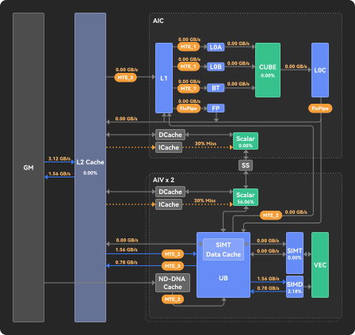
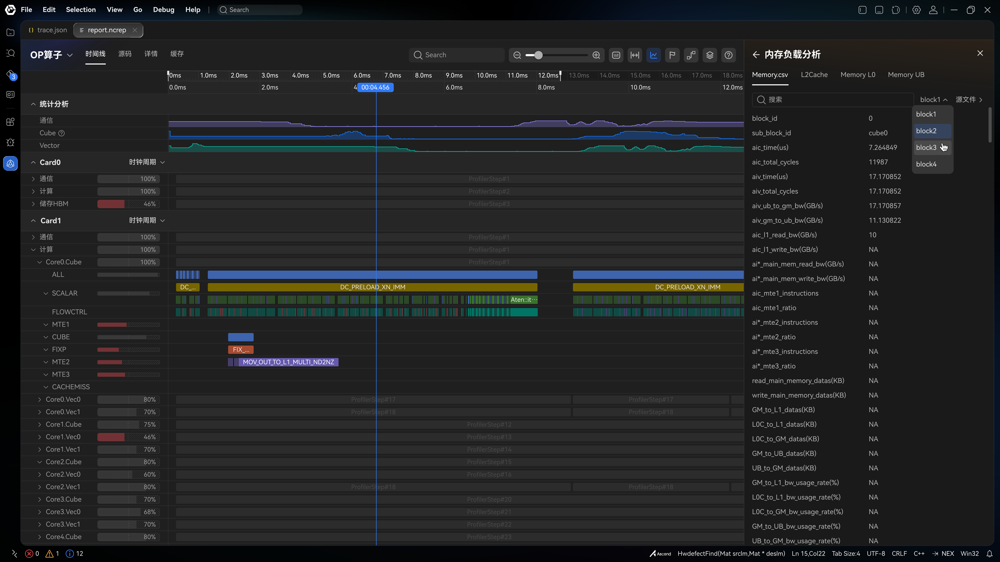

# Memory topology / Architecture Diagram

| | |
|--|--|
| **Id** | `memory-topology` |
| **Panel / component** | `MemoryTopologyPanel` → `src/ui/StatsAside/MemoryTopologyPanel/` |
| **Capabilities** | Compute → **`memoryDiagram`**; emulate → **`archDiagram`**. Same chrome + VM; do **not** advertise emulate as `memoryDiagram`. |
| **Phase** | M2 (compute); M4 interim (emulate Architecture Diagram stand-in) |
| **Unification** | **One chrome + one `memoryTopology` VM + two adapters** |
| **Sept 30 (emulate)** | **in** — ArchDiagramMetrics → interim plated chrome; **UI title** = 内存负载分析 / Memory load analysis (same as compute) |

## Architecture (normative)

| Piece | Rule |
|-------|------|
| **Chrome** | Exactly one SVG: `memory-topology.svg` (**448×423**, AIC above AIV × 2). No compute-only / emulate-only chrome. Full biprof Architecture Diagram SVG / richer model: [DATA-49](../context/questions/DATA.md). |
| **View model** | Exactly one carrier: `reportModel.memoryTopology` (`MemoryTopologyModel`). No separate emulate topology VM. |
| **Panel** | Exactly one: `MemoryTopologyPanel` — profile-agnostic overlays on chrome slots. |
| **Adapters** | Exactly two mappers: compute `buildMemoryTopology*` / `firstLabelledMemoryTopology`; emulate `topologyFromArchDiagramMetrics`. Shared node scaffold + plated edge ids; different CSV → field maps. |
| **Capabilities** | Compute sets `memoryDiagram` when topology is drawable. Emulate sets **`archDiagram`** when ArchDiagramMetrics yields drawable topology. Do **not** set `memoryDiagram` on emulate (that flag is compute Asc 内存负载). |

Full field tables: [§ edge-field-source](#edge-field-source) (compute) · [§ parameter-slot-map](#parameter-slot-map) (emulate).

## Sketches

**AIV × 2** is one subblock. Corridor labels are **not** AIV0+AIV1 sums: compute paints a single `aiv_*` field per plate; emulate averages `aiv0_*` / `aiv1_*` when both are present ([DATA-48a](../context/decisions/interim/DATA.md)). Do not change that fill. (GM↔L2 Main Read/Write remains aic+aiv **sum** — [DATA-40](../context/decisions/DATA.md) — a different axis.)

**Component crop:**  (raster of the runtime SVG / `v930-chrome/memory-topology`). Historical dual-AIV product dump: [`v930/report-stats-scrolled`](../ui/source/v930/report-stats-scrolled.jpeg) (link only — not the current chrome).

## Purpose

Fixed memory-path chrome with data-driven edge labels (BW / hit rate / util):

- **Compute (M2):** selected-block Memory* / PipeUtilization fill under capability `memoryDiagram` (Asc 内存负载分析 / 内存拓扑).
- **Emulate (M4 Sept 30):** biprof **Architecture Diagram** (§11.2.3.1) from `ArchDiagramMetrics` under capability **`archDiagram`**, painted on the **same** chrome and `memoryTopology` carrier. UI title stays **内存负载分析** / Memory load analysis (`memoryAnalysis`); fullscreen **内存拓扑**. Heatmap (`MemoryRWAccesses`, §11.2.3.2) is **out** Sept 30 ([DATA-49](../context/questions/DATA.md)).

## View-model

| Field | Role | Required? |
|-------|------|-----------|
| `reportModel.memoryTopology` | Nodes + edges with labels; optional `peakPct` / `plates` | **Required to show** |
| capability `memoryDiagram` | Compute feature gate | Set when topology present (compute only) |
| capability `archDiagram` | Emulate feature gate | Set when ArchDiagramMetrics yields drawable topology |

## Hide rule

No drawable labels / L2 plate → hide diagram ([DATA-30](../context/decisions/DATA.md), PR-VM-018). Emulate: omit `archDiagram` when undrawable.

## Compute fill

| Adapted field | Embed | Columns / notes | Schema SSOT |
|---------------|-------|-----------------|-------------|
| `memoryTopology` | `Memory.csv`, `MemoryL0.csv`, `MemoryUB.csv`, `L2Cache.csv`, `PipeUtilization.csv` | Edge / plate map below; `buildMemoryTopology` | [METRICS](../formats/compute/METRICS_AND_TRACE.md), [compute/FORMAT](../formats/compute/FORMAT.md) |

The panel renders the official chrome [`memory-topology.svg`](../../src/ui/StatsAside/MemoryTopologyPanel/memory-topology.svg) (**448×423** simplified Figma export: AIC row above a combined **AIV × 2** row; static labels/arrows intact, sample values stripped) and overlays **real values** on that chrome's value slots — the `summary.jsonl` category mean under `All`, that block's CSV row when a `block_id` is picked ([DATA-19](../context/decisions/DATA.md) / [DATA-29](../context/decisions/DATA.md)).

### VM field ← source (join / derivation)

| VM field | Source embed(s) | Join key(s) | Derivation |
|----------|-----------------|-------------|------------|
| topology (All) | `summary.jsonl` categories via `FILE_CATEGORY` | category name ↔ Memory / MemoryL0 / MemoryUB / L2Cache / PipeUtilization | `buildMemoryTopologyFromCategories` |
| topology (block) | `Memory.csv`, `MemoryL0.csv`, `MemoryUB.csv`, `L2Cache.csv`, `PipeUtilization.csv` | `block_id` = selected id on each CSV | `buildMemoryTopology(tables, blockId)` |
| `edges[].label` | per [EDGE_MAP](#edge-field-source) | _(column pick, not FK)_ | First present non-`NA` source column, except GM↔L2 Main Read/Write = **sum** aic+aiv; format `{n} GB/s` / KB / `%` |
| `nodes[l2].peakPct` | `L2Cache` hit-rate cols | _(same as `l2-hit` edge)_ | DATA-21 column order |
| `plates` (in-box utils) | `PipeUtilization` | _(none)_ | `aiv_scalar_ratio` / `aiv_vec_ratio` / `aic_cube_ratio` → `{ratio×100}%` on nodes `aiv_scalar` / `vec` / `cube` (UI-49) |
| show / hide | — | — | `hasDrawableTopology`: plated label or L2 peak required (PR-VM-018) |

Code: `memoryTopology.ts` (`EDGE_MAP`, `PLATE_MAP`, `buildMemoryTopology*`).

### Edge → field → source

Use this table for `MemoryTopologyPanel` labels. Bare `*_read_bw` = leaving the named resource; `*_write_bw` = arriving there.

| Display edge | Field | Source | Notes |
| --- | --- | --- | --- |
| GM → L2 | `aic_main_mem_read_bw(GB/s)` + `aiv_main_mem_read_bw(GB/s)` | `Memory.csv` | **DATA-40 (resolved):** the producer's **"Main Read"** — both sides **summed**, the same quantity the 带宽利用率 读 card shows (DATA-8). Read = leaving GM (`out.rep` 16.89, aiv-only there). A side that is `NA` contributes nothing; both `NA` → no label |
| GM ← L2 | `aic_main_mem_write_bw(GB/s)` + `aiv_main_mem_write_bw(GB/s)` | `Memory.csv` | **DATA-40 (resolved):** **"Main Write"**, likewise summed. Write = arriving at GM (≡ `aiv_ub_to_gm_bw`). The producer's row 32 lists the AIC **read** column by slip; the card's `aicore_gm_write_bw` side is the write column |
| L2 → L1 | `aiv_gm_to_ub_bw(GB/s)` | `Memory.csv` | **DATA-43 (resolved):** the plate is the producer's DATA-39 row `24` `GM -> UB` field, painted on the chrome's own AIC-row corridor slot ("display it according to svg spec"). `aic_l1_read_bw` therefore feeds **no** plate; it stays a Memory.csv 详情 column. `out.rep` NA |
| L2 ← L1 | `aic_l1_write_bw(GB/s)` | `Memory.csv` | Adapter edge exists; **diagram slot blank** pending UI-48 (export routes this corridor onto FixP) |
| L1 → L0A | `aic_l0a_read_bw(GB/s)` | `MemoryL0.csv` | Keep master L1→L0A (operand buffer); `out.rep` NA |
| L1 → L0B | `aic_l0b_read_bw(GB/s)` | `MemoryL0.csv` | Same |
| L0A → Cube | `aic_l0a_write_bw(GB/s)` | `MemoryL0.csv` | Same |
| L0B → Cube | `aic_l0b_write_bw(GB/s)` | `MemoryL0.csv` | Same |
| L0C → Cube | `aic_l0c_read_bw_cube(GB/s)` | `MemoryL0.csv` | |
| Cube → L0C | `aic_l0c_write_bw_cube(GB/s)` | `MemoryL0.csv` | |
| L0C → L1 | `L0C_to_L1_datas(KB)` | `Memory.csv` | **DATA-24:** Product-confirmed field. No 理论值 (Peak %) field exists — the producer's DATA-39 row `23` is `NA` ([DATA-41](../context/questions/DATA.md)) |
| L0C → L2 | `L0C_to_GM_datas(KB)` | `Memory.csv` | **DATA-25:** Product-confirmed field. No 理论值 (Peak %) field exists ([DATA-41](../context/questions/DATA.md)) |
| UB → L2 | `aiv_ub_to_gm_bw(GB/s)` | `Memory.csv` | **DATA-22:** Product answer; `MemoryUB.csv` `aiv_ub_read_bw_gm` is not the collected field |
| L2 → UB | `aiv_gm_to_ub_bw(GB/s)` | `Memory.csv` | **DATA-23:** Product answer; `MemoryUB.csv` `aiv_ub_write_bw_gm` is not the collected field |
| Vec → UB | `aiv_ub_write_bw_vector(GB/s)` | `MemoryUB.csv` | `ub_read_*` = leaving UB (`out.rep` add 2:1) |
| UB → Vec | `aiv_ub_read_bw_vector(GB/s)` | `MemoryUB.csv` | |
| L2Cache Hit Rate | total `*_hit_rate(%)` | `L2Cache.csv` / `summary.jsonl` `L2Cache` | **DATA-21:** use the **total** hit rate; fall back to first non-`NA` of `aic_total_hit_rate(%)`, `aiv_total_hit_rate(%)`, then read rates |
| **L2 Peak(%)** | same hit-rate columns as above | `L2Cache.csv` | **DATA-20 (resolved):** L2 box only = hit rate, its 100% reference is the hit rate itself (not a peak-relative percent) |
| **Scalar util (in-box)** | `aiv_scalar_ratio` | `PipeUtilization.csv` / `summary.jsonl` `PipeUtilization` | **UI-49 (resolved):** printed `{ratio × 100}%` (DATA-28 own-busy-time ratio, not a peak-relative percent) in the AIV0 **and** AIV1 `Scalar` boxes — one field, one value, both rows |
| **Vec util (in-box)** | `aiv_vec_ratio` | `PipeUtilization.csv` / `summary.jsonl` `PipeUtilization` | **UI-49 (resolved):** `{ratio × 100}%` in the AIV0 **and** AIV1 `Vec` boxes |
| **Cube util (in-box)** | `aic_cube_ratio` | `PipeUtilization.csv` / `summary.jsonl` `PipeUtilization` | **UI-49 (resolved):** `{ratio × 100}%` in the AIC `Cube` box |
| AIC `Scalar`, AIV0/AIV1 `SIMT VF`, AIV0/AIV1 `SIMD VF`, `FixP` (in-box) | — | — | **UI-49 (resolved):** the producer's DATA-39 table marks all six rows **`NA`**, but its `SIMD VF` rows name the `Vec` position the `Vec` rows paint — so the remaining **four** positions have no field and nothing is drawn |

**NA (confirmed):** do not show `NA` labels; **do show 0**. Edge thickness stays static.

### Visualization logic

- Static architecture template: GM/HBM → L2 → AIC (L1, L0A/B/C, Cube, FixP, Scalar) and AIV×2 (UB, Vec/SIMT/SIMD, Scalar).
- Overlay **GB/s** (or KB) on edges from the mapping tables. Hide `NA`; show `0`.
- Overlay **Peak (%)** on the **L2** unit as `{n}%` under **L2 Cache** (compute: hit rate DATA-20; emulate: `l2_cached_ratio`). **No other unit** carries a Peak(%). Compute in-box badges are **unit utilizations** (UI-49); emulate interim leaves those blank.
- **Right-click (UI-35):** open memory CSV overlay (Memory / L2Cache / MemoryUB / MemoryL0), same as **详情**.
- Labels are **block-scoped** via the same block switcher as memory details ([DATA-19](../context/decisions/DATA.md)) on compute; emulate ArchDiagramMetrics is report-scoped.

Component ACs that also own these rules: [MemoryTopologyPanel.spec.md](../../src/ui/StatsAside/MemoryTopologyPanel/MemoryTopologyPanel.spec.md).

### Details / CSV tabs（内存负载分析详情）— §11.2.6.1

Memory detail controls ([`v930/memory-load-detail`](../ui/source/v930/memory-load-detail.jpeg)):

| Control | Behavior |
| --- | --- |
| Tabs | `Memory L1` (`Memory.csv`), `L2Cache` (`L2Cache.csv`), `Memory L0` (`MemoryL0.csv`), `Memory UB` (`MemoryUB.csv`) — hide tab if CSV absent. On the CSV field-list rendering, also `PipeUtilization` when present — the only source of the chrome's MTE utilizations (UI-38); when memory summary categories exist the surface lists those categories instead |
| Block switcher | One selector for every widget ([DATA-19](../context/decisions/DATA.md) / [DATA-29](../context/decisions/DATA.md)); `All` shows the `summary.jsonl` category list, a picked id scopes the field list to that block's row |
| 查看全部 | Emit open-full-CSV intent; host/playground opens complete CSV in a new tab ([DATA-33d](../context/decisions/interim/DATA.md)) |

Searchable key–value / table of columns for the active tab + block. Show `NA` when present.

## Emulate fill (Architecture Diagram → same chrome)

| Adapted field | Embed | Columns / notes | Status |
|---------------|-------|-----------------|--------|
| `memoryTopology` (same carrier) | `ArchDiagramMetrics.csv` | Parameter→slot + **gaps** below ([DATA-48a](../context/decisions/interim/DATA.md)); SSOT `ARCH_DIAGRAM_EDGE_MAP` / `ARCH_DIAGRAM_L2_PEAK_PARAM` / `ARCH_DIAGRAM_UNPLATED_HTML_BASES`; gelu HTML `*_gbs` ids = evidence toward [DATA-48](../context/questions/DATA.md) (open) | `adapt-mapper` |
| Heatmap | `MemoryRWAccesses.csv` | biprof §11.2.3.2 | **out** Sept 30 ([DATA-49](../context/questions/DATA.md)) |

### ArchDiagramMetrics → slot (DATA-48a)

Single embed, EAV rows — **no FK join**. Map `ArchDiagramParameterName` → slot via the table below; value = `ArchDiagramParameterValue`. Dual AIV0/AIV1 params: **average** when both present (`pickValue`). Reuse compute edge `from`/`to` node ids from `memoryTopology.ts`. No in-box util plates on this path.

| VM field / slot | Source embed(s) | Join key(s) | Derivation |
|-----------------|-----------------|-------------|------------|
| `edges[gm-l2-read].label` | `ArchDiagramMetrics.csv` | name = `hbm_to_l2_syn_gbs` | `{n} GB/s` |
| `edges[gm-l2-write].label` | same | `l2_to_hbm_syn_gbs` | `{n} GB/s` |
| `edges[l2-l1-read].label` | same | `aic_out_to_l1_gbs` | `{n} GB/s` |
| `edges[l1-l0a]` / `[l1-l0b]` | same | `aic_l1_to_l0a_gbs` / `aic_l1_to_l0b_gbs` | `{n} GB/s` |
| `edges[l0a-cube]` / `[l0b-cube]` | same | `aic_l0a_to_cube_gbs` / `aic_l0b_to_cube_gbs` | `{n} GB/s` |
| `edges[cube-l0c]` / `[l0c-cube]` | same | `aic_cube_to_l0c_gbs` / `aic_l0c_to_cube_gbs` | `{n} GB/s` on sole plate `cube-l0c` — reverse folds onto forward (prefer forward); `l0c-cube` label cleared after fold |
| `edges[l2-ub]` | same | `aiv0_out_to_ub_gbs`, `aiv1_out_to_ub_gbs` | average when both present |
| `edges[ub-l2]` | same | `aiv0_ub_to_out_gbs` / `aiv1_ub_to_out_gbs` | average |
| `edges[ub-vec]` / `[vec-ub]` | same | `aiv*_ub_to_simd_gbs` / `aiv*_simd_to_ub_gbs` | average |
| `nodes[l2].peakPct` | same | `l2_cached_ratio` | numeric peak % |
| capability | — | — | `archDiagram` when `hasDrawableTopology` (not `memoryDiagram`) |

| Slot / plate | Parameter |
|--------------|-----------|
| `gm-l2-read` | `hbm_to_l2_syn_gbs` |
| `gm-l2-write` | `l2_to_hbm_syn_gbs` |
| `l2-l1-read` | `aic_out_to_l1_gbs` |
| `l1-l0a` / `l1-l0b` | `aic_l1_to_l0a_gbs` / `aic_l1_to_l0b_gbs` |
| `l0a-cube` / `l0b-cube` | `aic_l0a_to_cube_gbs` / `aic_l0b_to_cube_gbs` |
| `cube-l0c` / `l0c-cube` | `aic_cube_to_l0c_gbs` / `aic_l0c_to_cube_gbs` — fold reverse onto `cube-l0c` |
| `l2-ub` | `aiv0_out_to_ub_gbs` (AIV0), `aiv1_out_to_ub_gbs` (AIV1) — average when both present |
| `ub-l2` | `aiv0_ub_to_out_gbs` / `aiv1_ub_to_out_gbs` |
| `ub-vec` | `aiv0_ub_to_simd_gbs` / `aiv1_ub_to_simd_gbs` |
| `vec-ub` | `aiv0_simd_to_ub_gbs` / `aiv1_simd_to_ub_gbs` |
| L2 `peakPct` | `l2_cached_ratio` |

### Explicit gaps (HTML inventory present, not plated)

| Gap | Why out |
|-----|---------|
| HTML bases `aic_l0c_to_all_syn`, `aic_l0c_to_l1`, `aic_l0c_to_out`, `aic_l0c_to_ub0/1` | No Asc chrome plate (L0C→OUT / UB / all) |
| `aiv{0,1}_ub_to_l1` | No UB→L1 plate |
| `aiv{0,1}_out_to_simt` / `simt_to_out`, `ub_to_simt` / `simt_to_ub`, `cache_to_simt` / `simt_to_cache` | SIMT / DataCache corridors unplated (UI-38) |
| Entire HTML `*_ratio` / `*_cnt` Bandwidth tabs (except L2 peak) | Per-request / count views; util ratios other than `l2_cached_ratio` not mapped to `plates` |
| HTML util ratios `aic_cube_ratio`, `aic_*_scalar_ratio`, `aiv{0,1}_simd/simt/scalar_ratio` | Emulate interim paints no UI-49 badges from ArchDiagramMetrics |

Code SSOT: `ARCH_DIAGRAM_EDGE_MAP` / `ARCH_DIAGRAM_UNPLATED_HTML_BASES` / `ARCH_DIAGRAM_L2_PEAK_PARAM` in `emulateMemoryTopology.ts`; locked by `PR-ASIM-008` / `PR-ASIM-008b`.

Set capability **`archDiagram`** when `hasDrawableTopology` (do **not** advertise emulate as `memoryDiagram`). Do **not** use `MemoryRWAccesses` (heatmap — [DATA-49](../context/questions/DATA.md)).

## Adapter

| Profile | Entry | Notes |
|---------|-------|-------|
| compute | `buildMemoryTopology` / `firstLabelledMemoryTopology` | Capability **`memoryDiagram`** |
| emulate | `topologyFromArchDiagramMetrics` in `adaptEmulate` / `emulateMemoryTopology.ts` | Capability **`archDiagram`** when drawable; same chrome + VM |

## Related

- Spec: [MemoryTopologyPanel.spec.md](../../src/ui/StatsAside/MemoryTopologyPanel/MemoryTopologyPanel.spec.md); emulate mapper [adapt-emulate](../../specs/core/adapt-emulate.spec.md)
- Product: compute §11.2.6; emulate Architecture Diagram §11.2.3.1; heatmap §11.2.3.2 out Sept 30
- Delivery: [milestone-4](../process/roadmap/milestone-4.md)
- Open: [DATA-48](../context/questions/DATA.md), [DATA-49](../context/questions/DATA.md)
- Catalog: [README](README.md)
