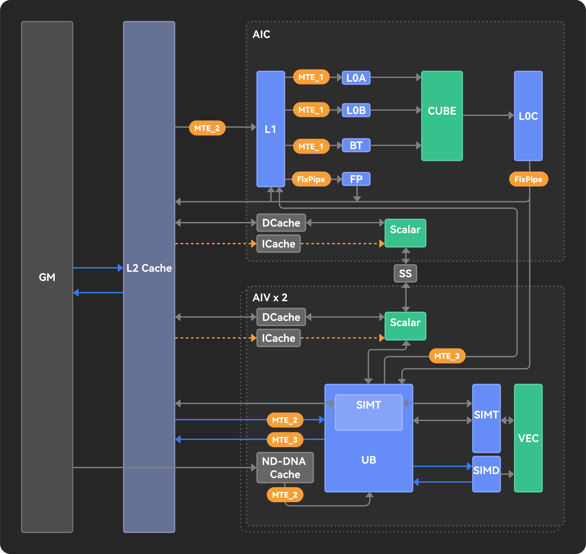
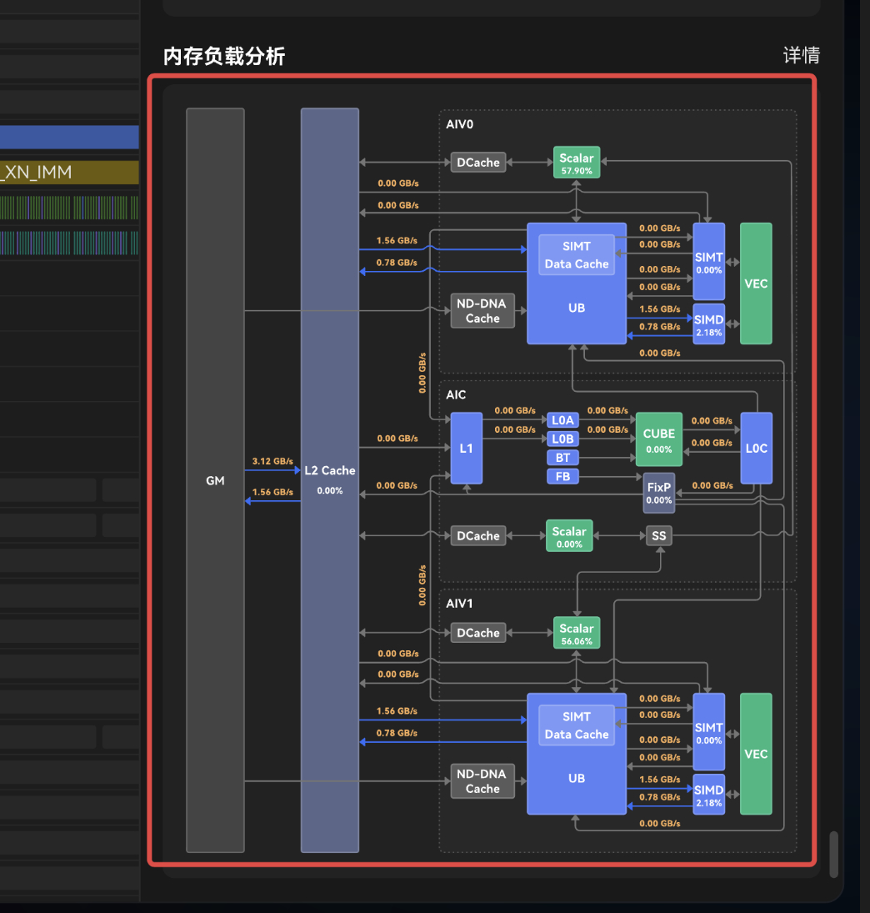

# Memory topology

| | |
|--|--|
| **Id** | `memory-topology` |
| **Panel / component** | `MemoryTopologyPanel` → `src/ui/StatsAside/MemoryTopologyPanel/` |
| **Capability** | `memoryDiagram` |
| **Phase** | M2 |
| **Unification** | `adapt-mapper` (compute); emulate uses this chrome as interim [arch-diagram](arch-diagram.md) stand-in |
| **Sept 30 (emulate)** | **interim chrome** — data via `archDiagram`; **UI title** = 内存负载分析 (same as compute) |

## Sketches

**Component crops:**  · 

## Purpose

Fixed memory-path chrome with data-driven edge labels (BW / hit rate) for the selected block.

## View-model

| Field | Role | Required? |
|-------|------|-----------|
| `reportModel.memoryTopology` | Nodes + edges with labels | **Required to show** |
| capability `memoryDiagram` | Feature gate | Set when topology present |

## Hide rule

No drawable labels / L2 plate → hide diagram ([DATA-30](../context/decisions/DATA.md), PR-VM-018).

## Compute fill

| Adapted field | Embed | Columns / notes | Schema SSOT |
|---------------|-------|-----------------|-------------|
| `memoryTopology` | `Memory.csv`, `MemoryL0.csv`, `MemoryUB.csv`, `L2Cache.csv` | Edge map in [VIEW_DATA_MAPPING §11.2.6](../ui/VIEW_DATA_MAPPING.md); `buildMemoryTopology` | [METRICS](../formats/compute/METRICS_AND_TRACE.md), [compute/FORMAT](../formats/compute/FORMAT.md) |

## Emulate fill (interim Architecture Diagram stand-in)

| Adapted field | Embed | Columns / notes | Status |
|---------------|-------|-----------------|--------|
| `memoryTopology` (VM carrier) | `ArchDiagramMetrics.csv` | Parameter→slot map [DATA-48a](../context/decisions/interim/DATA.md); product surface [arch-diagram](arch-diagram.md) | `adapt-mapper` |
| Heatmap | `MemoryRWAccesses.csv` | biprof §11.2.3.2 | **out** Sept 30 ([DATA-49](../context/questions/DATA.md)) |

## Adapter

| Profile | Entry | Notes |
|---------|-------|-------|
| compute | `buildMemoryTopology` / `firstLabelledMemoryTopology` | Capability `memoryDiagram` |
| emulate | `topologyFromArchDiagramMetrics` in `adaptEmulate` | Capability **`archDiagram`**; interim use of this chrome |

## Related

- Spec: [MemoryTopologyPanel.spec.md](../../src/ui/StatsAside/MemoryTopologyPanel/MemoryTopologyPanel.spec.md)
- Product: compute §11.2.6; emulate Architecture Diagram §11.2.3.1 ([arch-diagram](arch-diagram.md)); heatmap §11.2.3.2 out Sept 30
- Catalog: [README](README.md)
