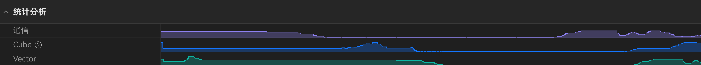

# Overview charts

| | |
|--|--|
| **Id** | `overview-charts` |
| **Panel / component** | `OverviewCharts` → `src/ui/TimelineView/OverviewCharts/` |
| **Capability** | _(none)_ |
| **Phase** | M |
| **Unification** | `gap` (emulate) |
| **Sept 30 (emulate)** | **hide** |

## Sketches

**Component crops:** 

_Product v930 full-frame crop for overview tracks alone is thin; use component visual as normative until a dedicated mockup lands._

## Purpose

Cube/Vector (or counter-named) overview series above the swimlane — sampling counters over time.

## View-model

| Field | Role | Required? |
|-------|------|-----------|
| `reportModel.overviewSeries[]` | Tracks `{ id, label, points[{t,v}] }` | **Required to show** |

## Hide rule

No `OverviewSeries` → **hide** the chart region entirely ([DATA-32](../context/decisions/DATA.md)). Do **not** invent series from PipeUtilization ratios.

## Compute fill

| Adapted field | Embed | Columns / notes | Schema SSOT |
|---------------|-------|-----------------|-------------|
| `overviewSeries` | `Sampling.json` `ph:"C"` | One series per counter `name`; µs→ns ([DATA-39](../context/decisions/DATA.md)) | [METRICS](../formats/compute/METRICS_AND_TRACE.md) |

### VM field ← source (join / derivation)

| VM field | Source embed(s) | Join key(s) | Derivation |
|----------|-----------------|-------------|------------|
| `overviewSeries[]` | `Sampling.json` / `sampling.json` | group by counter `name` (no FK) | CTEF `ph:"C"` only; `args.value` must be finite number |
| `overviewSeries[].id` / `label` | same | `name` | Both = counter `name` |
| `overviewSeries[].points[{t,v}]` | same | — | `t = ts × 1000` (µs→ns); `v = args.value`; sort by `t` |

Empty → `[]` → hide ([DATA-32](../context/decisions/DATA.md)). Code: `overviewSeriesFromSampling` in `adaptRep.ts`.

### Visualization logic (docx §11.2.7)

Docx placeholder samples (`{"category":"Cube",1:1,2:2}` / Vector) are illustrative only (invalid JSON / stub series).

- Collapsible **统计分析** section **above** the Kernel swimlane (under the time axis), with synchronized area charts over time (one track per `OverviewSeries`).
- Shared time axis with the swimlane viewport; gutter column width matches lane gutter.
- **Geometry (v930):** track height **16px**; **8px** margin between tracks; bright stroke + darker fill (see [`OverviewCharts/visual/`](../../src/ui/TimelineView/OverviewCharts/visual/)).
- **Producer ([DATA-39](../context/decisions/DATA.md)):** product `Sampling.json` `ph:"C"` counters → `OverviewSeries` (**one track per counter `name` present**; hide if empty — [DATA-32](../context/decisions/DATA.md)).

## Emulate fill

| Adapted field | Embed | Columns / notes | Status |
|---------------|-------|-----------------|--------|
| `overviewSeries` | — | Unless counters packed as Sampling-like CTEF | `gap` → hide |

## Adapter

| Profile | Entry | Notes |
|---------|-------|-------|
| compute | `overviewSeriesFromSampling` in `adaptPayloads` | |
| emulate | `adaptEmulate` | Omits overview unless future counter pack |

## Related

- Spec: [OverviewCharts](../../src/ui/TimelineView/OverviewCharts/) (co-located)
- Decisions: [DATA-32](../context/decisions/DATA.md), [DATA-39](../context/decisions/DATA.md)
- Product docx §: 11.2.7
