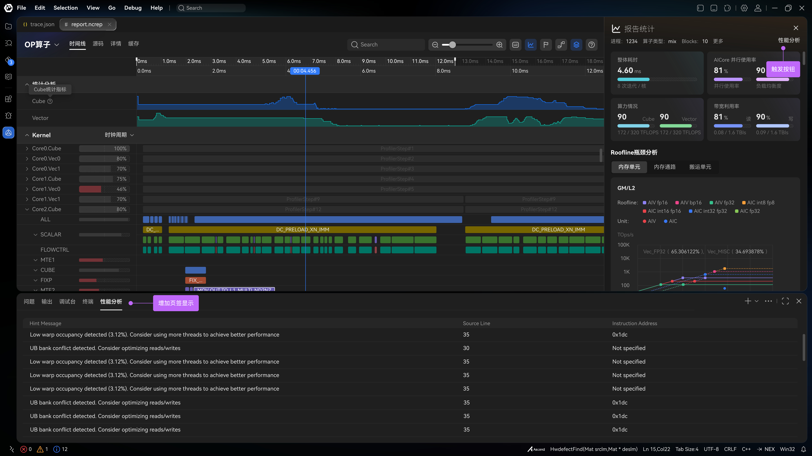

# Performance hints

| | |
|--|--|
| **Id** | `performance-hints` |
| **Panel / component** | Planned bottom dock (性能提示 / 性能分析) — not built |
| **Capability** | _(none yet)_ |
| **Phase** | M4 |
| **Unification** | `adapt-mapper` |
| **Sept 30 (emulate)** | **planned** |

## Sketches

Sketch shows a **性能分析** table under the timeline: **Hint Message**, **Source Line**, **Instruction Address**. Annotations call for a **性能分析** tab (增加页签) and a trigger in the report panel (触发按钮).

## Purpose

List simulator performance hints for the open emulate kernel: advice text, the source line it attaches to, and the instruction address when the hint is per-PC.

## View-model

| Field | Role | Required? |
|-------|------|-----------|
| Hint rows | Message text, optional source line, optional instruction address | **Required to show** |
| Kernel-only rows | Message with no line and no address | Optional |

## Hide rule

No joined hint rows → **hide** the panel ([DATA-30](../context/decisions/DATA.md)). Do not invent hints from compute CSVs ([DATA-45](../context/decisions/interim/DATA.md#data-45)).

## Compute fill

| Adapted field | Embed | Columns / notes | Schema SSOT |
|---------------|-------|-----------------|-------------|
| — | — | No compute equivalent | — |

## Emulate fill

Join on gelu ([TABLES](../formats/emulate/TABLES.md)):

| Adapted field | Embed | Columns / notes | Status |
|---------------|-------|-----------------|--------|
| Message | `HintMessages.csv` + `HintTypes.csv` | `HintMsgId` → `HintMsgText`; `HintTypeId` → `HintTypeName` | `adapt-mapper` (planned) |
| Instruction address | `InstructionHints.csv` | `PC` + `HintMsgId` / `HintTypeId` | `adapt-mapper` (planned) |
| Source line | `SourceLineHints.csv` | `SourceLineId` + message; line number needs `SourceLines` when that table is packed | `gap` on gelu — `SourceLines` is empty |
| Kernel hints | `KernelHints.csv` | Message only (no PC, no source line) | `adapt-mapper` (planned) |

`HintMessages`, `InstructionHints`, `KernelHints`, and `SourceLineHints` are packed on `gelu.npu-rep` even though the export catalog records `row_count` 0.

## Adapter

| Profile | Entry | Notes |
|---------|-------|-------|
| compute | — | Out of scope |
| emulate | `adaptEmulate` | Not wired yet |

## Related

- Plan: [milestone-4](../process/roadmap/milestone-4.md)
- Schema: [SCHEMA](../formats/emulate/SCHEMA.md) `HintMessages`, `HintTypes`, `InstructionHints`, `KernelHints`, `SourceLineHints`
- Sketch index: [DESIGN_INDEX](../ui/DESIGN_INDEX.md)
