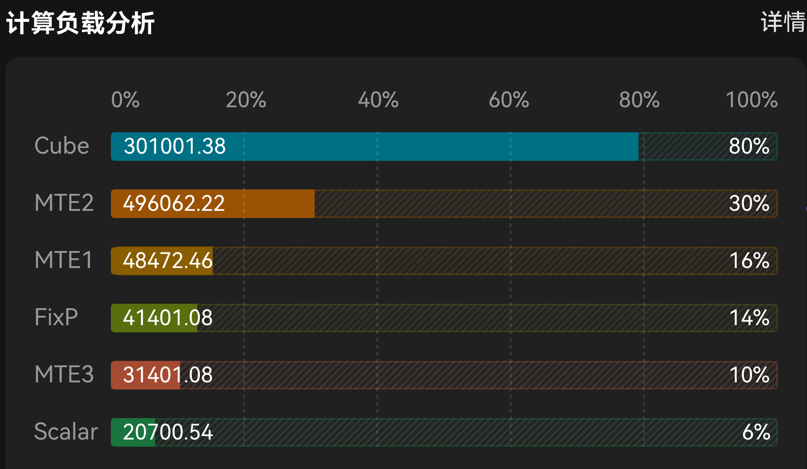
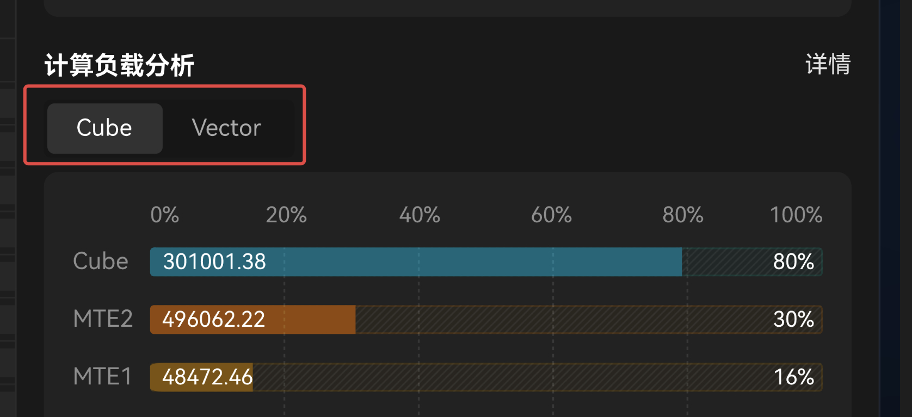

# PIPE occupancy

| | |
|--|--|
| **Id** | `pipe-occupancy` |
| **Panel / component** | `PipeOccupancyPanel` → `src/ui/StatsAside/PipeOccupancyPanel/` |
| **Capability** | _(none)_ |
| **Phase** | M (+ M1 Cube\|Vector MIX toggle) |
| **Unification** | `adapt-mapper` |
| **Sept 30 (emulate)** | **in** |

## Sketches

**Component crops:**  · 

## Purpose

Horizontal pipe-utilization bars (Cube/Vector sides) for the selected block scope. Detail button opens compute CSV field list.

## View-model

| Field | Role | Required? |
|-------|------|-----------|
| `reportModel.pipeOccupancy[]` | Bar rows (`id`, `label`, `ratio`, `side`, …) | **Required to show** |
| `summary` / op type | MIX → show Cube\|Vector toggle | Optional |
| `computeTables` / `csvTexts` | 详情 tabs | Optional |

## Hide rule

Empty `pipeOccupancy` (missing util embeds or all-NA) → **hide** panel ([DATA-30](../context/decisions/DATA.md)). No empty chrome.

## Compute fill

| Adapted field | Embed | Columns / notes | Schema SSOT |
|---------------|-------|-----------------|-------------|
| `pipeOccupancy` | `PipeUtilization.csv` / `summary.jsonl` `PipeUtilization` | Mean non-`NA` `aic_*` / `aiv_*` ratios; `*_time(us)` absolute ([DATA-33b](../context/decisions/interim/DATA.md), DATA-33f) | [METRICS](../formats/compute/METRICS_AND_TRACE.md) |

**Rule (product table):** for `OpType == MIX`, show **Cube \| Vector** segmented control and the active side’s bars (plus ICache rates when present). Non-MIX ops show only the relevant Cube or Vector set; omit or placeholder `NA` values. Use the column tables below — not a single combined bar list.

**Emulate ([UI-54](../context/decisions/UI.md)):** when `pipeOccupancy` carries ≥2 of `side` `aic` / `aiv0` / `aiv1` (from `PipeUtilizationHist.csv` `CoreName` or `PipesUtilization` + `CoreTypes`), show **Cube | Vector 0 | Vector 1** with the same segmented-control chrome and filter bars by the active core. Do **not** average AIV0 with AIV1 into Vector. Compute MIX Cube|Vector remains unchanged.

### VM field ← source (join / derivation)

| VM field | Source embed(s) | Join key(s) | Derivation |
|----------|-----------------|-------------|------------|
| `pipeOccupancy[]` (All) | `summary.jsonl` category `PipeUtilization` | category id (no row FK) | `pipeOccupancyFromRows` on category columns |
| `pipeOccupancy[]` (block) | `PipeUtilization.csv` | `block_id` = selected id | Same column map on that row |
| `pipeOccupancy[].ratio` | same | — | Mean non-`NA` of side-prefixed ratio cols (`PIPE_COLUMNS` in `adaptRep.ts`); Cube `aic_*` and Vector `aiv_*` never blended |
| `pipeOccupancy[].absoluteValue` | same | — | Mean matching `*_time(us)` when present (DATA-33f); omit if absent |
| `pipeOccupancy[].side` / `id` / `label` | — | — | Fixed map: see Cube / Vector tables below |

Code: `pipeOccupancyFromRows` / `pipeOccupancyFromCsv` in `adaptRep.ts`.

### Cube occupancy

| # | Display | Field | Source |
| --- | --- | --- | --- |
| 1 | Cube | `aic_cube_ratio` | `PipeUtilization.csv` |
| 2 | MTE2 | `aic_mte2_ratio` | `PipeUtilization.csv` |
| 3 | MTE1 | `aic_mte1_ratio` | `PipeUtilization.csv` |
| 4 | FIXP | `aic_fixpipe_ratio` | `PipeUtilization.csv` |
| 5 | Scalar | `aic_scalar_ratio` | `PipeUtilization.csv` |
| 6 | ICache Miss | `aic_icache_miss_rate` | `PipeUtilization.csv` |

### Vector occupancy

| # | Display | Field | Source |
| --- | --- | --- | --- |
| 1 | Vector | `aiv_vec_ratio` | `PipeUtilization.csv` |
| 2 | MTE2 | `aiv_mte2_ratio` | `PipeUtilization.csv` |
| 3 | MTE3 | `aiv_mte3_ratio` | `PipeUtilization.csv` |
| 4 | Scalar | `aiv_scalar_ratio` | `PipeUtilization.csv` |
| 5 | ICache Miss | `aiv_icache_miss_rate` | `PipeUtilization.csv` |

In-bar absolute (DATA-18, [DATA-33f](../context/decisions/interim/DATA.md)): mean non-`NA` matching `*_time(us)` for that family/side; omit when absent. Include **ICache Miss** rows when the corresponding `*_icache_miss_rate` mean is present (no time column → no absolute).

### Details / CSV tabs（计算负载分析详情）— §11.2.5.1

Detail surface uses **tabs** ([`v930/compute-load-detail`](../ui/source/v930/compute-load-detail.jpeg)):

| Tab | Source CSV |
| --- | --- |
| `PipeUtilization` | `PipeUtilization.csv` (compute; omitted when hist is present — [UI-55](../context/decisions/UI.md)) |
| `Pipe Utilization` | `PipeUtilizationHist.csv` — preferred when present; sparse `aic_*` / `aiv0_*` / `aiv1_*` `*_ratio` keys from Utilization ([UI-55](../context/decisions/UI.md)) |
| `ArithmeticUtilization` | `ArithmeticUtilization.csv` |
| `ResourceConflictRatio` | `ResourceConflictRatio.csv` |

Render a searchable key–value (or table) list of all columns for the **selected block** ([DATA-19](../context/decisions/DATA.md)):

- Compute `PipeUtilization`: AIC group cycles / `*_time(us)` / `*_ratio` / …; AIV group same; display `NA` when absent.
- Emulate hist ([UI-55](../context/decisions/UI.md)): one synthetic row of projected ratio keys (e.g. `aic_scalar_ratio`, `aiv0_vec_ratio`, `aiv1_mte3_ratio`) in file order; values 0..1; no times/cycles.
- Hide a tab when its CSV is missing from the report.

## Emulate fill

| Adapted field | Embed | Columns / notes | Status |
|---------------|-------|-----------------|--------|
| `pipeOccupancy` | `PipeUtilizationHist.csv` (prefer) or `PipesUtilization.csv` | Keep emulate basenames — **do not** invent `PipeUtilization.csv` ([DATA-45](../context/decisions/interim/DATA.md#data-45)) | `adapt-mapper` |
| PIPE CSV tab | same embeds → `computeTables` | | `adapt-mapper` |

### Emulate VM field ← source (join / derivation)

Prefer `PipeUtilizationHist.csv`. Else `PipesUtilization.csv` + dictionaries.

| VM field | Source embed(s) | Join key(s) | Derivation |
|----------|-----------------|-------------|------------|
| `pipeOccupancy[]` (hist) | `PipeUtilizationHist.csv` | _(none)_ — match `PipeName` via `PIPE_NAME_MAP` regex; `CoreName` → side | Acc key `` `${side}:${id}` `` with `side` ∈ `aic`/`aiv0`/`aiv1` ([UI-54](../context/decisions/UI.md)); `ratio` = mean `Utilization` (`normalizeRatio` 0..1 or 0..100%). **Never** average AIV cores |
| `pipeOccupancy[]` (util) | `PipesUtilization.csv` + `InstrQueueTypes.csv` + `CoreTypes.csv` | `InstrQueueTypeId` → `InstrQueueTypes.InstrQueueTypeName`; `CoreTypeId` → `CoreTypes.CoreTypeName` | Resolve queue label → `mapPipeName`; side from `coreNameToPipeSide` (`aic`/`aiv0`/`aiv1`). Skip bare integer FKs that do not resolve |
| lane `utilization` | same pipe rows + swimlane threads | pipe `colorKey` ↔ `laneColorKey(thread.name)` | `withPipeLaneUtilizations` — mean ratio onto matching lanes |

Code: `pipeOccupancyFromHist` / `pipeOccupancyFromPipesUtilization` in `pipeOccupancyEmulate.ts`.

## Adapter

| Profile | Entry | Notes |
|---------|-------|-------|
| compute | `adaptPayloads` → `pipeOccupancyFromRows` | Also attaches lane `utilization` |
| emulate | `adaptEmulate` → `pipeOccupancyFromHist` / `pipeOccupancyFromPipesUtilization` | |

## Related

- UX: [UX_SPEC](../ui/UX_SPEC.md)
- FEATURE_MATRIX: PIPE occupancy bars
- Product docx §: 11.2.5 / 11.2.5.1 / emulate 11.2.3.4–6
- Interim: [DATA-33b](../context/decisions/interim/DATA.md)
- View catalog: [README](README.md)
