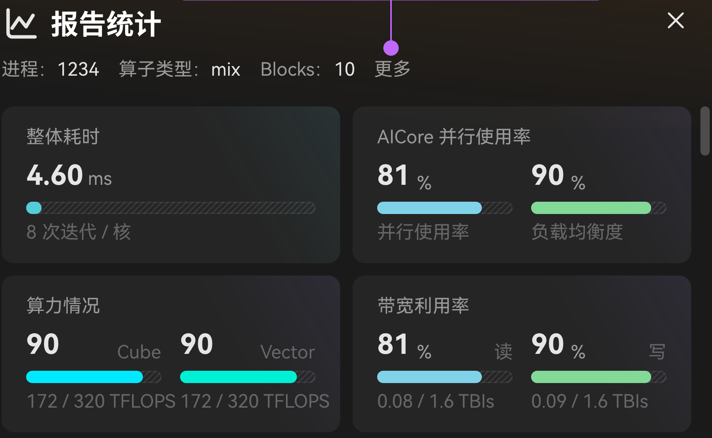

# Report summary

| | |
|--|--|
| **Id** | `report-summary` |
| **Panel / component** | `StatsSummaryPanel` → `src/ui/StatsAside/StatsSummaryPanel/` |
| **Capability** | _(none)_ |
| **Phase** | M |
| **Unification** | `adapt-mapper` |
| **Sept 30 (emulate)** | **out** ([DATA-47](../context/decisions/DATA.md)) |

## Sketches

**Component crop:** 

## Purpose

Aside summary cards and meta row (duration, compute/BW when present, process/op/blocks). Gives a quick OP identity and cost snapshot beside the timeline.

## View-model

| Field | Role | Required? |
|-------|------|-----------|
| `reportModel.summary.taskDurationUs` | Duration card | **Required to show** duration card |
| `summary.opName` / `opType` / `pid` / `blockDim` | Meta / secondary | Optional |
| `computeCard` / `bandwidthCards` / parallel util | Extra cards | Optional — hide when absent |
| `hardwareDetails` | 更多 overlay source | Optional |
| `profile: 'emulate'` | Omits cards + meta/更多 | Emulate only |

If no `taskDurationUs` and no `bandwidthCards` → **hide** the summary card group (PIPE may still show). Meta row is independent on compute; emulate omits both ([DATA-47](../context/decisions/DATA.md)).

## Hide rule

[DATA-30](../context/decisions/DATA.md): omit cards whose adapted fields are empty; do not invent values. Emulate: omit the entire chrome regardless of KernelInfo ([DATA-47](../context/decisions/DATA.md)).

## Compute fill

| Adapted field | Embed | Columns / notes | Schema SSOT |
|---------------|-------|-----------------|-------------|
| `summary.*` | `OpBasicInfo.csv`, `Summary.jsonl` | `Task Duration(us)`, Op Name/Type, Pid, Block Dim; FLOPS from OpInfoSummary | [METRICS](../formats/compute/METRICS_AND_TRACE.md) |
| `computeCard` | Arithmetic + HardwareInfo / summary.jsonl | DATA-33h | [METRICS](../formats/compute/METRICS_AND_TRACE.md) |
| `bandwidthCards` | Memory / summary.jsonl | DATA-8 | [METRICS](../formats/compute/METRICS_AND_TRACE.md) |

### VM field ← source (join / derivation)

Block scope ([DATA-19](../context/decisions/DATA.md) / [DATA-28](../context/decisions/DATA.md) / [DATA-29](../context/decisions/DATA.md)): **All** = `summary.jsonl` category aggregates; picked `block_id` = that CSV row (UI recompute). Identity is **not** an FK join — prefer OpBasicInfo row 0 when present, overlay OpInfoSummary metrics.

| VM field | Source embed(s) | Join key(s) | Derivation |
|----------|-----------------|-------------|------------|
| `summary.opName` / `opType` / `pid` / `blockDim` / `taskDurationUs` | `OpBasicInfo.csv` or `Summary.jsonl` `OpInfoSummary` | _(none — single row / first OpInfoSummary)_ | Prefer OpBasicInfo columns when present; else OpInfoSummary JSON keys (`Op Name`, `Op Type`, `Pid`/`PID`, `Block Dim`, `Task Duration(us)`) |
| `summary.aicFlops` / `aivFlops` / theoretical | `Summary.jsonl` `OpInfoSummary` | _(none)_ | `aic_flops` / `aiv_flops` / `*_theoretical` overlay even when identity came from OpBasicInfo |
| `summary.parallelUtilization` / `parallelBalance` | `Summary.jsonl` `OpInfoSummary` | _(none)_ | `aicore_parallel_utilization` / `aicore_parallel_balance` |
| `summary.coreCount` | `HardwareInfo.jsonl` + `summary.opType` | _(match by op type, not FK)_ | `coreCountForOpType`: mix→`ai_core_count`; vector→`ai_vector_count`; cube→`ai_cube_count` (alt names accepted) |
| `computeCard` (measured) | Prefer OpInfoSummary; else `ArithmeticUtilization.csv` | All: category; block: `block_id` | Prefer summary FLOPS; else mean(`aic_cube_fops`\|`aiv_vec_fops`) / mean(`*_time(us)`) / 1e6 → TFLOPS ([DATA-33h](#data-33h)) |
| `computeCard` (peak) | `HardwareInfo.jsonl` (+ OpBasicInfo freq fallback) | _(none)_ | Peak formulas in [DATA-33h](#data-33h); cores×freq×dtype |
| `bandwidthCards` | Prefer OpInfoSummary; else `Memory.csv` | All: category; block: `block_id` | Measured `aicore_gm_read_bw` / `aicore_gm_write_bw` (or mean Memory main-mem sides); peak `aicore_gm_bw_theoretical` or **1600** ([DATA-8](#data-8-bandwidth)) |

Code: `reportModelFromPayloads` / `summaryFrom*` / `computeCard*` / `bandwidthCards*` in `adaptRep.ts`.

### Field mapping (docx §11.2.3)

| # | Display (CN) | Field | Source | Notes |
| --- | --- | --- | --- | --- |
| 1 | 进程ID | `PID` / `Pid` | `OpBasicInfo.csv` | |
| 2 | 算子类型 | `OpType` / `Op Type` | `OpBasicInfo.csv` | e.g. `vector`, `MIX` |
| 3 | Blocks | `Block Dim` | `OpBasicInfo.csv` | |
| 4 | 整体耗时 | `Task Duration（us）` / `Task Duration(us)` | `OpBasicInfo.csv` | **Confirmed** (npu-compute 0818). Shown as ms in mockup (unit conversion in UI) |
| 5 | 算力情况 | measured / peak TFLOPS | `ArithmeticUtilization.csv` + `HardwareInfo.jsonl` | **Interim DATA-33h** (DATA-2..4, UI-33). Sketch: **Cube \| Vector** columns |
| 6 | 带宽利用率 | measured / peak read \| write BW | `summary.jsonl` `OpInfoSummary` (+ `category: Memory` fallback) | Sketch: one card **读 \| 写**. Measured read / write = the producer's summed sides `aicore_gm_read_bw` / `aicore_gm_write_bw`; peak SOL **1600 GB/s** shared by both sides; each direction's score = measured ÷ peak ([DATA-8](../context/decisions/DATA.md)). One block selector for the aggregation ([DATA-19](../context/decisions/DATA.md) / [DATA-28](../context/decisions/DATA.md) / [DATA-29](../context/decisions/DATA.md)). Source is **not** `Report.csv`. |
| 7 | AICore 并行使用率 | `aicore_parallel_utilization` / `aicore_parallel_balance` | `summary.jsonl` | **DATA-9 / DATA-10**. Sketch: **并行使用率** \| **负载均衡度** |

### Visualization logic (from mockup)

| Element | Behavior |
| --- | --- |
| Header shell | Title **报告统计** + decorative chart icon + close (X). Close clears `asideVisible`. |
| Meta row | **进程** / **算子类型** / **Blocks** / **更多** / CANNBot. `OpBasicInfo.csv` → `Pid` (also `PID`) / `Op Type` / `Block Dim`. Hide a segment when unset. Meta row stays visible on the report shell so **更多** is always reachable (UI-30, UI-31). Not 核数, aic频率, or NPU ARCH. `Current Freq` / `Rated Freq` stay off this shell (hardware overlay / OpBasicInfo dump). Overlay `chip_info` / `arch_info` are Device Info names, not a header ARCH value. |
| 更多 | **Always** on the report shell (UI-30, UI-31). Opens hardware overlay and emits `open-hardware-details`. Render `HardwareDetailsPanel` when `hardwareDetails` is present (`HardwareInfo.jsonl` preferred; OpBasicInfo fallback per DATA-34a); else show **缺少 hardware info** / Missing hardware info. |
| Grid | Sketch **2×2**: top 整体耗时 \| AICore 并行使用率; bottom 算力情况 \| 带宽利用率 |
| 整体耗时 card | Large duration (always **2 decimal places**; full value in hover `title`) + progress bar = `min(100%, Block Dim / core_count × 100%)` when adapter sets `summary.coreCount` (UI-32); else decorative ~15% fill (DATA-33e). Secondary: `{blockDim} / {coreCount}` iterations/core when both set (DATA-1); else `blockDim` only; else `opName`; else omit. No standalone op-type card. |
| 算力情况 card | **Cube \| Vector** columns (UI-33): large score (no `%`), bar = `round(measured/peak×100)` %, subtitle `measured / peak` with `TFLOPS` on the next line — **DATA-33h** (DATA-2..4). Omit side without both measured + peak; **N/A** placeholder when duration present but `computeCard` absent. |
| 带宽利用率 card | **读 \| 写** columns: large score **with** `%`, bar = score% of track, `measured / peak` — **DATA-8** / UI-34 GB/s (sketch TB/s). Same card chrome as 整体耗时. |
| AICore 并行使用率 card | Dual **并行使用率** \| **负载均衡度** from `summary.parallelUtilization` / `parallelBalance` (**DATA-9 / DATA-10**): 2dp `%` scores, bars = clamped score % of track ([0, 100]), unrounded percent in value `title`. Hide a column when its field is absent; **title + `N/A`** when duration present but both absent. |

Compute uses interim [DATA-33h](../context/decisions/interim/DATA.md) (MFU formulas still partial). Bandwidth **measured / peak / 读写** are product-confirmed ([DATA-8](../context/decisions/DATA.md)). AICore parallel fields are product-confirmed (**DATA-9 / DATA-10**).

### Interim DATA-33h (算力情况)

| Slot | Interim |
| --- | --- |
| Measured | Mean `aic_cube_fops` / `aiv_vec_fops` ÷ mean `aic_time(us)` / `aiv_time(us)` on `ArithmeticUtilization.csv` → TFLOPS (`/ 1e6`) — same basis as roofline DATA-37a |
| Peak | Cube: `16×sizeof(dtype)×16×core×freq×2/1000`; Vector: `128×core×freq×2/1000`. Cores from `HardwareInfo.jsonl`; freq from jsonl `ai_core_frequency_MHZ` (confirmed MHz) or OpBasicInfo `Rated Freq` / `Current Freq` **assumed MHz** until Product confirms units (DATA-3); `sizeof(dtype)` = **2** (FP16) until dtype in CSV |
| Score | `round(measured/peak×100)` clamped 0–100 |
| Display | TFLOPS with same magnitude rounding as DATA-8 GB/s |
| Layout | Same raised card chrome as duration. Inner **Cube \| Vector** columns (UI-33; adapter `aic`/`aiv`). Requires `taskDurationUs`; BW-only summary omits this card |
| NA | Omit side without both measured and peak; **N/A** placeholder when duration present but no computable sides |

### 带宽利用率 (DATA-8)

| Slot | Rule |
| --- | --- |
| Measured | `summary.jsonl` `OpInfoSummary` `aicore_gm_read_bw(GB/s)` / `aicore_gm_write_bw(GB/s)` — the producer's sums of the `category: Memory` aic + aiv sides. Fallback: those same two `Memory` columns summed; `Memory.csv` non-`NA` means without `summary.jsonl` |
| Peak | `OpInfoSummary` `aicore_gm_bw_theoretical(GB/s)` = **1600 GB/s** (SOL), shared by both sides (DATA-6) |
| Score | `round(measuredGBs / peakGBs × 100)` clamped 0–100, per direction. The card does **not** use `aicore_gm_bw_usage_rate(%)` (a mean of the per-path usage columns) |
| Display | **GB/s** with magnitude rounding: ≥10 → 1 decimal; ≥0.01 → 2; ≥0.001 → 3; else 4 (UI-34; sketch may still print TB/s) |
| Layout | Sketch: one card, **读 \| 写** columns, score **with** `%`. UI **sums** any aic\|aiv sides per direction (the summed producer field arrives as one `aicore` side) |
| Bar | Fill width = score % of track (`--pr-color-card-bar-primary` / `--pr-color-card-bar-secondary`; legacy alias `--pr-color-bandwidth-bar`); same 8px pill hatched track as duration; 0% fill has no 2px sliver |
| NA | Omit that column; omit the card if both sides NA |
| `Report.csv` | Named SOL/平均带宽 in producer notes; **no schema** — unused. Confirmed not the card source ([DATA-8](../context/decisions/DATA.md)) |

## Emulate fill

| Adapted field | Embed | Columns / notes | Status |
|---------------|-------|-----------------|--------|
| `summary.*` | — | Empty; `profile: 'emulate'` | **out** ([DATA-47](../context/decisions/DATA.md)) |
| `computeCard` / `bandwidthCards` | — | No compute-equivalent pack promised | `gap` → hide |

No joins — `adaptEmulate` leaves `reportModel.summary` empty and does not map KernelInfo into summary chrome.

## Adapter

| Profile | Entry | Notes |
|---------|-------|-------|
| compute | `adaptPayloads` | Full summary path |
| emulate | `adaptEmulate` | Does not map KernelInfo → summary |

## Related

- UX: [UX_SPEC](../ui/UX_SPEC.md) S1 / S10
- FEATURE_MATRIX: Right panel summary
- Spec: StatsAside / StatsSummaryPanel (co-located when present)
- Product docx §: 11.2.3
- Decision: [DATA-47](../context/decisions/DATA.md)
