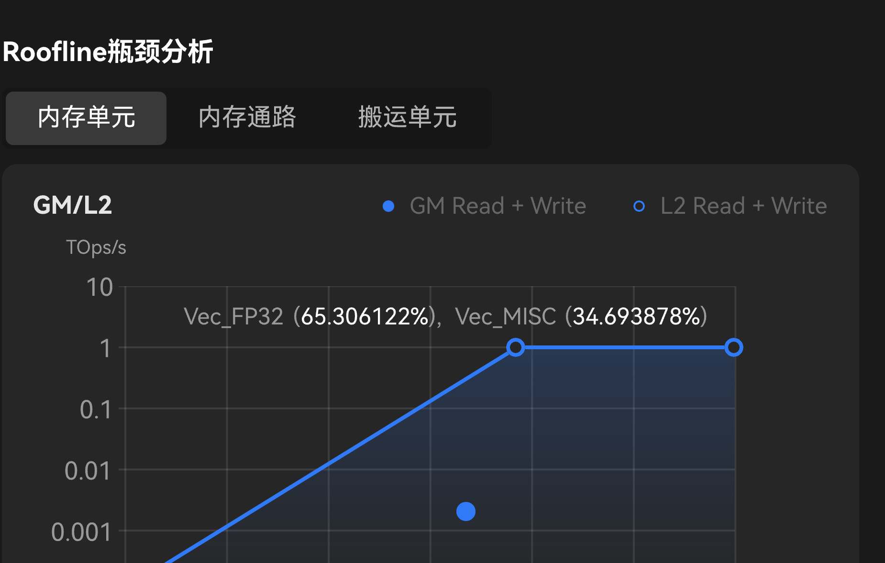

# Roofline

| | |
|--|--|
| **Id** | `roofline` |
| **Panel / component** | `RooflinePanel` → `src/ui/StatsAside/RooflinePanel/` |
| **Capability** | `roofline` |
| **Phase** | M2 |
| **Unification** | `gap` (emulate — same panel, different mapper) |
| **Sept 30 (emulate)** | **hide** |

## Sketches

**Component crop:** 

## Purpose

Log-log intensity vs achieved performance chart with theoretical roof and optional op-mix labels.

## View-model

| Field | Role | Required? |
|-------|------|-----------|
| `reportModel.roofline.points[]` | Measured points | **Required to show** |
| `roofline.mixLabels` / peaks | Mix + ceilings | Optional |
| capability `roofline` | Host/feature gate | Set when points exist |

## Hide rule

No usable GM point → hide panel ([DATA-30](../context/decisions/DATA.md)). Tabs 内存单元/通路/搬运 omitted until DATA-37 (DATA-37f).

## Compute fill

| Adapted field | Embed | Columns / notes | Schema SSOT |
|---------------|-------|-----------------|-------------|
| `roofline` | `ArithmeticUtilization.csv` + `Memory.csv` | Interim DATA-37a–e GM point | [METRICS](../formats/compute/METRICS_AND_TRACE.md), [view-models](../../specs/core/view-models.spec.md) |

### Tabs → fields (docx §11.2.4)

| # | Display (CN) | Field | Source |
| --- | --- | --- | --- |
| 1 | 内存单元 | `aic_cube_ratio` | `PipeUtilization.csv` |
| 2 | 内存通路 | `aic_mte2_ratio` | `PipeUtilization.csv` |
| 3 | 搬运单元 | `aic_mte1_ratio` | `PipeUtilization.csv` |

**Contradictions / gaps (do not implement as-is):**

1. Tab labels are memory-oriented (内存单元 / 通路 / 搬运) while mapped fields are **pipe utilization ratios**. Possible mislabel or incomplete mapping.
2. Those ratios alone **cannot** supply Ops/Byte or TOps/s for the chart axes, nor peak bandwidth / peak compute for the roof.

### Interim M2 implementation (DATA-37a–f)

Do **not** use the docx tab→pipe-ratio table. While DATA-37 is open:

| Axis / element | Interim source |
| --- | --- |
| Y achieved | DATA-37a: `fops / timeUs / 1e6` from `ArithmeticUtilization` |
| X GM | DATA-37b: fops / GM R+W bytes from `Memory` |
| L2 point | DATA-37c: omit |
| Roof | DATA-37d: peakCompute=1 TOps/s; peakBW from main-mem BW columns |
| Op-mix labels | DATA-37e: normalize Vector/Cube mix ratios |
| Tabs | DATA-37f: hidden |
| Block scope | **All** = the `summary.jsonl` `ArithmeticUtilization` + `Memory` categories; a picked `block_id` = that block's CSV rows ([DATA-19](../context/decisions/DATA.md) / [DATA-29](../context/decisions/DATA.md)). A picked block with no GM point hides the panel — never the **All** point under a block label |

Hide `RooflinePanel` when no GM point can be derived.

## Emulate fill

| Adapted field | Embed | Columns / notes | Status |
|---------------|-------|-----------------|--------|
| `roofline` | ArchDiagramMetrics + ExecutedInstructions + VectorUtilizations ± ELF Functions/SourceInstructions | New mapper required; not Arithmetic+Memory | `gap` → hide Sept 30 |

Do **not** invent compute Arithmetic/Memory CSVs ([DATA-45](../context/decisions/interim/DATA.md#data-45)).

## Adapter

| Profile | Entry | Notes |
|---------|-------|-------|
| compute | `rooflineFromCsv` in `adaptPayloads` | |
| emulate | — | Post–Sept 30 slice |

## Related

- Spec: [RooflinePanel.spec.md](../../src/ui/StatsAside/RooflinePanel/RooflinePanel.spec.md)
- Product docx §: 11.2.4 / emulate 11.2.3.5
- Open: [DATA-37](../context/questions/DATA.md)
