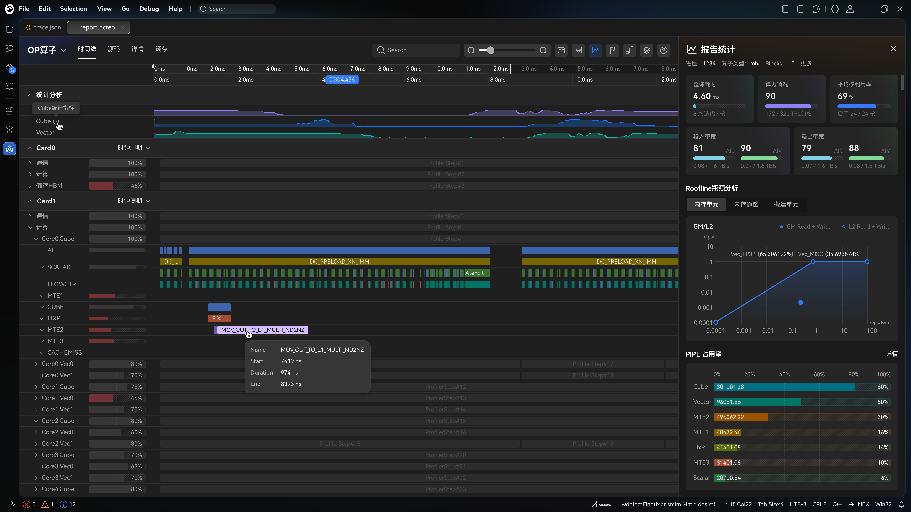
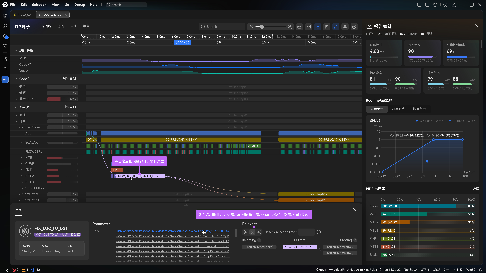

# Timeline

| | |
|--|--|
| **Id** | `timeline` |
| **Panel / component** | `ProfilingReport` / `TimelineView` / `SwimlaneCanvas` → `src/ui/ProfilingReport/`, `src/ui/TimelineView/` |
| **Capability** | _(none)_ — shell; optional `dependencies` for P2 links |
| **Phase** | M |
| **Unification** | `same-path` (`chromeTraceToSwimlane`) |
| **Sept 30 (emulate)** | **in** |

## Sketches

## Purpose

Primary Gantt / swimlane of OP execution over time. Opens from `.npu-rep` or standalone Chrome Trace; aside analytics are independent.

## View-model

| Field | Role | Required? |
|-------|------|-----------|
| `SwimlaneModel` (`processes`, `minTime`, `maxTime`) | Lanes + time range | **Required** for Timeline |
| `ReportViewModel` | Aside analytics | Optional — Timeline works without |
| `capabilities` | Gates P2 surfaces | Optional |

Minimum: parseable Chrome Trace → non-empty time range (lanes may be thin).

## Hide rule

Hard error only if the source cannot be parsed. Empty events → empty lanes (still valid). Aside panels hide independently ([DATA-30](../context/decisions/DATA.md)).

## Compute fill

| Adapted field | Embed | Columns / notes | Schema SSOT |
|---------------|-------|-----------------|-------------|
| `SwimlaneModel` | `PipeTrace.json` (µs) or `trace.json` (ns) | CTEF `ph:X` events | [compute/FORMAT](../formats/compute/FORMAT.md), [METRICS](../formats/compute/METRICS_AND_TRACE.md) |

## Emulate fill

| Adapted field | Embed | Columns / notes | Status |
|---------------|-------|-----------------|--------|
| `SwimlaneModel` | `PipeTrace.json` (µs) | Producer converts ticks → µs ([DATA-46](../context/decisions/DATA.md)) | `same-path` |

## Adapter

| Profile | Entry | Notes |
|---------|-------|-------|
| compute | `adaptCompute` / `adaptPayloads` | Prefers PipeTrace over trace |
| emulate | `adaptEmulate` | Requires `EmulateManifest.json` + PipeTrace |
| CTEF-only | `adaptChromeTrace` | Empty report model ([PROC-3](../context/decisions/PROC.md)) |

## Related

- UX: [UX_SPEC](../ui/UX_SPEC.md) S1, S10
- FEATURE_MATRIX: Timeline / open `.npu-rep`
- Specs: [ProfilingReport.spec.md](../../src/ui/ProfilingReport/ProfilingReport.spec.md), [SwimlaneCanvas.spec.md](../../src/ui/TimelineView/SwimlaneView/SwimlaneCanvas/SwimlaneCanvas.spec.md)
- Product docx §: 11.2.8
- Decisions: [DATA-46](../context/decisions/DATA.md), [PROC-3](../context/decisions/PROC.md), [PROC-8](../context/decisions/PROC.md)
