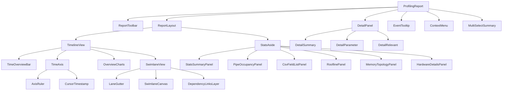

# UI component tree

Folder layout under `src/ui/` mirrors on-screen regions. Leaf folders with `visual/` hold crops + `provenance.yaml` next to the Vue stub/impl.

**Legend:** `✓` = has visual pack · `(no pack)` = shell/orchestrator · overlays are root siblings of `ReportLayout`.

## Diagram



## Path tree

```text
src/ui/
  ProfilingReport/                 (no pack)
  ReportToolbar/                   ✓  v930/entry
  ReportLayout/                    (no pack)
  EventTooltip/                    ✓  v930/task-hover
  ContextMenu/                     ✓  v930/task-context-menu
  MultiSelectSummary/              ✓  v930/task-marquee
  TimelineView/                    (no pack)
    TimeOverviewBar/               ✓  v930/entry
    TimeAxis/                      (no pack)
      AxisRuler/                   ✓  v930/entry
      CursorTimestamp/             ✓  v930/search-highlight
    OverviewCharts/                ✓  v930/entry
    SwimlaneView/                  (no pack)
      LaneGutter/                  ✓  v930/entry
      SwimlaneCanvas/              ✓  v930/entry (+ search/measure/multi-height/marquee/selection-dim)
      DependencyLinksLayer/        ✓  v930/task-click-detail
  StatsAside/                      ✓  shell: v930/report-stats-scrolled
    StatsSummaryPanel/             ✓  v930/report-stats-open
    PipeOccupancyPanel/            ✓  v930/compute-load
    CsvFieldListPanel/             ✓  v930/compute-load-detail, memory-load-detail
    RooflinePanel/                 ✓  v930/report-stats-open
    MemoryTopologyPanel/           ✓  v930/report-stats-scrolled
    HardwareDetailsPanel/          ✓  v930/hardware-more-detail
  DetailPanel/                     ✓  v930/detail-strip-raised
    DetailSummary/                 ✓
    DetailParameter/               ✓
    DetailRelevant/                ✓
```

## Notes

- Host IDE chrome (OP/kernel selector, OP算子/源码/详情/缓存 tabs) is out of this library tree.
- `CanvasSwimlaneRenderer` stays under `src/swimlane/` (imperative backend).
- Design index: [`docs/ui/DESIGN_INDEX.md`](../../docs/ui/DESIGN_INDEX.md).
