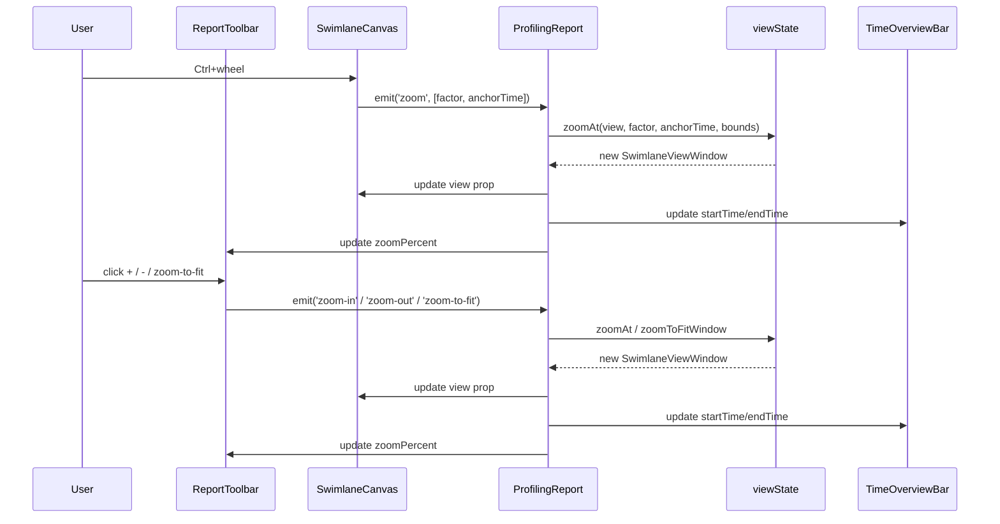
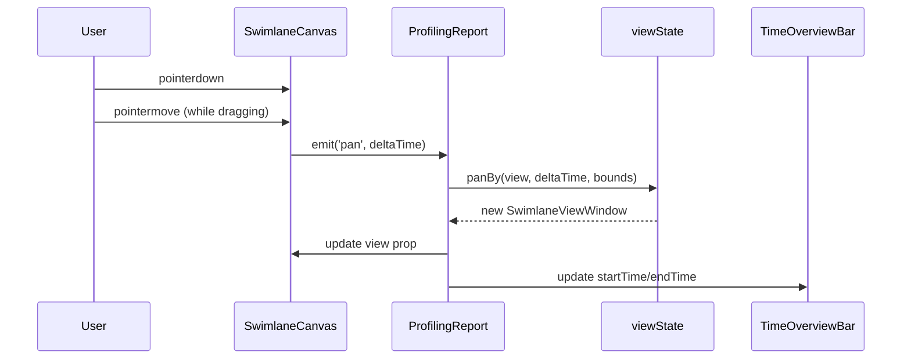
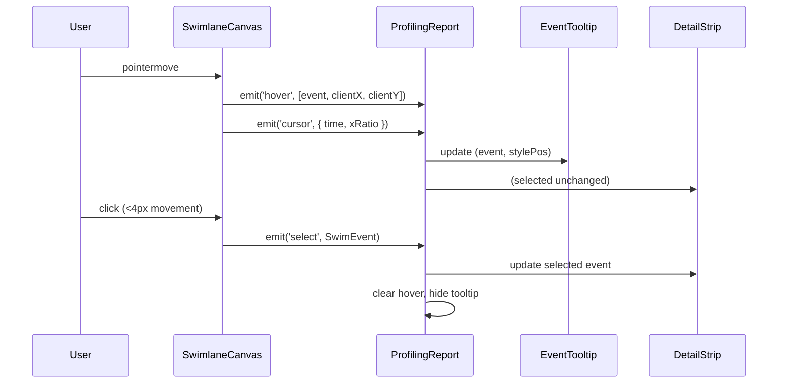
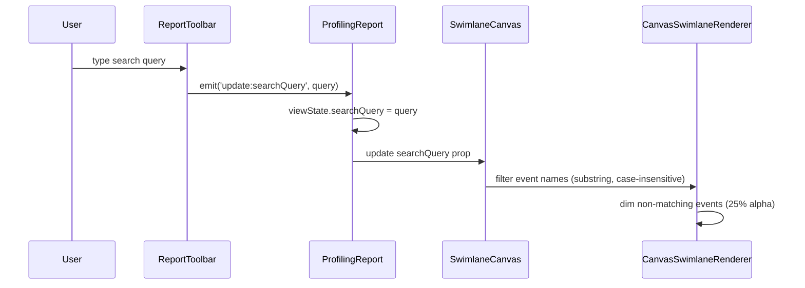
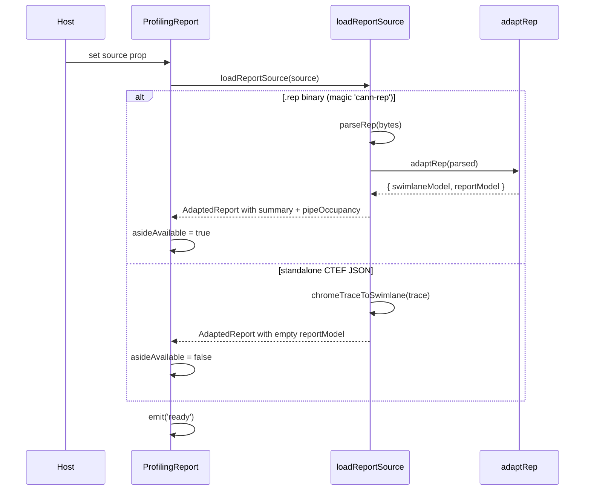

# ProfilingReport

| spec-id-prefix |
|----------------|
| PR-ROOT-*      |

Root component and single owner of all interaction state. Orchestrates data loading, viewport management, and event coordination across child components.

## Inputs

The component works in two modes. In **auto-loading mode**, provide **source** — a binary buffer containing a `.rep` file or standalone CTEF JSON. The component detects, parses, and renders automatically. In **host-managed mode**, provide pre-parsed **swimlaneModel** and **reportModel** to skip the internal pipeline. **title** sets the panel header. **theme** and **locale** control presentation. **timeUnit** (ms/µs/ns) selects the display unit. **capabilities** gates Phase 2 features — an array of feature flag strings such as `'roofline'` or `'memoryDiagram'`.

## Outputs

Lifecycle events: **ready** fires once the report is loaded and the timeline is rendered. **select** fires with a `SelectedEvent` (id, name, startTime, duration, endTime) when the user clicks an event on the swimlane, or `null` when they click empty space. **error** fires with `{ message, cause? }` on load or parse failure. **open-hardware-details** is forwarded from StatsAside when the user clicks 更多 (no hardware panel in-library until Q7). Aside **close** is handled internally (`asideVisible = false`); it is not a root emit. The component does not expose internal view state — viewport, hover, and cursor are managed internally.

## Interaction flows

### Zoom

Ctrl+wheel zooms around cursor position. Toolbar buttons zoom around viewport center. All zoom operations are clamped to timeline bounds.

### Drag-pan

Drag-to-pan emits delta time continuously on every pointermove. Pan is clamped to timeline bounds. A 4px threshold on pointer-up suppresses the click-to-select when movement exceeded 4px.

### Hover, selection, tooltip

Hover is transient: tooltip follows the cursor. Selection is persistent: detail strip shows until user clicks empty space. Clicking empty space emits `select(null)` — tooltip, selection, and detail strip all clear. A 4px threshold on pointer-up gates selection: movement >4px between pointerdown and pointerup suppresses the click-to-select. Pan emits continuously on every move while dragging.

### Search

The renderer applies event name filtering as a substring, case-insensitive match during draw. Events that match render at full opacity; non-matching events are dimmed to 25% alpha but remain visible and interactive (hover/select still work on dimmed events). Lanes with no matching events remain visible (empty lanes are not collapsed).

### Data loading

Two loading paths produce different results: `.rep` enables full UI (swimlane + aside with summary and pipe occupancy), standalone CTEF enables swimlane only (aside auto-hides per Q15).

## Behavior

**Data loading.** When `source` is provided (without pre-parsed models), the component calls `loadReportSource`, which detects `.rep` (magic bytes) vs standalone CTEF JSON. A `.rep` binary produces a full report with swimlane, summary, and pipe occupancy. Standalone CTEF produces swimlane only — the report model's `summary` is empty and `pipeOccupancy` is `[]`.

**Aside availability.** `asideAvailable` is true when `summary.taskDurationUs` is set (I-Q6a duration card) or `pipeOccupancy` is non-empty. Name/type alone do not open the aside.

**State ownership.** ProfilingReport owns a single `SwimlaneViewState` object holding viewport bounds, selection, hover, search, playhead, and aside visibility. Children receive state as read-only props and emit events upward. All mutations create new object references to trigger Vue reactivity.

**Bounds protection.** When `maxTime === minTime`, bounds clamp adds +1 to prevent division by zero during zoom calculations.

**Viewport time axis.** Shares `AxisRuler` chrome with the overview strip (20px track; 18px / 12px/400 labels; 5px minors; major bars with labels to the right). See `docs/specs/ui/components/VISUAL_SPEC.md`.

**Resizable panels.** Lane gutter width (`--pr-gutter-width`, default 280, clamp 180–480) and aside width (default 360, clamp 280–560) are session-only; drag handles at the gutter/timeline seam and aside left edge.

**Aside auto-open.** Initial `asideVisible` follows `reportHasAsideContent` — summary, pipe occupancy, compute tables, or memory tables (same gate as the toolbar toggle).

## Acceptance Criteria

1. **PR-ROOT-001** — Mounts with title, shows shell, handles empty source.
2. **PR-ROOT-002** — Accepts pre-parsed swimlaneModel and reportModel.

## Edge Cases

| State | Behavior |
|---|---|
| Empty source | Empty shell, no error |
| Corrupt/invalid `.rep` | Emits error with message, shows error in shell |
| `.rep` missing `trace.json` | Swimlane stays null, error displayed |
| Standalone CTEF | Swimlane renders, aside auto-hides, no error |
| `maxTime === minTime` | Bounds clamp adds +1 to prevent division by zero |

## Design sketches

- [Entry overview with sidebar](../../../docs/specs/ui/source/entry-overview.png)
- [Report stats](../../../docs/specs/ui/source/report-stats.png)

## Dependencies

All child component specs. [mstt-integration](../../../specs/architecture/mstt-integration.spec.md).

**Input formats:** [REP_FORMAT.md](../../../docs/specs/formats/REP_FORMAT.md) (`.rep` binary container), [INPUT_FORMATS.md](../../../docs/specs/formats/INPUT_FORMATS.md) (embedded file contract), [METRICS_AND_TRACE.md](../../../docs/specs/formats/METRICS_AND_TRACE.md) (CSV schemas and file-to-UI mapping).

## Open

Q3 (OP selector semantics), Q15 (standalone CTEF hides aside).

## Changelog
- **2026-08-07** — `reportHasAsideContent` includes compute/memory CSV; PR-UI-008.
- **2026-08-07** — Resizable lane gutter and aside (session-only widths).
- **2026-08-07** — Viewport time axis shares AxisRuler chrome with overview.
- **2026-08-05** — Initial spec. Core behaviors established.
