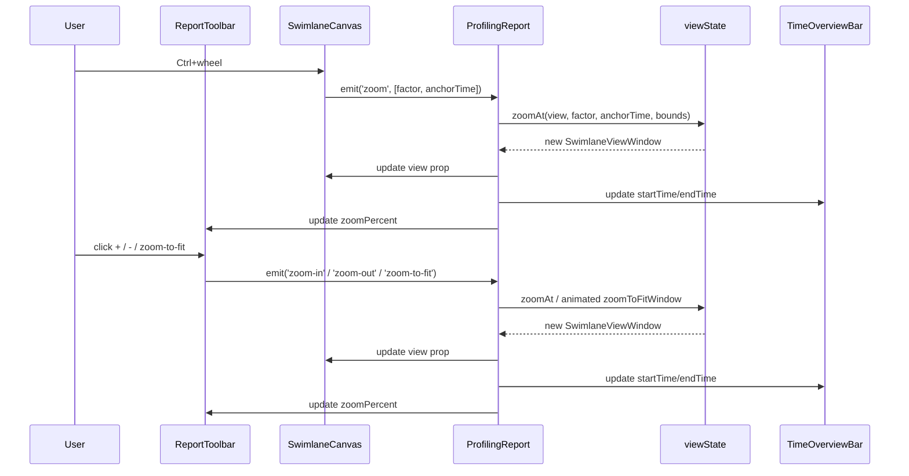
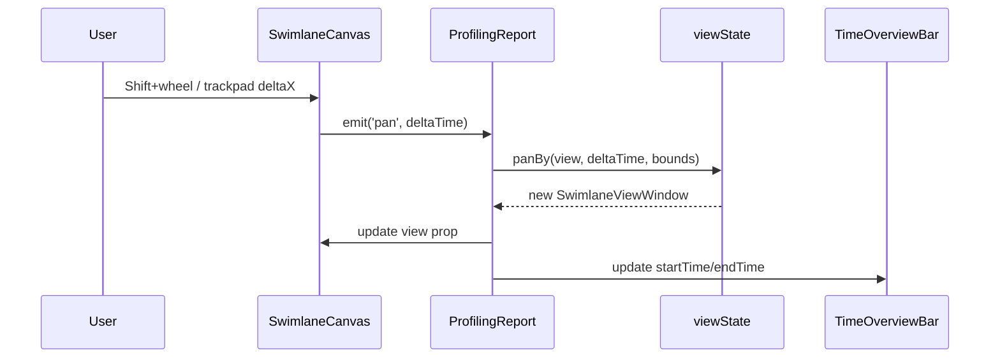
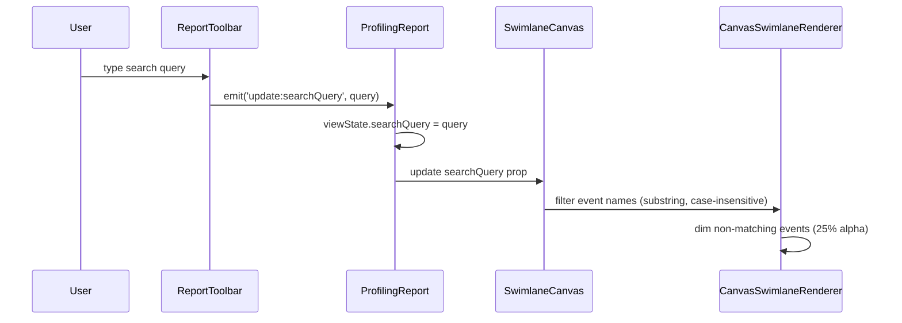
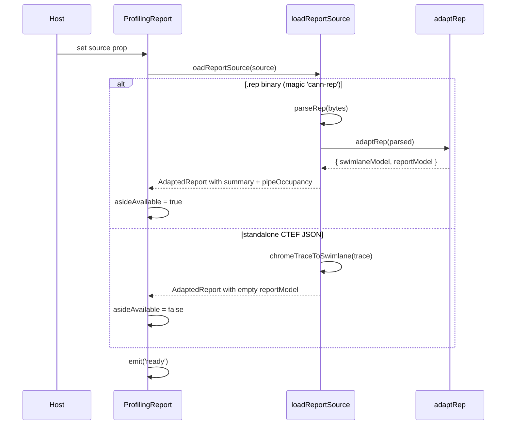

# ProfilingReport

| spec-id-prefix |
|----------------|
| PR-ROOT-*      |

Root component and single owner of all interaction state. Orchestrates data loading, viewport management, and event coordination across child components.

## Inputs

The component works in two modes. In **auto-loading mode**, provide **source** — a binary buffer containing a `.npu-rep` (or classic engineering `.rep` fixture) or standalone CTEF JSON. The component detects, parses, and renders automatically. In **host-managed mode**, provide pre-parsed **swimlaneModel** and **reportModel** to skip the internal pipeline. **title** sets the panel header. **theme** and **locale** control presentation. Wall-time labels auto-scale (`TimeScaleUnit`: s / ms / µs / ns) from viewport span and overview axis density — there is no `timeUnit` host prop (removed; see changelog); optional **timeDisplayMode** (`'time' | 'cycles'`) switches the whole report to derived CPU clocks when OpBasicInfo freq is present ([UI-40](../../docs/context/decisions/UI.md) / [UI-45](../../docs/context/decisions/UI.md)). **dependencyMode** (`all` / `predecessors` / `successors`) and **dependencyDepth** (hops; default `1`, `-1` no hop cap, 10 000 links per side) filter selection curves, undimmed neighbors, and the detail dock's Relevent column alike; the dock's Relevent toolbar updates them in place (no page reload). **capabilities** gates Phase 2 features — an array of feature flag strings such as `'roofline'`, `'memoryDiagram'`, or `'dependencies'`. It is optional in auto-loading mode: the adapter derives capabilities from the source it just parsed and those apply on their own, so a host that passes only `source` still gets the panels its report can fill. A supplied array overrides them wholesale (host-managed mode has no adapter to ask). Adapter-derived flags never outlive their report: they are dropped when `source` is cleared, and they are ignored entirely once the host drives `swimlaneModel` / `reportModel`, which publish an empty capability set unless the host passes its own array. Optional **reportMeta** (`CannbotReportMeta`: name/path/id/collectedAt) carries the report identity used for the cannbot payload's meta fields. Optional **userGuideUrl** (default `DEFAULT_USER_GUIDE_URL`) is forwarded to the toolbar help button.

## Outputs

Lifecycle events: **ready** fires once the report is loaded and the timeline is rendered. **select** tracks the **single** selection: it fires with a `SelectedEvent` (id, name, startTime, duration, endTime) when the user clicks an event on the swimlane, and with `null` whenever the single selection is dismissed — an empty-space click, a cleared marquee (empty commit / Escape / dock close), or a non-empty marquee commit that replaces it with a multi-selection. In that last case `select(null)` arrives while the (internal) multi-select dock is active, so hosts read it as "no single selection", not "nothing is selected". The marquee's `multi-select` / `multi-select-span` are internal child→root emits, not part of the host surface ([public-api](../../../specs/architecture/public-api.spec.md)). **error** fires with `{ message, cause? }` on load or parse failure. **open-hardware-details** is forwarded from StatsAside when the user clicks 更多 (aside also opens interim HardwareDetailsPanel when data exists, DATA-34a). **open-pipe-details** is forwarded when the user clicks PIPE 详情 (aside navigates to CSV details). **view-full-csv** forwards `{ fileName, text }` for 查看全部 (DATA-33d). **cannbot-request** fires when a section cannbot icon is clicked, with the `CannbotPayload` assembled from the current reportModel + reportMeta (version/scope/report_name/report_id/report_path/op_name/collected_at/data/prompt). **open-user-guide** forwards the guide URL from the toolbar help button (toolbar also attempts `window.open`). Aside **close** is handled internally (`asideVisible = false`); it is not a root emit. The component does not expose internal view state — viewport, hover, and cursor are managed internally.

## Interaction flows

### Zoom

Ctrl+wheel zooms around cursor position. Toolbar buttons zoom around viewport center. Zoom-to-fit eases both view edges to the full trace span (same animation as Δt measure focus). All zoom operations are clamped to timeline bounds. The toolbar `zoomPercent` slider shares the same range: 0 = fit, 100 = `MIN_WINDOW` (same floor as `zoomAt` / Ctrl+wheel), not a hard 100× cap.

### Wheel-pan

Time panning is **Shift+wheel** or a two-finger horizontal trackpad scroll — an unmodified drag marquees instead (see [MultiSelectSummary](../MultiSelectSummary/MultiSelectSummary.spec.md)). Pan is clamped to timeline bounds. A 4px threshold on pointer-up still separates click-to-select from a marquee drag.

### Hover, selection, tooltip

Hover is transient: tooltip follows the cursor. Selection is persistent: detail strip shows until user clicks empty space. Clicking empty space emits `select(null)` — tooltip, selection, and detail strip all clear. A 4px threshold on pointer-up gates selection: movement >4px between pointerdown and pointerup starts a marquee instead, so that press never selects.

### Search

The renderer applies event name filtering as a substring, case-insensitive match during draw. Events that match render at full opacity; non-matching events are dimmed to 25% alpha but remain visible and interactive (hover/select still work on dimmed events). Lanes with no matching events remain visible (empty lanes are not collapsed).

### Data loading

Two loading paths produce different results: `.rep` enables full UI (swimlane + aside with summary and pipe occupancy), standalone CTEF enables swimlane only (aside auto-hides per PROC-3).

## Behavior

**Data loading.** When `source` is provided (without pre-parsed models), the component calls `loadReportSource`, which detects `.rep` (magic bytes) vs standalone CTEF JSON. A `.rep` binary produces a full report with swimlane, summary, and pipe occupancy. Standalone CTEF produces swimlane only — the report model's `summary` is empty and `pipeOccupancy` is `[]`.

**Aside availability.** `asideAvailable` is true when duration, I/O bandwidth cards (DATA-33g), PIPE, CSV tables, roofline, hardware details, or labelled topology exist. Name/type alone do not open the aside. Missing `bandwidthCards` on a host-managed model is treated as empty.

**State ownership.** ProfilingReport owns a single `SwimlaneViewState` object holding viewport bounds, selection (single and marquee), hover, search, playhead, and aside visibility. Children receive state as read-only props and emit events upward. All mutations create new object references to trigger Vue reactivity.

**Selection and the docks.** Single-select and marquee multi-select are mutually exclusive and drive mutually exclusive docks: `multiSelectedIds` non-empty mounts [MultiSelectSummary](../MultiSelectSummary/MultiSelectSummary.spec.md), else a `selectedEventId` mounts DetailPanel, else neither. The exclusivity itself lives in [view-state](../../../specs/core/view-state.spec.md) (`setSelectedEvent` / `setMultiSelection` / `clearSelection`), so the root just routes: canvas `multi-select` sets the marquee, the dock's `select-single` and `close` and an empty-space click and **Escape** go back through the single-select path. Every marquee commit emits `select(null)` — an empty commit because everything cleared, a non-empty one because the single selection was dismissed in favor of the multi-selection — so `select(null)` means "no single selection", and a host must not infer from it that nothing is selected (see Outputs). The root also owns the Δt span the axis draws for a multi-selection — the live marquee extent during the drag; the canvas clears it on commit so the axis Δt disappears when the rect commits. Both docks share the one session-only `dockHeight` inside a persistent `<footer class="pr-dock">` shell. **Enter** height-tweens from `0` so the timeline shrinks with the visible panel (no empty flex slot / black hole). **Leave** takes the dock `position: absolute` and slides it away so flex space frees immediately while the panel is still on screen.

**Swim model identity (PR-ROOT-012).** The loaded/host `swimlaneModel` is held and consumed shallow (not deep-proxied) so collapse/expand, dependency walks, and gutter stay fast on large traces. Host-managed callers must **replace the `swimlaneModel` reference** to refresh — in-place nested `event` / `thread` mutations do not invalidate the display tree. Emitted `SwimEvent` payloads and pin/body canvas models share the same raw object identity.

**Bounds protection.** When `maxTime === minTime`, bounds clamp adds +1 to prevent division by zero during zoom calculations.

**Viewport time axis.** Shares `AxisRuler` chrome with the overview strip. Tokens: [`AxisRuler.spec.md`](../AxisRuler/AxisRuler.spec.md).

**Cursor timestamp.** Playhead time bubble on the viewport — rendered by [`CursorTimestamp`](../CursorTimestamp/CursorTimestamp.spec.md).

**Resizable panels.** Lane gutter width (`--pr-gutter-width`, default 280, clamp 180–480) and aside width (`--pr-aside-width`, default **480**, clamp **280–720**) are session-only. Drag handles: gutter/timeline seam and aside left seam. Narrow hosts run `fitPanelWidths` (aside shrinks first, then gutter) so the swimlane track keeps ≥320px — no horizontal scroll. Clamps: [`ReportLayout.spec.md`](../ReportLayout/ReportLayout.spec.md).

**Aside auto-open.** Initial `asideVisible` follows `reportHasAsideContent` — duration, bandwidth cards, PIPE, CSV tables, roofline, hardware, or labelled topology (same gate as the toolbar toggle). Switching operators keeps the current `asideVisible` (closing the sidebar then changing OP does not reopen it) and the session gutter/aside widths (a manual resize does not snap back to 480).

**Multi-operator packs.** An `npu-rep` container with nested operator archives renders a top-left OP selector in the toolbar. Switching operators swaps the swimlane + report models from the pre-adapted per-operator reports (no re-parse) and resets the viewport/selection like a fresh load, while preserving aside visibility and panel widths. Re-selecting the already-active operator is a no-op (no reset).

**Corner wash.** Owned by [ReportToolbar](../ReportToolbar/ReportToolbar.spec.md) (criterion 19 there), not the root. At the root it was a child of `.pr-root` beneath `.pr-main`, which is opaque at `z-index: 1`, so it never painted. It also has to exist on both toolbar render paths, and only one of them is a direct child of the root.

**Dependency state.** `dependencyMode` and `dependencyDepth` are one pair of values, held here and read by both dependency surfaces: the swimlane curves and the detail dock's Relevent column, which walk the same `SwimEvent.dependencies` refs with the same filter. The dock's Relevent toolbar is where the user edits them; the props seed them and a change re-walks in place. `hasDependencies` gates the walk, so a model without edges hands the dock no neighbours and the column never mounts. Neighbour semantics — cap, ordering, cycles — belong to [dependencies](../../../specs/core/dependencies.spec.md).

**Topology fullscreen.** StatsAside **全屏** (fit-window icon; `title`/`aria-label` = Full screen) emits `open-topology-fullscreen` with the current `MemoryTopologyModel`. The root covers `.pr-root` (toolbar + timeline + aside) with an opaque overlay: Back (`t('back')`) + title **内存拓扑** / Memory topology, then `MemoryTopologyPanel` scaled to the remaining box. Show/hide is a 200ms opacity + slight scale `Transition` (`pr-topo-fs`; instant under `prefers-reduced-motion: reduce`). The model stays until `@after-leave` so the leave frame still paints; a mid-leave reopen keeps the new model (`after-leave` clears only while still closed). Leave uses `pointer-events: none` so clicks reach the report underneath. WASD stay idle for the whole cover window (open flag **or** held model during leave). The overlay is a modal dialog (`role="dialog"`, `aria-modal`); focus moves to Back on open. `ReportLayout` stays mounted. Back or Escape restores the stacked report (aside open/width/scroll unchanged). Escape still clears an active measure session first. Overlay right-click does not open the memory CSV overlay and does not close fullscreen (browser context menu is suppressed). Stacked-diagram UI-35 is unchanged. A report / operator change closes the overlay. Not the browser Fullscreen API.

## Visual

(Orchestration only — component chrome lives in child specs. Panel clamps: [`ReportLayout.spec.md`](../ReportLayout/ReportLayout.spec.md).)

## Acceptance Criteria

1. **PR-ROOT-001** — Mounts with title, shows shell, handles empty source.
2. **PR-ROOT-002** — Accepts pre-parsed swimlaneModel and reportModel.
3. **PR-ROOT-003** — Switching dependency mode in the detail dock re-walks in place, without a page reload.
4. **PR-ROOT-004** — Auto-loaded sources apply the adapter's capabilities; the prop overrides them; host-managed models and a removed `source` publish none and clear operator state (no stale OP selector).
5. **PR-ROOT-005** — Multi-op npu-rep source renders OP selector; switching operator updates `selectedOperatorId` / active menu item and swaps models and capabilities; re-select is a no-op; closing the aside then switching operator keeps the aside closed; a manually resized aside keeps its preferred width across operator switches (does not reset to 480).
6. **PR-ROOT-006** — *WITHDRAWN (2026-09-01)* — the corner wash moved to the toolbar strip, which now owns it; at the root it was occluded by `.pr-main`.
7. **PR-ROOT-007** — Marquee mounts MultiSelectSummary; `select-single` / Escape / an empty commit swap back.
8. **PR-ROOT-008** — cannbot-request emits assembled payload with reportMeta.
9. **PR-ROOT-009** — Topology 全屏 covers `.pr-root`; Back closes; layout stays mounted; no spurious no-timeline; report change closes overlay.
10. **PR-ROOT-010** — Overlay right-click stays fullscreen and does not open memory CSV.
11. **PR-ROOT-011** — Overlay dialog: Escape closes; WASD idle.
12. **PR-ROOT-012** — Host/deep-reactive `swimlaneModel` is consumed raw (shallow): collapse, deps, and gutter do not walk Proxies; in-place nested mutations do not invalidate the display tree — replace the prop reference to refresh.
13. **PR-ROOT-013** — Topology fullscreen show/hide uses a 200ms opacity + scale `Transition` (`pr-topo-fs`); `prefers-reduced-motion: reduce` drops the transition. Closing keeps the model until leave finishes; WASD stay idle while the leave panel is still mounted; leave uses `pointer-events: none` so clicks reach the report; a mid-leave reopen does not clear the new model.
14. **PR-ROOT-014** — The dock stacks above the timeline (`.pr-dock` `z-index` > `.pr-main`'s 1) so the full-height cursor playhead paints *under* the dock, not over it.
15. **PR-ROOT-015** — Dock enter uses `height: 0` (no `translateY`) so the timeline shrinks with the visible panel; leave keeps `position: absolute` + `translateY` slide so flex space frees immediately while the panel is still on screen.

## Edge Cases

| State | Behavior |
|---|---|
| Empty source | Empty shell, no error |
| Corrupt/invalid `.rep` | Emits error with message, shows error in shell |
| `.rep` missing `trace.json` | Swimlane stays null, error displayed |
| Standalone CTEF | Swimlane renders, aside auto-hides, no error |
| `maxTime === minTime` | Bounds clamp adds +1 to prevent division by zero |
| Topology fullscreen open, report replaced | Overlay closes; stacked report remains |
| Topology fullscreen open, W/S/A/D | Viewport unchanged |
| Topology fullscreen open, Escape | Overlay closes (after measure-clear if a measure session is active) |

## Design sketches

- [Entry overview with sidebar](../../../docs/ui/source/v930/entry.jpeg)
- [Report stats](../../../docs/ui/source/v930/report-stats-open.jpeg)
- [v930 entry](../../../docs/ui/source/v930/entry.jpeg) — full layout context

## Dependencies

All child component specs. [CursorTimestamp](../CursorTimestamp/CursorTimestamp.spec.md). [mstt-integration](../../../specs/architecture/mstt-integration.spec.md).

**Input formats:** [REP_FORMAT.md](../../../docs/formats/REP_FORMAT.md) (`.rep` binary container), [INPUT_FORMATS.md](../../../docs/formats/INPUT_FORMATS.md) (embedded file contract), [METRICS_AND_TRACE.md](../../../docs/formats/METRICS_AND_TRACE.md) (CSV schemas and file-to-UI mapping).

## Open

DATA-30 (OP selector semantics), PROC-3 (standalone CTEF hides aside).

## Changelog
- **2026-09-12** — Dock enter height-tweens from 0 (no empty flex slot / black hole); leave stays absolute + slide (PR-ROOT-015).
- **2026-09-11** — The dock stacks above `.pr-main` (`z-index: 2`) so the full-height cursor playhead paints under it (PR-ROOT-014).
- **2026-09-09** — Topology fullscreen leave: `pointer-events: none`, WASD idle while model held, after-leave clears only when still closed; PR-ROOT-013 exercises Back→reopen (PR-ROOT-013).
- **2026-09-08** — Topology fullscreen show/hide animates over 200ms (`pr-topo-fs` opacity + scale; PR-ROOT-013).
- **2026-09-08** — Swim model is shallow (PR-ROOT-012): host must replace `swimlaneModel` (not mutate nested events in place) to refresh; `toRaw` at the swim source keeps collapse/deps/gutter off Proxies.
- **2026-09-08** — Topology **全屏** covers `.pr-root` with Back + scaled diagram (PR-ROOT-009); overlay right-click does not open memory CSV (PR-ROOT-010); Escape closes and WASD stay idle (PR-ROOT-011).
- **2026-09-07** — Product host files are `.npu-rep` ([PROC-2](../../docs/context/decisions/PROC.md)); classic `.rep` remains an engineering fixture path.
- **2026-09-07** — Optional `userGuideUrl` (default demo guide) forwarded to the toolbar help button; toolbar emits `open-user-guide` (and `window.open`) for host `openExternal`.
- **2026-09-04** — Host `timeDisplayMode: 'cycles'` falls back to wall time when OpBasicInfo freq is missing (combined immediate watcher); omitted host prop no longer resets a toolbar cycles choice on freq change (PR-UI-009/010/011).
- **2026-09-03** — Operator switch preserves `asideVisible` and session gutter/aside widths (closing or resizing the sidebar then changing OP no longer reopens it or snaps width back to 480; PR-ROOT-005).
- **2026-09-02** — Added `timeDisplayMode` host prop (`'time' | 'cycles'`); CPU-clocks mode derived from OpBasicInfo freq per UI-40 / UI-45.
- **2026-08-27** — **Breaking:** removed `timeUnit` host prop; wall-time labels auto-scale (`TimeScaleUnit`) from viewport span and overview density per UI-40.
- **2026-08-27** — `select` contract restated: `null` means "no single selection" and also fires on a non-empty marquee commit; `multi-select` / `multi-select-span` documented as internal emits.
- **2026-08-26** — reportMeta prop + cannbot-request payload emit (PR-ROOT-008).
- **2026-08-26** — Gesture flip per Product: drag marquees instead of panning (pan is Shift+wheel / trackpad horizontal), and the root owns the multi-select Δt span (live extent → committed hull).
- **2026-08-25** — Owns the marquee multi-selection: mutually exclusive docks, Escape clears it, empty commit = clear; PR-ROOT-007.
- **2026-08-20** — Top-left 208×60 blue fade corner wash (PR-ROOT-006).
- **2026-08-20** — Multi-operator npu-rep packs: OP selector + operator switch (PR-ROOT-005).
- **2026-09-01** — The dock's height becomes a boolean: the root holds `dockExpanded` rather than a pixel height, and wraps the dock in a `Transition` so appearing and disappearing animate on the same curve as the expander.
- **2026-08-20** — Owns the detail dock's height alongside the gutter and aside widths; session-only, like the other two.
- **2026-08-20** — One dependency state for both surfaces: the detail dock's Relevent column walks the model's `EventRef`s with the same `dependencyMode` / `dependencyDepth` the swimlane curves use, and its toolbar is where they are edited (they left 显示控制). The separate DATA-36a id graph and its `level` are gone. PR-ROOT-003 restated against the dock.
- **2026-08-19** — Adapter capabilities no longer leak: cleared when `source` is removed and ignored while the host drives `swimlaneModel` / `reportModel`; `dependencyLevel` resets with the view on model load.
- **2026-08-19** — Missing `bandwidthCards` treated as empty in `reportHasAsideContent`.
- **2026-08-19** — I/O bandwidth cards count as aside content (DATA-33g).
- **2026-08-18** — PR-ROOT-004: auto-loaded sources apply the capabilities the adapter derived; previously `loadReportSource` computed them and the component dropped them, so `.rep` reports rendered with none unless the host repeated the array.
- **2026-08-18** — Owns the interim DATA-36a dependency graph and connection level for the detail dock's Relevent column; `capabilities` gained `'dependencies'`.
- **2026-08-14** — Display-control `dependencyMode` filters curves in place (no reload); PR-ROOT-003.
- **2026-08-07** — `reportHasAsideContent` includes compute/memory CSV; PR-UI-008.
- **2026-08-07** — Resizable lane gutter and aside (session-only widths).
- **2026-08-07** — Viewport time axis shares AxisRuler chrome with overview.
- **2026-08-05** — Initial spec. Core behaviors established.
